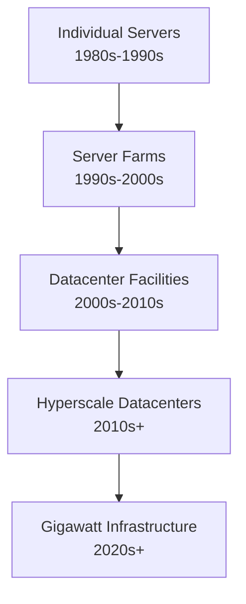

**Category:** Gigawatt Datacenter Evolution
**Difficulty:** Intermediate
**Reading time:** 6 min read

---

This lesson covers history of datacenter scale progression, an important concept in web hosting and infrastructure. Understanding the evolution from small server rooms to massive hyperscale facilities provides crucial context for modern infrastructure decisions. The progression reflects technological advances, economic pressures, and changing business requirements.

- **Kilowatt Era** — Early server deployments consuming single-digit kilowatts
- **Megawatt Transition** — Move to facilities consuming hundreds of megawatts of power
- **Gigawatt Threshold** — Modern hyperscale datacenters reaching gigawatt-scale power consumption
- **Technological Drivers** — Moore's Law, virtualization, and cloud computing enabling density increases
- **Economic Factors** — Economies of scale making hyperscale deployment economically viable

Datacenter evolution reflects a continuous shift toward consolidation and scale. Early computing involved individual servers in office environments, requiring minimal infrastructure. As demand grew, organizations built dedicated server rooms and then entire datacenter facilities. The progression accelerated with virtualization technology, which dramatically increased computational density per physical rack. Cloud computing providers realized that building massive facilities at continental scale offered superior economics, leading to today's hyperscale datacenters. Each evolution stage introduced new engineering challenges around power delivery, cooling, networking, and management - challenges that grew exponentially as scale increased.

- Understanding technology adoption patterns and infrastructure planning
- Making decisions about datacenter location and sizing
- Evaluating cloud provider maturity and capability
- Predicting future infrastructure requirements
- Planning enterprise vs cloud migration strategies
- Assessing capital expenditure requirements

| Advantage | Disadvantage |
|-----------|--------------|
| Exponential growth in computational power | Increased complexity of operations |
| Improved power efficiency through scale | Higher upfront capital requirements |
| Enhanced redundancy and reliability | Dependency on specific geographic regions |
| Better resource utilization economics | Environmental impact and regulatory scrutiny |

- [Megawatt to gigawatt evolution timeline](megawatt-to-gigawatt-evolution-timeline.md)
- [Moore's Law impact on datacenter density](moores-law-impact-on-datacenter-density.md)
- [Power density trends over decades](power-density-trends-over-decades.md)

---
*Part of the [Gigawatt Datacenter Evolution](gigawatt-datacenter-evolution/index.md) category · [Back to Master Index](../../index.md)*
