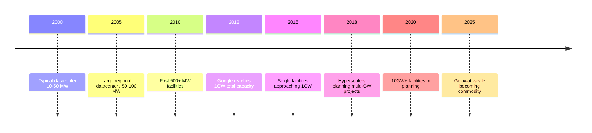

**Category:** Gigawatt Datacenter Evolution
**Difficulty:** Intermediate
**Reading time:** 6 min read

---

This lesson covers megawatt to gigawatt evolution timeline, tracing the specific timeframes when datacenters transitioned from megawatt to gigawatt-scale power consumption. This evolution happened rapidly in the 2010s-2020s as cloud computing companies competed for global dominance through infrastructure scale.

- **Megawatt Era** — 2000-2010, typical large datacenters consuming 5-100 MW
- **Transition Period** — 2010-2015, emergence of first gigawatt-class datacenters
- **Gigawatt Normalization** — 2015-2020, gigawatt scale becoming standard for hyperscalers
- **Multi-Gigawatt Future** — 2020+, facilities approaching 10GW capacity
- **Timeline Acceleration** — Each doubling taking progressively less time

The timeline of evolution from megawatt to gigawatt reflects exponential growth in three domains: computation demand, technological capability, and economic viability. In the 2000s, Google, Amazon, and Microsoft began building massive datacenters, each consuming 50-100+ MW. By 2012, Google disclosed annual electricity consumption approaching 4 terawatt-hours, requiring gigawatt-scale infrastructure. The 2015-2018 period saw normalization of gigawatt-scale facilities. By 2020, the industry was planning 10+ GW facilities, driven by AI workloads, cloud gaming, and video streaming demands. Each doubling in scale occurred faster than the previous doubling due to improved economics and proven designs.

- Forecasting future infrastructure requirements
- Understanding current state of datacenter technology
- Evaluating strategic timing for infrastructure investments
- Assessing competitive positioning among cloud providers
- Planning power and cooling infrastructure
- Predicting future demands for renewable energy

| Advantage | Disadvantage |
|-----------|--------------|
| Clearer understanding of technology maturity | Historical data varies by source |
| Enables trend projection | Future projections uncertain |
| Shows economic acceleration | Regional variations in deployment |

- [History of datacenter scale progression](history-of-datacenter-scale-progression.md)
- [Power density trends over decades](power-density-trends-over-decades.md)
- [Renewable energy driving gigawatt scale](renewable-energy-driving-gigawatt-scale.md)

---
*Part of the [Gigawatt Datacenter Evolution](gigawatt-datacenter-evolution/index.md) category · [Back to Master Index](../../index.md)*
