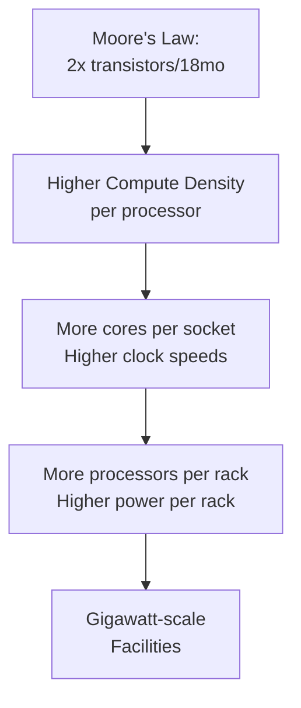

**Category:** Gigawatt Datacenter Evolution
**Difficulty:** Intermediate
**Reading time:** 6 min read

---

This lesson covers Moore's Law impact on datacenter density, examining how the exponential increase in transistor density has fundamentally enabled the progression toward gigawatt-scale facilities. Moore's Law predicts a doubling of transistor count every 18-24 months, and this scaling has been the primary driver of datacenter evolution.

- **Transistor Scaling** — Exponential increase in compute power per unit volume
- **Power Efficiency** — Modern processors delivering more compute per watt
- **Rack Density** — Evolution from 5kW per rack to 50+ kW per rack
- **Heat Density Challenges** — Cooling complexity increases exponentially
- **Architectural Implications** — Network fabric and power delivery must scale proportionally

Moore's Law has been the primary engine of datacenter evolution. Every 18-24 months, processors have roughly doubled in transistor count and performance. This enabled data centers to pack more computing power into the same physical footprint. Where 1990s servers might have consumed 1-2 kW, modern high-performance systems consume 20-50 kW or more. This enables 100-200 kW per rack, and thousands of racks per datacenter, reaching gigawatt scale with finite space. However, Moore's Law is approaching physical limits, with continued scaling becoming increasingly expensive and energy-intensive. The law has slowed in recent years, though specialized processors for AI workloads continue aggressive scaling.

- Understanding infrastructure cost trends
- Predicting when next facility expansions will be needed
- Evaluating processor selection for specific workloads
- Assessing power and cooling requirements
- Planning datacenter thermal design
- Forecasting semiconductor technology maturity

| Advantage | Disadvantage |
|-----------|--------------|
| Predictable performance growth | Slowing of Moore's Law limits future gains |
| Cost reduction through economies of scale | Power density challenges increase |
| Better power efficiency | Increased thermal design complexity |

- [Power density trends over decades](power-density-trends-over-decades.md)
- [Hyperscale datacenter emergence](hyperscale-datacenter-emergence.md)
- [Liquid cooling for high-density servers](../server-hardware-infrastructure/liquid-cooling-for-high-density-servers.md)

---
*Part of the [Gigawatt Datacenter Evolution](gigawatt-datacenter-evolution/index.md) category · [Back to Master Index](../../index.md)*
