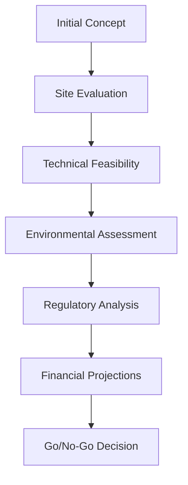

**Category:** Gigawatt Datacenter Planning
**Difficulty:** Intermediate
**Reading time:** 6 min read

---

Gigawatt-scale datacenter feasibility studies evaluate the technical, environmental, regulatory, and economic viability of developing massive facilities. These comprehensive assessments guide investment decisions and identify critical success factors before committing billions of dollars.

- **Power Feasibility** — Evaluating available electrical capacity and transmission infrastructure
- **Water Resources** — Assessing cooling water availability and environmental impact
- **Site Suitability** — Geographic, geological, and climate considerations
- **Regulatory Landscape** — Zoning, environmental, and operational permit requirements
- **Financial Modeling** — Cost analysis, ROI projections, and funding requirements

Feasibility studies begin with site identification considering proximity to power sources, water, fiber networks, and labor markets. Technical teams assess electrical capacity, water cooling possibilities, seismic risk, and climate suitability. Environmental impact assessments analyze water usage, emissions, and ecological effects. Regulatory teams navigate zoning, permitting, tax incentives, and compliance requirements. Financial models project capital expenditure, operational costs, revenue, and returns. Stakeholder engagement assesses community support and identifies potential opposition. The final feasibility report synthesizes findings and makes a go/no-go recommendation.

- Hyperscaler expansion planning in new regions
- Data center developer site evaluation
- Technology company infrastructure investment
- Government agency data center consolidation
- Colocation provider expansion
- AI and ML cluster development

| Advantage | Disadvantage |
|-----------|--------------|
| Comprehensive risk assessment | Long study duration (months) |
| Guides major capital investment | High study costs (millions) |
| Identifies showstoppers early | Uncertainty in projections |
| Regulatory pre-planning | Political and regulatory changes |
| Stakeholder alignment | Competitive intelligence leak risk |

- [Site Selection for GW-scale Facilities](site-selection-for-gw-scale-facilities.md)
- [Power Availability Assessment](power-availability-assessment.md)
- [Water Availability for Cooling](water-availability-for-cooling.md)

---
*Part of the [Gigawatt Datacenter Planning](index.md) category · [Back to Master Index](../../index.md)*
