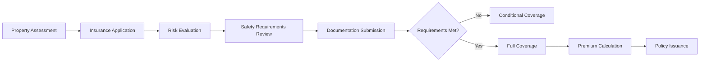

**Category:** Gigawatt Fire Suppression
**Difficulty:** Intermediate
**Reading time:** 6 min read

---

Fire insurance requirements define the minimum fire safety standards and equipment that insurers mandate for coverage in commercial and residential properties. These requirements ensure adequate protection mechanisms are in place to minimize loss potential and reduce claim frequency, reflecting insurer risk assessment and underwriting standards.

- **Underwriting Standards** — criteria used by insurers to assess risk and determine coverage eligibility and rates
- **Proof of Compliance** — documentation such as inspection certificates and system maintenance records required by insurers
- **Coverage Exclusions** — specific conditions or situations not covered by the policy due to safety deficiencies
- **Loss Prevention Credit** — premium discounts offered when buildings exceed minimum safety requirements
- **Mandatory Systems** — fire suppression, detection, and alarm equipment that cannot be absent or disabled

Insurance companies establish fire safety requirements based on property type, occupancy, construction materials, and location risk factors. During the underwriting process, insurers review building plans, inspection reports, and safety system specifications to verify compliance with their standards. Properties must maintain active fire alarm systems, working sprinkler systems, adequate exit lighting, and emergency communication equipment. Proof of regular maintenance and inspection is required to maintain coverage validity. Insurers may offer lower premiums for properties exceeding minimum code requirements or having advanced detection systems. Non-compliance can result in reduced coverage, higher deductibles, or policy cancellation. Documentation of all safety measures must be retained and updated as requirements change.

- Securing comprehensive fire insurance coverage for commercial properties
- Calculating premium rates based on fire safety system sophistication
- Meeting lender requirements for mortgage approval on commercial properties
- Establishing loss prevention programs to reduce claims
- Documenting safety investments that qualify for insurance discounts
- Transitioning between insurance carriers while maintaining coverage

| Advantage | Disadvantage |
|-----------|--------------|
| Ensures adequate coverage in case of fire loss | Systems must be maintained continuously |
| Premium discounts for superior safety systems | High initial equipment investment required |
| Protects business continuity and recovery | Non-compliance can void coverage |
| Encourages proactive loss prevention | Regular documentation requirements |
| May reduce overall insurance costs | Upgrading systems can disrupt operations |

- [Fire marshal inspections](fire-marshal-inspections.md)
- [Fire suppression systems overview](../index.md)
- [Building code compliance](../../building-standards/index.md)

---
*Part of the [Gigawatt Fire Suppression](../index.md) category · [Back to Master Index](../../index.md)*
