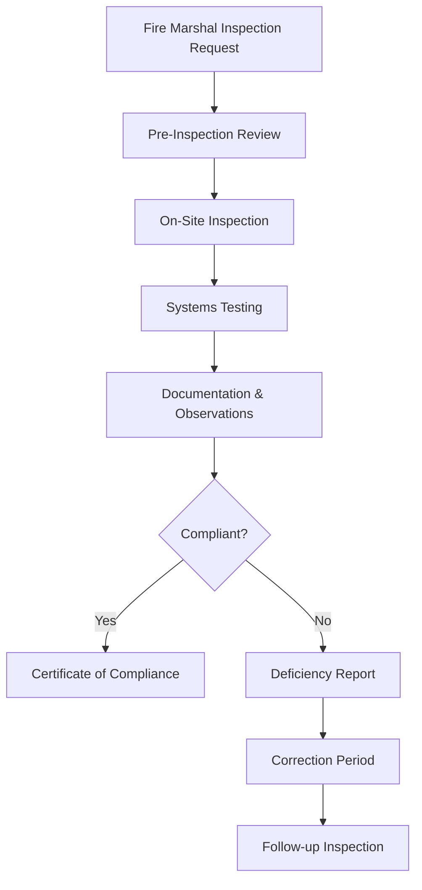

**Category:** Gigawatt Fire Suppression
**Difficulty:** Intermediate
**Reading time:** 6 min read

---

Fire marshal inspections are regulatory compliance assessments conducted by local or state fire officials to verify that buildings meet fire safety codes and standards. These inspections ensure that fire suppression systems, emergency exits, and safety equipment function properly and meet all applicable legal requirements.

- **Fire Code Compliance** — adherence to local, state, and federal fire safety regulations and standards
- **Inspection Authority** — official power granted to fire marshals by local and state governments to enforce codes
- **Life Safety Systems** — equipment and design features that protect occupants during fires, including alarms and exits
- **Occupancy Classification** — categorization of buildings based on usage type (residential, commercial, industrial, etc.)
- **Deficiency Report** — official documentation of code violations found during inspection with required correction timelines

Fire marshal inspections follow a structured process designed to ensure building safety. Initially, facility managers schedule inspections according to local requirements, which vary by jurisdiction and occupancy type. The fire marshal conducts a comprehensive assessment examining fire detection systems, suppression equipment, emergency lighting, exit routes, and storage of hazardous materials. During the inspection, officials verify that all systems meet current codes, test fire alarms and sprinkler systems, and check emergency access routes for obstructions. Any violations are documented with severity levels and correction deadlines. Buildings must address all deficiencies by the specified date, after which follow-up inspections confirm remediation. Successful compliance results in documentation that may be required for insurance purposes, permits, or lease agreements.

- Verifying compliance before occupancy of new or renovated buildings
- Annual routine inspections for office buildings and commercial spaces
- Investigating safety conditions following fire department calls or complaints
- Ensuring compliance after equipment modifications or system upgrades
- Documenting safety records for insurance underwriting and risk assessment
- Supporting facility planning and capital improvement budgeting

| Advantage | Disadvantage |
|-----------|--------------|
| Ensures regulatory compliance and occupant safety | Requires facility downtime for inspections |
| Identifies hazards before incidents occur | Can reveal expensive code violations |
| Protects insurance coverage validity | Correction costs can be substantial |
| Establishes clear accountability | Tight correction deadlines create urgency |
| Creates safety culture | Recurring expenses for maintenance |

- [Fire insurance requirements](fire-insurance-requirements.md)
- [Fire suppression systems overview](../index.md)
- [Building code compliance](../../building-standards/index.md)

---
*Part of the [Gigawatt Fire Suppression](../index.md) category · [Back to Master Index](../../index.md)*
