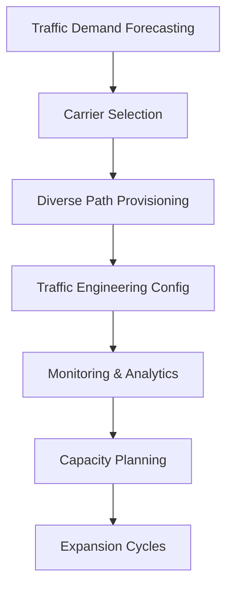

**Category:** Gigawatt Network Infrastructure
**Difficulty:** Intermediate
**Reading time:** 6 min read

---

Managing gigawatt-scale network bandwidth requires sophisticated infrastructure planning, redundancy strategies, and carrier relationships to support massive data flows. Understanding bandwidth requirements, traffic patterns, and optimization techniques is essential for infrastructure at this scale.

- **Bandwidth Provisioning** — Planning capacity requirements with headroom
- **Traffic Engineering** — Load balancing across diverse paths
- **Carrier Relationships** — Contracts for multiple carriers and carriers at GW scale
- **Peering Strategies** — Direct connections reducing reliance on transit
- **Traffic Analysis** — Understanding patterns and peak demands

Bandwidth planning begins with traffic demand forecasting based on historical patterns and projected growth. Multiple carriers are selected to avoid single points of failure and to achieve price competitiveness. Diverse paths are provisioned across different fiber routes, carriers, and geographic locations. Traffic engineering uses BGP and MPLS to distribute traffic optimally across available paths. Real-time monitoring tracks utilization, identifying congestion and performance issues. Capacity planning cycles add bandwidth quarterly or annually, with long lead times for dark fiber and equipment. Peering relationships reduce external bandwidth costs by exchanging traffic with other networks directly.

- Hyperscaler data center network backbone
- Content delivery networks serving global traffic
- Cloud service provider infrastructure
- Large ISP network planning
- Financial services global trading networks
- Telecommunications provider core network

| Advantage | Disadvantage |
|-----------|--------------|
| Redundancy and fault tolerance | Extremely high infrastructure costs |
| Diverse carriers reduce vendor lock-in | Complex vendor management |
| Peering reduces transit costs | Negotiation overhead with peers |
| Scalable architecture for growth | Lead times for capacity additions |
| High availability through diversity | Coordination complexity |

- [Dark Fiber Procurement](dark-fiber-procurement.md)
- [Internet Exchange IX Connections](internet-exchange-ix-connections.md)
- [Border Gateway Protocol BGP Design](border-gateway-protocol-bgp-design.md)

---
*Part of the [Gigawatt Network Infrastructure](index.md) category · [Back to Master Index](../../index.md)*
