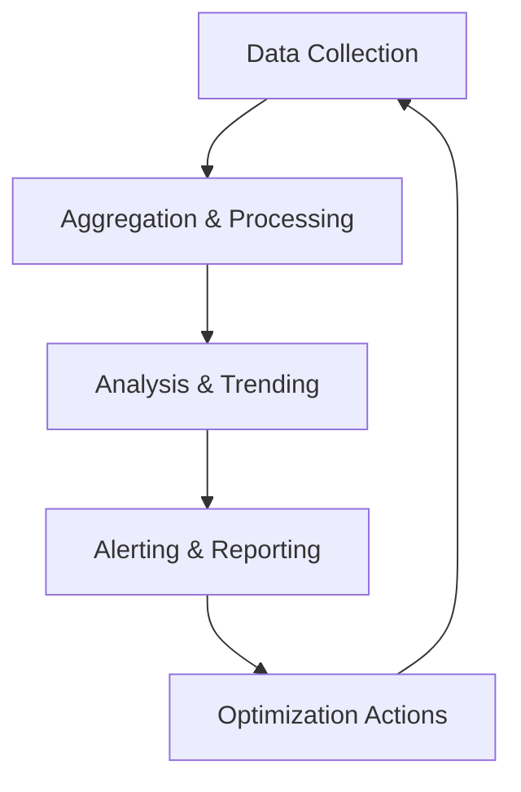

**Category:** Gigawatt Operations & Maintenance
**Difficulty:** Intermediate
**Reading time:** 6 min read

---

Operations metrics and KPIs (Key Performance Indicators) are quantifiable measurements that track the health, efficiency, and performance of data center and infrastructure operations. These metrics provide visibility into system reliability, resource utilization, and operational excellence, enabling teams to make data-driven decisions for continuous improvement.

- **Uptime Percentage** — ratio of system availability time to total time, typically measured as "five nines" (99.999%)
- **Mean Time Between Failures (MTBF)** — average duration between system failures, indicating reliability
- **Mean Time To Recovery (MTTR)** — average time required to restore service after a failure
- **Resource Utilization Rate** — percentage of available capacity being actively used (CPU, memory, storage)
- **Service Level Agreement (SLA)** — contractual commitment defining minimum uptime guarantees and compensation terms

Operations metrics form a feedback loop that continuously monitors infrastructure health. Sensors and monitoring agents collect raw data from servers, networks, storage systems, and applications. This data flows into aggregation layers that normalize and combine signals from diverse sources. Analytics engines process historical and real-time data to identify trends, anomalies, and patterns. When thresholds are breached, alerting systems notify operations teams. Dashboards provide visibility into key metrics, enabling quick assessment of system status. Teams use these insights to optimize configurations, capacity planning, and incident response procedures. Over time, historical KPI data informs strategic decisions about infrastructure investment and technology upgrades.

- Capacity planning and resource forecasting based on utilization trends
- SLA compliance verification and reporting to customers and stakeholders
- Incident management and performance degradation troubleshooting
- Cost optimization by identifying underutilized resources for consolidation
- Benchmarking performance against industry standards and competitors

| Advantage | Disadvantage |
|-----------|--------------|
| Enables proactive problem detection before user impact | Requires significant monitoring infrastructure investment |
| Provides objective data for capacity planning decisions | Can generate alert fatigue if poorly tuned |
| Facilitates SLA compliance documentation and auditing | Historical data storage and analysis can be expensive |
| Supports cost optimization through detailed utilization visibility | Requires expertise to interpret complex multi-dimensional data |
| Drives continuous improvement through measurable tracking | Privacy/security risks if metrics expose sensitive information |

- [Service Level Agreements (SLA)](../../index.md)
- [Capacity Planning](../../capacity-planning/index.md)
- [Performance Monitoring](../../index.md)

---
*Part of the [Gigawatt Operations & Maintenance](index.md) category · [Back to Master Index](../../index.md)*
