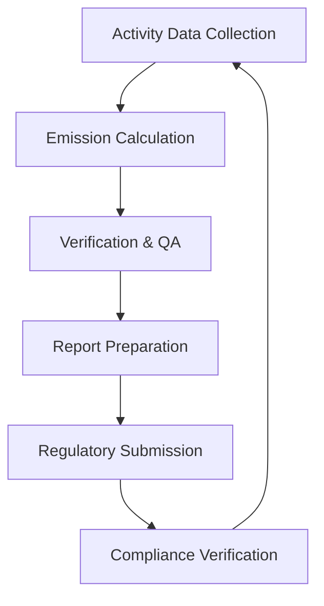

**Category:** Gigawatt Regulatory & Compliance
**Difficulty:** Intermediate
**Reading time:** 6 min read

---

Air emissions reporting involves monitoring, calculating, and disclosing the release of pollutants from data center operations including backup generators, HVAC systems, and refrigerant handling. Regulatory agencies mandate emissions tracking and reporting to track air quality impacts and enforce pollution limits.

- **Criteria Pollutants** — EPA-regulated substances including particulate matter (PM2.5, PM10), NOx, SOx, CO, and ozone precursors
- **Greenhouse Gas Reporting** — tracking carbon dioxide (CO2) and equivalent emissions from energy consumption and combustion
- **Emission Factors** — standardized calculations that convert activity data (fuel burned, hours operated) into pollutant quantities
- **Reporting Thresholds** — regulatory levels above which facilities must submit detailed emissions inventories
- **Compliance Certificates** — documentation that purchased emissions allowances or offsets meet regulatory requirements

Emissions reporting begins with collecting activity data: fuel consumption for generators, hours of operation, electricity purchased from the grid, and refrigerant quantities. Emission factors (provided by EPA or industry databases) convert this activity into pounds or tons of pollutants per unit of activity. Calculations apply to direct emissions (on-site combustion, refrigerant leaks) and indirect emissions (purchased electricity generation). Quality assurance reviews verify calculation accuracy and data completeness. Reports are prepared in formats specified by regulatory agencies (EPA e-GGRT, state programs, or international reporting schemes). Submission occurs on schedules ranging from monthly to annual depending on thresholds and local requirements. Regulatory agencies review submissions for reasonableness and may request supporting documentation. Facilities must correct any discrepancies and maintain records for audits.

- Backup generator emissions from diesel fuel combustion for power continuity
- Refrigerant emissions from equipment leaks or maintenance procedures
- Electricity-related emissions based on grid mix and renewable energy purchases
- HVAC system emissions including refrigerant charges and handling losses
- Annual emissions inventory reporting to state environmental agencies

| Advantage | Disadvantage |
|-----------|--------------|
| Drives facility decarbonization through measurement and disclosure | Reporting requirements add administrative burden |
| Enables regulatory compliance with air quality standards | Calculation methodologies complex and evolving |
| Supports corporate sustainability and ESG commitments | Large facilities may exceed thresholds requiring expensive controls |
| Identifies reduction opportunities through data analysis | Legacy equipment often has higher emissions factors |
| Creates transparency for stakeholders and regulators | Verification and auditing can challenge reported numbers |

- [Greenhouse Gas Reporting](greenhouse-gas-reporting.md)
- [Environmental Health and Safety](environmental-health-and-safety.md)
- [Storm Water Management](storm-water-management.md)

---
*Part of the [Gigawatt Regulatory & Compliance](index.md) category · [Back to Master Index](../../index.md)*
