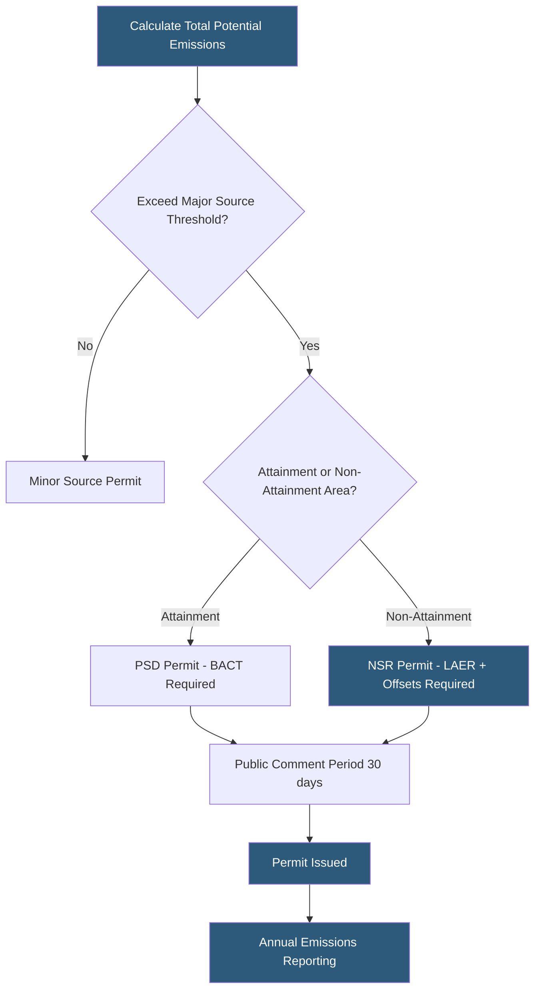

**Category:** Gigawatt Regulatory & Compliance
**Difficulty:** Advanced
**Reading time:** 7 min read

---

Air quality permits regulate atmospheric emissions from gigawatt-scale datacenter operations, primarily diesel generator exhaust containing NOx, PM2.5, carbon monoxide, and volatile organic compounds. Obtaining and maintaining these permits in non-attainment areas requires emissions offsets, best available control technology analysis, and annual reporting to state environmental agencies. The permitting timeline — often 12–24 months — is a critical path item for new datacenter development.

- **Title V permit** — Major source operating permit under the Clean Air Act required when emissions exceed 100 tons/year of regulated pollutants
- **New Source Review (NSR)** — Pre-construction permitting program evaluating new or modified major sources
- **Best Available Control Technology (BACT)** — Most effective emission control technology required for new major sources in attainment areas
- **Lowest Achievable Emission Rate (LAER)** — Stricter standard than BACT, required for new sources in non-attainment areas
- **Emission offset** — Reduction in emissions from an existing source used to compensate for a new source's emissions in non-attainment areas
- **Non-attainment area** — Geographic region that does not meet NAAQS standards for one or more pollutants
- **NAAQS** — National Ambient Air Quality Standards establishing concentration limits for six criteria pollutants
- **Emergency generator exemption** — Limited operating hours (typically 500 hours/year) under which generator testing avoids major source thresholds

Air quality permitting for a gigawatt campus is primarily driven by diesel generator potential to emit. A single 2 MW generator emits approximately 10–20 tons of NOx per year at full load; a 300 MW backup generation plant may have a potential to emit exceeding 1,500 tons/year of NOx — well above the 100 ton/year major source threshold for most pollutants.

The emergency generator operating hour exemption is the most common strategy to avoid major source classification. By limiting each generator to fewer than 500 hours per year of combined non-emergency and maintenance testing, many facilities remain below major source thresholds. However, regulators scrutinize this limitation carefully, and facilities must maintain detailed operating logs demonstrating compliance.

When major source thresholds are unavoidable, Prevention of Significant Deterioration (PSD) permits are required in attainment areas. PSD requires a BACT analysis — a top-down evaluation of available control technologies ranked by effectiveness — and air quality impact modeling demonstrating that ambient standards are not exceeded. In non-attainment areas, NSR applies LAER and requires purchasing emission offsets at ratios of 1.0:1 to 1.5:1 from retiring emission sources.

Tier 4 Final diesel engines represent the current BACT/LAER standard, emitting approximately 0.04 g/bhp-hr NOx versus Tier 2 engines at 6.4 g/bhp-hr — a 99% reduction. Selective Catalytic Reduction (SCR) aftertreatment further reduces NOx by 80–90% for ultra-low emission installations. Natural gas generators and fuel cells are alternatives with significantly lower NOx emissions.

Annual emissions inventories must be filed with the state air agency, typically using AP-42 emission factors or certified test data. Title V facilities undergo formal compliance certifications signed by a responsible official.

- Structuring generator testing schedules to remain below emergency generator hour thresholds
- Conducting top-down BACT analysis for Tier 4 Final generators with SCR
- Procuring emission offsets for a non-attainment area installation
- Modeling ambient air quality impacts from generator exhaust at property boundary
- Filing annual Title V emissions inventories across multiple campus phases

| Advantage | Disadvantage |
|-----------|--------------|
| Emergency generator hour exemption avoids major source classification | Hour limits constrain testing frequency, potentially affecting reliability documentation |
| Tier 4 Final engines satisfy BACT requirements in most jurisdictions | Tier 4 engines require ultra-low sulfur diesel and additional maintenance |
| Natural gas generators eliminate diesel storage and reduce NOx substantially | Natural gas supply interruptions during grid emergencies defeat backup purpose |
| Emission offsets enable development in non-attainment areas | Offset acquisition is expensive and supply is limited in constrained markets |

- [Environmental Regulations](environmental-regulations.md)
- [Water Discharge Permits](water-discharge-permits.md)
- [Greenhouse Gas Reporting](greenhouse-gas-reporting.md)

---
*Part of the [Gigawatt Regulatory & Compliance](index.md) category · [Back to Master Index](../../index.md)*
