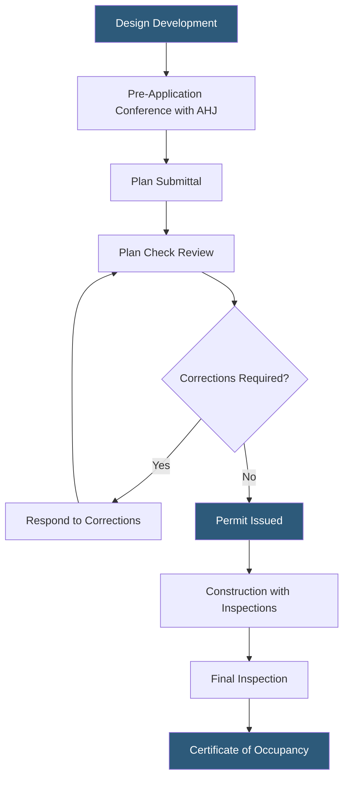

**Category:** Gigawatt Regulatory & Compliance
**Difficulty:** Intermediate
**Reading time:** 6 min read

---

Building code compliance for gigawatt-scale datacenters involves satisfying the International Building Code (IBC), fire codes, mechanical codes, and local amendments that govern structural integrity, occupancy classification, egress, and life safety systems. These codes evolve on 3-year cycles and directly influence construction costs, design choices, and schedule. Engaging code officials early through pre-application conferences avoids costly mid-construction redesigns.

- **IBC (International Building Code)** — Model code adopted by most U.S. jurisdictions governing building construction standards
- **Occupancy classification** — IBC designation (e.g., S-1, B, F) that determines fire protection and egress requirements
- **Construction type** — IBC classification (Types I–V) specifying allowable building height, area, and materials
- **Plan check** — Formal review of construction drawings by the building department before permits are issued
- **Certificate of occupancy (CO)** — Document confirming a completed building meets code, required before operations commence
- **Authority Having Jurisdiction (AHJ)** — The governmental body responsible for interpreting and enforcing applicable codes
- **Special inspection** — Third-party inspection of high-risk construction elements such as structural welds or post-installed anchors
- **Accessible design (ADA)** — Requirements under the Americans with Disabilities Act for accessible routes and facilities

Gigawatt-scale datacenter buildings are typically classified under IBC as Group S-1 (moderate hazard storage) or Group B (business occupancy) depending on primary use, with Type I-A construction (non-combustible, highest fire resistance) being standard for large facilities. This classification drives requirements for fire suppression systems, smoke control, egress distances, and emergency lighting.

Structural code compliance focuses on load path documentation — demonstrating that all gravity, seismic, and wind loads are transmitted safely through the structure to the foundation. Seismic design categories vary by location; facilities in high-seismic zones such as the Pacific Northwest require special moment frames and extensive detailing. Wind load design for buildings over 60 feet must account for ASCE 7 provisions, including internal pressure coefficients.

Mechanical code compliance addresses HVAC system design. Large cooling plants must meet International Mechanical Code (IMC) requirements for refrigerant containment, machinery room ventilation, and equipment access. Electrical code (NFPA 70 / NEC) governs conductor sizing, grounding, arc flash protection, and emergency system separation — critical for facilities with multiple UPS systems and generator plants.

Plan check is the critical path item for permit issuance. Large projects may involve concurrent multi-discipline review across building, fire, electrical, mechanical, and civil permits. Using a permit expediter and maintaining dedicated code compliance staff reduces response time on correction notices from weeks to days, protecting the construction schedule.

- Designing a 50 MW data hall to Type I-A construction for maximum allowable area without fire walls
- Navigating seismic design requirements in Zone 4 for a new campus in the Pacific Northwest
- Expediting concurrent building, electrical, and fire permits to protect construction schedule
- Satisfying AHJ special inspection requirements for high-strength concrete and structural steel
- Coordinating certificate of occupancy phasing to enable early equipment commissioning

| Advantage | Disadvantage |
|-----------|--------------|
| Type I-A construction maximizes allowable floor area and height | Non-combustible construction increases structural steel costs 15–25% |
| Pre-application meetings resolve interpretation questions before design is complete | AHJ staffing limitations cause plan check delays of 4–12 weeks |
| Third-party plan check services accelerate review in over-burdened jurisdictions | Third-party reviewers still require AHJ final approval, adding handoff time |
| Phased certificates of occupancy allow early equipment installation | Each CO phase requires its own final inspection and documentation package |

- [Electrical Code Requirements (NEC)](electrical-code-requirements-nec.md)
- [Fire Code Compliance (NFPA)](fire-code-compliance-nfpa.md)
- [Land Use Regulations](land-use-regulations.md)

---
*Part of the [Gigawatt Regulatory & Compliance](index.md) category · [Back to Master Index](../../index.md)*
