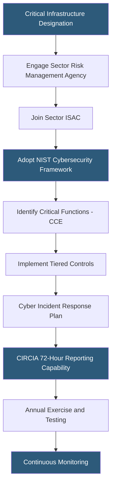

**Category:** Gigawatt Regulatory & Compliance
**Difficulty:** Advanced
**Reading time:** 7 min read

---

Gigawatt-scale datacenters are increasingly designated as critical infrastructure under U.S. Presidential Policy Directive 21 (PPD-21) within the Communications and Information Technology sectors. This designation triggers obligations under sector-specific regulatory frameworks, information sharing requirements, and enhanced cybersecurity standards. Operators must engage with sector-specific agencies, participate in information sharing organizations, and implement risk management frameworks aligned with NIST standards.

- **PPD-21** — Presidential Policy Directive establishing 16 critical infrastructure sectors and assigning sector risk management agencies
- **CISA** — Cybersecurity and Infrastructure Security Agency; lead federal agency for critical infrastructure protection across most sectors
- **ISACs** — Information Sharing and Analysis Centers; sector-specific organizations facilitating threat intelligence sharing
- **NIST Cybersecurity Framework (CSF)** — Voluntary framework providing a common language for managing cybersecurity risk across critical infrastructure
- **Sector Risk Management Agency (SRMA)** — Federal agency responsible for each critical infrastructure sector (e.g., CISA for IT sector)
- **Cyber Incident Reporting for Critical Infrastructure Act (CIRCIA)** — 2022 law requiring critical infrastructure owners to report significant cyber incidents to CISA within 72 hours
- **Resilience** — Ability of critical infrastructure to withstand, adapt to, and recover from adversarial events, disasters, or failures
- **Consequence-driven, Cyber-informed Engineering (CCE)** — Methodology for identifying and protecting the most critical functions within complex infrastructure

Critical infrastructure designation does not automatically impose legally binding technical requirements beyond CIRCIA reporting, but it creates strong regulatory expectations and influences customer requirements. Major hyperscaler tenants contractually require their datacenter providers to maintain critical infrastructure protection programs aligned with NIST CSF or equivalent frameworks.

NIST CSF organizes cybersecurity activities into five functions: Identify, Protect, Detect, Respond, and Recover. For gigawatt operators, Identify includes asset inventory management across hundreds of thousands of IT and OT components — servers, switches, building automation systems, power monitoring equipment, and environmental controls. Protect includes access controls, data security, and protective technologies. Detect encompasses continuous monitoring using SIEM, OT/IT network anomaly detection, and physical security integration.

Operational technology (OT) security is particularly important at gigawatt scale. Building management systems, SCADA systems for power distribution, and cooling plant controls represent attack surfaces that can cause physical damage if compromised. The 2021 Oldsmar water treatment attack demonstrated that internet-exposed OT systems can be manipulated remotely; datacenter OT networks must be segmented with strict access controls and monitored for anomalous behavior.

CIRCIA, once fully implemented through CISA rulemaking, will require covered entities to report significant cyber incidents within 72 hours and ransomware payments within 24 hours. Covered entities include critical infrastructure owners and operators. Implementing automated incident detection, classification, and reporting workflows before the effective date reduces compliance risk.

- Joining the IT-ISAC to receive and share threat intelligence with peer datacenter operators
- Implementing NIST CSF Tier 3 (Repeatable) program for a campus supporting government tenants
- Segmenting OT networks for power distribution and cooling from corporate IT networks
- Building 72-hour CIRCIA incident reporting workflow with pre-approved legal review process
- Conducting CCE analysis to identify and harden the 10 most critical functions at a campus

| Advantage | Disadvantage |
|-----------|--------------|
| NIST CSF adoption provides recognized framework for customer due diligence requests | Full CSF implementation at Tier 4 (Adaptive) requires significant program maturity investment |
| ISAC membership provides early threat intelligence before public disclosure | ISAC participation requires contributing intelligence, not just receiving it |
| OT network segmentation prevents IT compromises from affecting physical operations | Segmentation complicates remote management and requires jump hosts and additional authentication |
| CIRCIA compliance capability improves incident response speed overall | Incident classification workflows require legal and compliance involvement in security response |

- [NERC CIP Compliance](nerc-cip-compliance.md)
- [Cybersecurity Requirements](cybersecurity-requirements.md)
- [Data Sovereignty Requirements](data-sovereignty-requirements.md)

---
*Part of the [Gigawatt Regulatory & Compliance](index.md) category · [Back to Master Index](../../index.md)*
