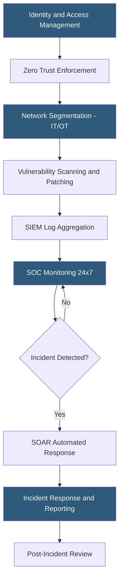

**Category:** Gigawatt Regulatory & Compliance
**Difficulty:** Advanced
**Reading time:** 7 min read

---

Cybersecurity requirements for gigawatt-scale datacenters span voluntary frameworks (NIST CSF, ISO 27001), contractual obligations (SOC 2, PCI DSS), and emerging mandatory regulations (CIRCIA, EU NIS2 Directive). Together they require comprehensive security programs covering identity management, vulnerability management, incident response, third-party risk, and OT/IT network security. The convergence of IT and OT systems at gigawatt facilities creates unique attack surfaces where physical infrastructure — power, cooling, access control — can be compromised through cyber means.

- **Zero Trust Architecture** — Security model requiring continuous verification of identity, device, and context for every access request
- **OT security** — Protection of operational technology systems including BMS, SCADA, and power monitoring from cyber threats
- **SIEM** — Security Information and Event Management platform aggregating logs for threat detection and compliance evidence
- **SOAR** — Security Orchestration, Automation and Response; platforms automating incident detection and response workflows
- **Penetration testing** — Authorized simulated attack evaluating security controls for vulnerabilities
- **Vulnerability management** — Systematic process of identifying, prioritizing, and remediating security vulnerabilities
- **Multi-factor authentication (MFA)** — Authentication requiring two or more verification factors; mandatory for remote access to critical systems
- **EU NIS2 Directive** — Updated EU network and information security directive imposing cybersecurity obligations on essential entities

Cybersecurity at gigawatt scale requires defending a vast, heterogeneous asset inventory: thousands of IT systems, hundreds of network devices, dozens of OT systems controlling physical infrastructure, and an expanding IoT sensor ecosystem. The attack surface is large and continuously growing as facilities add remote monitoring, AI-driven automation, and cloud-connected management systems.

Zero Trust Architecture replaces the traditional perimeter security model — which trusted everything inside the network — with continuous verification. Every access request, regardless of network origin, must authenticate, demonstrate device compliance, and be authorized for the specific resource requested. Microsegmentation limits lateral movement if an attacker gains initial access; they cannot freely traverse the network without re-authenticating for each segment.

OT security is the most operationally sensitive domain. Building management systems, UPS monitoring, generator control, and cooling plant automation are increasingly IP-connected for efficiency, but were originally designed without cybersecurity in mind. Passive network monitoring using OT-aware intrusion detection platforms (such as Claroty, Nozomi, or Dragos) provides visibility without disrupting fragile OT protocols. Active vulnerability scanning is typically prohibited in OT environments due to the risk of crashing sensitive control systems.

24/7 Security Operations Center (SOC) coverage is standard practice. SOC analysts monitor SIEM alerts, investigate anomalies, and execute playbooks for common incident types. Mean time to detect (MTTD) and mean time to respond (MTTR) are primary SOC performance metrics. Automated playbooks using SOAR platforms can reduce MTTR for common incidents like compromised credentials from hours to minutes.

- Deploying microsegmentation between corporate IT, data hall, and OT networks
- Implementing passive OT network monitoring to achieve visibility without disrupting control systems
- Building SOC playbooks for ransomware, insider threat, and physical breach scenarios
- Meeting EU NIS2 incident reporting requirements for facilities hosting essential entity customers
- Conducting annual external penetration test of internet-facing systems and reporting to board

| Advantage | Disadvantage |
|-----------|--------------|
| Zero Trust reduces blast radius of credential compromises | ZTA implementation requires replacing legacy VPN infrastructure and retraining staff |
| OT passive monitoring provides visibility without operational risk | Passive monitoring cannot block threats; response requires manual intervention |
| 24/7 SOC coverage enables rapid threat detection and response | In-house SOC requires significant staffing investment; managed SOC introduces third-party risk |
| SIEM aggregation provides comprehensive audit trail for compliance | SIEM licensing costs scale with log volume; gigawatt facilities generate terabytes of logs daily |

- [Critical Infrastructure Protection](critical-infrastructure-protection.md)
- [NERC CIP Compliance](nerc-cip-compliance.md)
- [Physical Security Standards](physical-security-standards.md)

---
*Part of the [Gigawatt Regulatory & Compliance](index.md) category · [Back to Master Index](../../index.md)*
