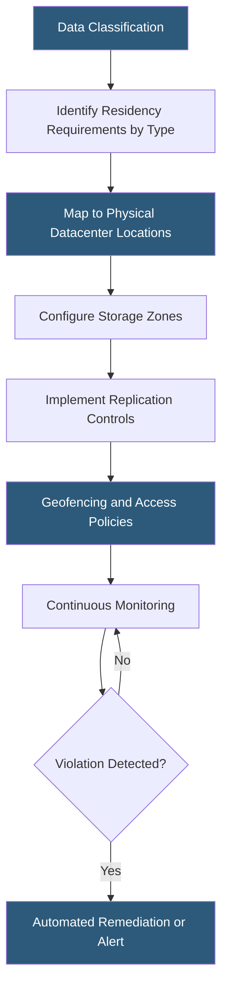

**Category:** Gigawatt Regulatory & Compliance
**Difficulty:** Intermediate
**Reading time:** 6 min read

---

Data residency regulations require that specific categories of data remain physically stored within a defined geographic boundary — a country, region, or legal jurisdiction — regardless of where the data controller is headquartered. Unlike data sovereignty (which concerns legal jurisdiction), data residency is purely a physical location requirement. For datacenter operators, residency mandates drive facility siting decisions, replication architectures, and storage system configurations across global portfolios.

- **Data residency** — Requirement that data remain within a defined geographic boundary at rest
- **Data localization law** — National law mandating that citizen or resident data be stored domestically
- **Geographic redundancy within borders** — Replication to multiple sites within the same jurisdiction to satisfy both residency and availability requirements
- **Metadata residency** — Some regulations extend residency requirements to metadata (logs, indexes) in addition to primary data
- **Healthcare data residency** — Many jurisdictions impose specific localization requirements on patient health records
- **Financial data residency** — Banking regulators in Russia, China, and India require financial transaction data to remain in-country
- **Geofencing** — Technical control restricting data access, storage, or processing to defined geographic coordinates
- **Multi-jurisdiction compliance** — Challenge of simultaneously satisfying conflicting residency requirements from multiple countries

Data residency compliance requires a three-step foundation: classify data by type and jurisdiction of origin, map applicable regulations to each classification, and configure storage and replication infrastructure to enforce the resulting residency boundaries.

Russia's Federal Law No. 242-FZ requires that personal data of Russian citizens collected through activities targeting Russian residents be stored on servers in Russia. China's PIPL similarly requires local storage of personal information of Chinese citizens processed by entities operating in China. India's Personal Data Protection Bill (once enacted) will impose residency requirements on sensitive personal data categories.

Technical enforcement uses multiple layers. Storage systems must be provisioned in compliant data center locations with replication policies filtering by data classification tag. Object storage platforms support bucket policies that enforce single-region storage. Database systems support read replicas that receive only non-residency-restricted data. Encryption key management ensures that even if data bytes are copied outside the boundary, they cannot be decrypted without keys held inside.

The hardest operational challenge is backup and disaster recovery. Meeting both availability requirements (replicate to geographically diverse sites) and residency requirements (stay within national borders) simultaneously is only possible where the country is large enough to have multiple datacenter regions separated by sufficient distance. For smaller countries, regulators sometimes accept single-site storage with air-gap backups.

Audit and monitoring systems must continuously verify residency compliance, generating evidence for regulatory inspections. Any violation — even a brief replication to a non-compliant site during a failover event — must be disclosed in jurisdictions with mandatory breach reporting obligations.

- Configuring AWS S3 bucket policies to enforce EU-only storage for German health records
- Designing in-country disaster recovery architecture for Russian personal data under FZ-242
- Implementing data classification tagging to differentiate residency-restricted from unrestricted data
- Building audit reports demonstrating continuous residency compliance for Indian financial data
- Resolving conflict between UK and EU residency requirements for data about dual-national users

| Advantage | Disadvantage |
|-----------|--------------|
| Residency compliance enables operating in regulated markets that otherwise prohibit cloud | Building or leasing datacenter capacity in every required jurisdiction increases costs significantly |
| Classification-based residency policies enable flexible global architectures | Classification errors can result in residency violations at scale |
| In-country geographic redundancy satisfies both residency and availability | Some countries lack multiple datacenter regions; redundancy within borders may be impractical |
| Encryption and key-in-country architecture provides defense against accidental transfers | Key management complexity increases as number of jurisdictions grows |

- [Data Sovereignty Requirements](data-sovereignty-requirements.md)
- [Privacy Law Compliance (GDPR, CCPA)](privacy-law-compliance-gdpr-ccpa.md)
- [Industry-Specific Regulations (HIPAA, PCI)](industry-specific-regulations-hipaa-pci.md)

---
*Part of the [Gigawatt Regulatory & Compliance](index.md) category · [Back to Master Index](../../index.md)*
