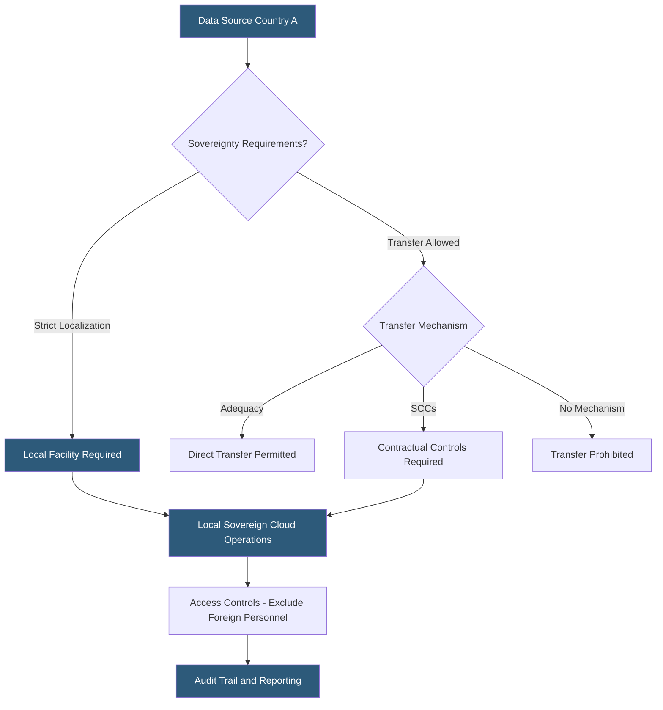

**Category:** Gigawatt Regulatory & Compliance
**Difficulty:** Advanced
**Reading time:** 7 min read

---

Data sovereignty requirements mandate that data about a nation's citizens or critical infrastructure remain within that nation's legal jurisdiction, subject to its laws and accessible to its courts. For gigawatt-scale datacenter operators, these requirements determine where facilities must be built, which cloud services may be used, and how cross-border data flows must be managed. Violations can result in loss of operating licenses, customer contract termination, and multi-million dollar fines.

- **Data sovereignty** — The concept that data is subject to the laws of the country where it physically resides
- **Data localization** — Legal requirement that data be stored and processed within a specific country or region
- **Cross-border data transfer** — Movement of data across national boundaries, subject to bilateral or multilateral frameworks
- **Standard Contractual Clauses (SCCs)** — EU-approved contract terms enabling lawful data transfer to non-EEA countries
- **Adequacy decision** — EU finding that a third country provides an essentially equivalent level of data protection
- **Sovereign cloud** — Cloud infrastructure operated under a country's laws with strict controls on foreign access
- **Data residency** — Requirement that data remain within a specific geographic boundary at rest
- **Binding Corporate Rules (BCRs)** — Internal policies approved by EU supervisory authority enabling intra-group data transfers

Data sovereignty compliance requires mapping data types against applicable national laws to determine where each data set may be stored and processed. Healthcare records in Germany must remain in the EU under GDPR. Financial transaction data in Russia must remain in Russia under Federal Law No. 242-FZ. China's Data Security Law and Personal Information Protection Law impose strict localization for personal data of Chinese citizens processed by businesses operating there.

For gigawatt operators serving global hyperscalers, compliance means building or certifying local capacity in each required jurisdiction and implementing technical controls ensuring data does not replicate beyond authorized boundaries. This requires jurisdiction-aware storage systems, encrypted replication with destination filtering, and audit logs demonstrating that data never left the permitted region.

Access controls add a layer of complexity: sovereign cloud frameworks such as those required by ANSSI in France (SecNumCloud) or Germany (C5) require that foreign governments — including parent company home country governments — cannot compel access to data. This drives architectural separation: dedicated key management infrastructure, identity systems controlled by local entities, and personnel security requirements excluding non-citizen staff from certain roles.

Cross-border data transfers within global enterprises use SCCs for EU data, adequacy decisions where available (currently with countries including Japan, South Korea, and the UK post-Brexit frameworks), or Binding Corporate Rules for intra-group transfers. SCCs require data mapping and Transfer Impact Assessments evaluating whether the destination country's surveillance laws undermine the protections SCCs provide — a requirement arising from the Schrems II ruling.

- Designing EU-only data zones within a global campus to satisfy GDPR data residency
- Implementing access controls preventing non-EU personnel from accessing EU sovereign cloud systems
- Conducting Transfer Impact Assessment for data replication from EU to U.S. hyperscaler region
- Certifying a Chinese facility to comply with PIPL cross-border transfer requirements
- Building air-gapped sovereign environments for German federal government workloads

| Advantage | Disadvantage |
|-----------|--------------|
| Local data residency eliminates cross-border transfer compliance risk | Building local facilities in every jurisdiction increases capital requirements substantially |
| Sovereign cloud certification enables government and regulated-sector customers | Certification requirements (SecNumCloud, C5) require multi-year auditing programs |
| SCCs provide a flexible legal mechanism for EU data exports | Schrems II Transfer Impact Assessments require ongoing legal analysis as laws change |
| Adequacy decisions simplify transfers to covered countries | Adequacy decisions can be revoked (e.g., Privacy Shield invalidation), disrupting operations |

- [Data Residency Regulations](data-residency-regulations.md)
- [Privacy Law Compliance (GDPR, CCPA)](privacy-law-compliance-gdpr-ccpa.md)
- [Critical Infrastructure Protection](critical-infrastructure-protection.md)

---
*Part of the [Gigawatt Regulatory & Compliance](index.md) category · [Back to Master Index](../../index.md)*
