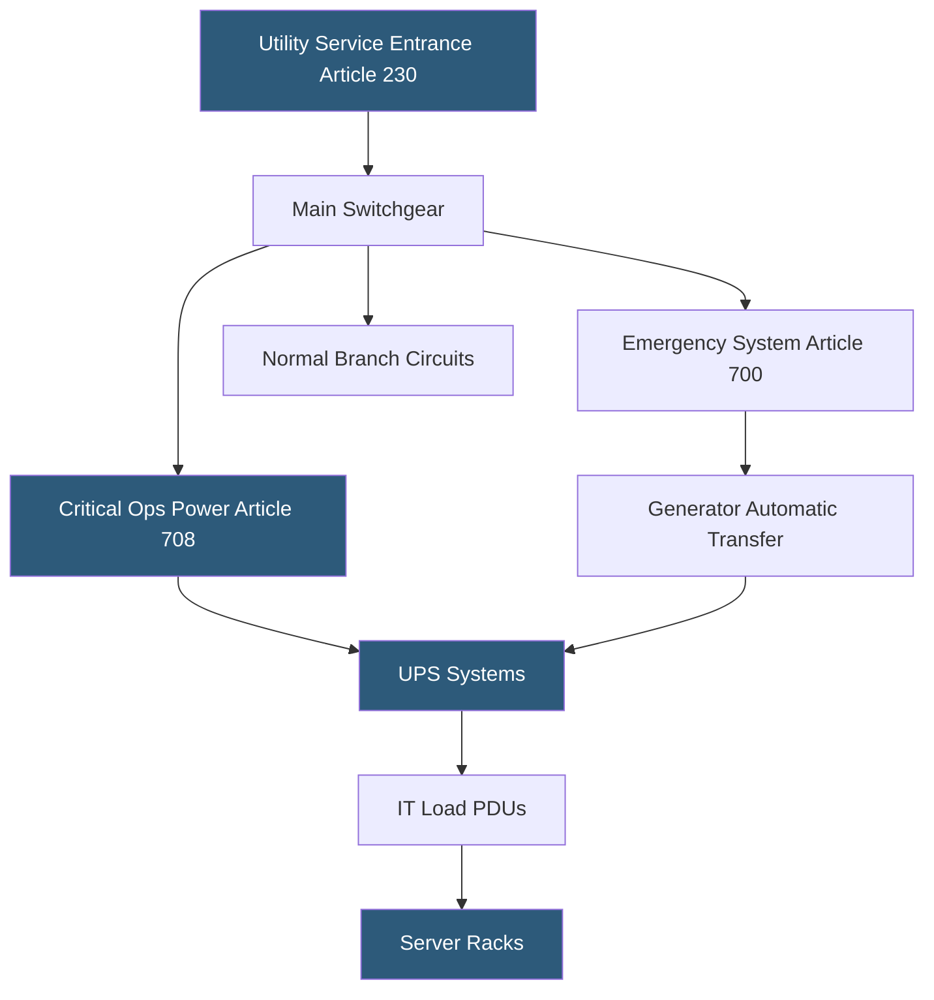

**Category:** Gigawatt Regulatory & Compliance
**Difficulty:** Advanced
**Reading time:** 7 min read

---

The National Electrical Code (NFPA 70 / NEC) is the foundational U.S. standard governing electrical installation safety in datacenters, covering conductor sizing, overcurrent protection, grounding, arc flash hazard analysis, and emergency power systems. Gigawatt-scale facilities involve complex electrical distributions that must comply with Articles 700, 701, and 708 for emergency, legally required standby, and critical operations power systems respectively. NEC compliance is enforced by the AHJ and directly impacts equipment procurement lead times and commissioning schedules.

- **NEC Article 708** — Governs Critical Operations Power Systems (COPS) for facilities that must remain energized during emergencies
- **Arc flash analysis** — Engineering study per NFPA 70E identifying incident energy at each switchgear location to specify PPE requirements
- **Grounding electrode system** — Network of conductors bonding electrical systems to earth to limit overvoltage
- **Equipment bonding** — Low-impedance connection between conductive parts to ensure fault current flows to protective devices
- **Short-circuit current rating (SCCR)** — Maximum fault current a device is rated to interrupt safely
- **Demand factor** — Ratio of maximum demand to connected load, used to size service entrance conductors
- **Separately derived system** — Electrical source with no direct connection to supply conductors (e.g., isolation transformer output)
- **NFPA 70E** — Standard for electrical safety in the workplace, specifying arc flash PPE categories and safe work practices

NEC compliance in a gigawatt-scale datacenter begins at the utility service entrance (Article 230), where metering, disconnecting means, and overcurrent protection must be coordinated. Switchgear rated for available fault current — often 85,000–100,000 amperes asymmetrical at high-voltage substations — must be properly labeled and maintained with current arc flash labels.

Article 708 (Critical Operations Power Systems) is the primary NEC reference for mission-critical facilities. It requires that COPS be designed to remain energized in declared emergencies, with documented load transfer times and fuel supply for a minimum number of operating hours. Generator sets must be sized to carry all COPS loads simultaneously, and automatic transfer switch (ATS) testing must be documented.

Conductor ampacity calculations per NEC Chapter 3 account for temperature correction factors, conduit fill, and continuous load derating (125% for loads operating more than 3 hours). In large datacenters, busway distribution is common at 480V, requiring compliance with Article 368, including adequate support intervals and expansion joint requirements for thermal movement.

Grounding and bonding (Article 250) is particularly complex when multiple separately derived systems — transformers, UPS output — interconnect. Each separately derived system requires its own grounding electrode conductor, and all systems must be bonded to a common grounding electrode system to prevent ground loops and transient overvoltages that damage sensitive IT equipment.

Arc flash studies must be updated whenever the electrical system changes. AHJs increasingly require arc flash labels as a condition of occupancy permits, and NFPA 70E mandates that labels be current within 5 years.

- Sizing service entrance conductors for a 100 MW campus with 80% demand factor
- Documenting Article 708 COPS compliance for a facility designated as critical infrastructure
- Coordinating arc flash studies across 15 medium-voltage switchgear lineups
- Designing grounding electrode systems for facilities with 50+ separately derived UPS systems
- Specifying switchgear SCCR for a 34.5 kV distribution system

| Advantage | Disadvantage |
|-----------|--------------|
| Article 708 COPS designation formalizes design requirements for mission-critical loads | COPS compliance documentation and testing add 3–6 months to commissioning schedule |
| Arc flash analysis reduces liability and worker injury risk | Arc flash studies must be repeated after any system modification |
| Standardized NEC requirements simplify permit submittal across jurisdictions | Local amendments can add requirements that invalidate standard designs |
| Continuous load derating (125%) ensures conductors do not overheat | Derating increases conductor sizes and associated material costs |

- [Building Code Compliance](building-code-compliance.md)
- [Fire Code Compliance (NFPA)](fire-code-compliance-nfpa.md)
- [OSHA Compliance](osha-compliance.md)

---
*Part of the [Gigawatt Regulatory & Compliance](index.md) category · [Back to Master Index](../../index.md)*
