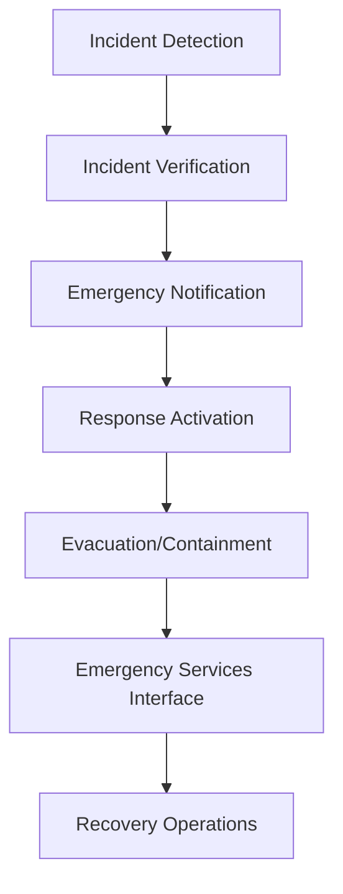

**Category:** Gigawatt Regulatory & Compliance
**Difficulty:** Intermediate
**Reading time:** 6 min read

---

Emergency response planning establishes documented procedures for rapid and effective reactions to crises including fires, electrical incidents, natural disasters, and hazardous material spills. For data centers, emergency planning ensures worker safety, business continuity, and regulatory compliance during critical events.

- **Emergency Action Plan (EAP)** — documented procedures for evacuation, shelter-in-place, and assigned responsibilities
- **Incident Command System (ICS)** — standardized organizational structure for managing emergency response
- **Evacuation Routes and Assembly Points** — designated escape paths and gathering locations for personnel accountability
- **Emergency Drills and Testing** — regular exercises to validate plan effectiveness and identify gaps
- **Communication Protocols** — systems for coordinating with emergency services, employees, and external stakeholders

Emergency response plans establish detection mechanisms (alarms, automated monitoring systems) to identify incidents quickly. Verification protocols confirm the incident type and severity before activating response procedures. Notification systems alert personnel through multiple channels (PA systems, mass messaging, sirens). The Incident Commander assumes authority to coordinate response activities following established hierarchy. Evacuation procedures direct personnel to assembly points via marked routes. Containment measures address specific hazards (electrical isolation, fire suppression, chemical containment). Coordination with fire departments, hazmat teams, and medical responders ensures professional assistance arrives with proper briefing. Recovery procedures address facility damage assessment, restoration of services, and resumption of operations.

- Fire emergency evacuation and suppression system activation
- Electrical incident response including circuit isolation and emergency shutdowns
- Severe weather response including storm surge, flooding, and high winds
- Hazardous material spills from cooling systems or backup generators
- Cyber-physical attacks requiring facility isolation and incident investigation

| Advantage | Disadvantage |
|-----------|--------------|
| Saves lives through rapid, coordinated response procedures | Plans require regular updates and testing consuming resources |
| Minimizes operational downtime through practiced recovery steps | Unexpected incident variations may render plans inadequate |
| Demonstrates regulatory compliance and preparedness | Planning and drills can disrupt normal operations |
| Reduces confusion and decisions during high-stress events | Psychological resistance to taking drills seriously |
| Protects facility assets and data through containment procedures | Over-rehearsed plans may become routine without urgency |

- [Spill Prevention Plans](spill-prevention-plans.md)
- [Storm Water Management](storm-water-management.md)
- [Occupational Health and Safety](occupational-health-and-safety.md)

---
*Part of the [Gigawatt Regulatory & Compliance](index.md) category · [Back to Master Index](../../index.md)*
