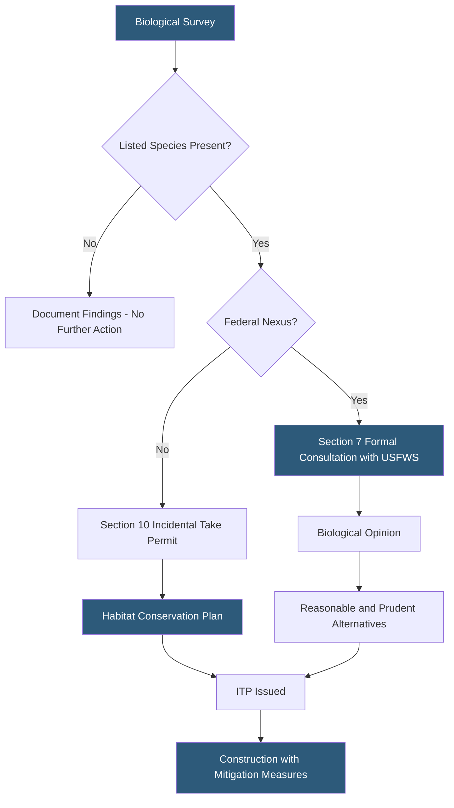

**Category:** Gigawatt Regulatory & Compliance
**Difficulty:** Intermediate
**Reading time:** 6 min read

---

The Endangered Species Act (ESA) Section 7 (for federal nexus projects) and Section 10 (for private projects) require biological assessment of potential impacts to listed species before gigawatt-scale datacenter development proceeds. A "take" of a listed species without authorization carries criminal penalties up to $50,000 per violation. Incidental Take Permits with Habitat Conservation Plans (HCPs) provide a legal mechanism for development while implementing mitigation measures.

- **ESA Section 7** — Requires federal agencies to consult with USFWS/NMFS when actions may affect listed species; applies when federal permits are involved
- **ESA Section 10** — Authorizes Incidental Take Permits (ITPs) for private parties when take cannot be avoided
- **Biological assessment (BA)** — Document prepared by project proponent evaluating effects on listed species; triggers formal consultation
- **Incidental take** — Take of a listed species that is incidental to, not the purpose of, an otherwise lawful activity
- **Habitat Conservation Plan (HCP)** — Mitigation plan accompanying an ITP specifying minimization and compensation measures
- **Critical habitat** — Areas essential to the conservation of a listed species designated by USFWS or NMFS
- **Migratory Bird Treaty Act (MBTA)** — Federal statute prohibiting unpermitted take of migratory birds, applicable to construction activities
- **Compensatory mitigation** — Restoration, enhancement, or preservation of habitat offsetting unavoidable impacts

ESA compliance begins with Phase I biological surveys during site selection — desktop assessments of listed species occurrence records within the project area. If potential habitat is present, protocol-level field surveys are conducted during appropriate seasons. For example, vernal pool fairy shrimp require surveys during wet years, while burrowing owls require breeding season surveys in spring.

When listed species are present and impacts cannot be avoided, the regulatory pathway depends on whether federal permits are involved (Section 7) or not (Section 10). Section 7 consultation with the U.S. Fish and Wildlife Service (USFWS) or National Marine Fisheries Service (NMFS) results in a Biological Opinion (BiOp) determining whether the action is likely to jeopardize the species' continued existence and establishing an Incidental Take Statement with reasonable and prudent measures.

Section 10 ITPs require developing an HCP that identifies impacts, minimization measures, and compensatory mitigation — typically habitat restoration or purchase of mitigation bank credits. HCPs for large projects may cover the entire campus footprint plus future expansion areas, providing "no surprises" assurance that future phases won't require additional mitigation if conditions are unchanged.

Construction timing restrictions are common mitigation measures. Grading during nesting seasons may be prohibited; pre-construction clearance surveys confirm absence before ground disturbance begins. Biological monitors may be required on site during initial grading to identify and relocate individuals.

- Conducting protocol-level surveys for California tiger salamander on a Central Valley site
- Preparing HCP covering 500-acre campus for red-legged frog avoidance and creek buffer
- Coordinating Section 7 consultation with USFWS for project requiring Army Corps 404 wetland permit
- Procuring mitigation bank credits to offset grassland habitat loss for burrowing owls
- Implementing construction timing windows to avoid California least tern nesting season

| Advantage | Disadvantage |
|-----------|--------------|
| HCP provides regulatory certainty for entire campus buildout | HCP development takes 12–36 months and requires agency negotiations |
| Early biological surveys identify fatal flaws before significant site investment | Protocol surveys must be conducted in specific seasons, extending pre-development timeline |
| Mitigation banking provides quantifiable, permanent offsets | Mitigation bank credits can cost $10,000–$100,000+ per acre depending on species |
| Section 7 consultation produces formal USFWS determination reducing litigation risk | Formal consultation can take 135+ days and may result in project redesign requirements |

- [Environmental Regulations](environmental-regulations.md)
- [Wetland Protection Compliance](wetland-protection-compliance.md)
- [Land Use Regulations](land-use-regulations.md)

---
*Part of the [Gigawatt Regulatory & Compliance](index.md) category · [Back to Master Index](../../index.md)*
