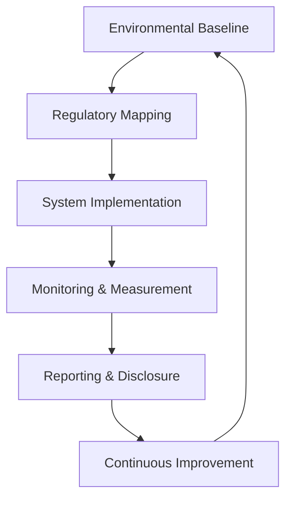

**Category:** Gigawatt Regulatory & Compliance
**Difficulty:** Intermediate
**Reading time:** 6 min read

---

Environmental Health and Safety (EHS) refers to integrated management systems addressing occupational safety, environmental protection, and public health impacts. In data center operations, EHS encompasses waste management, water usage, air quality, and hazardous material handling alongside traditional occupational safety.

- **Environmental Impact Assessment** — evaluation of facility effects on air, water, soil, and ecosystems
- **Hazardous Waste Management** — proper handling, storage, and disposal of chemical and electronic waste
- **Air Quality Compliance** — monitoring and control of emissions including refrigerant leaks and exhaust
- **Water Management** — conservation and treatment of cooling water and wastewater
- **Sustainability Metrics** — tracking environmental performance through PUE (Power Usage Effectiveness) and similar measures

EHS programs establish baseline environmental conditions through initial assessments of air emissions, water usage, waste generation, and energy consumption. Regulatory mapping identifies applicable federal (EPA, DOT), state, and local environmental requirements. Control systems address specific areas: refrigerant containment and leak detection, wastewater treatment, solid waste segregation and recycling, hazardous material containment with secondary containment, and air filter maintenance. Monitoring includes regular sampling and analysis of environmental indicators. Reporting fulfills regulatory disclosure obligations and tracks progress toward sustainability goals. Continuous improvement processes evaluate control effectiveness and implement enhancements.

- Refrigerant management and leak prevention in cooling systems
- Electronic waste (e-waste) recycling compliance for retired equipment
- Water conservation and stormwater management for cooling operations
- Air emissions monitoring for power generation and HVAC systems
- Chemical inventory and hazardous material storage compliance

| Advantage | Disadvantage |
|-----------|--------------|
| Reduces environmental liability and regulatory penalties | Infrastructure improvements require capital investment |
| Improves public perception and stakeholder relations | Ongoing monitoring and reporting add operational cost |
| Prevents environmental damage from facility operations | Some regulations have overlapping or conflicting requirements |
| Creates market differentiation through sustainability | Environmental compliance data may face public scrutiny |
| Supports corporate sustainability commitments | Data centers inherently have high environmental impact |

- [Storm Water Management](storm-water-management.md)
- [Air Emissions Reporting](air-emissions-reporting.md)
- [Spill Prevention Plans](spill-prevention-plans.md)

---
*Part of the [Gigawatt Regulatory & Compliance](index.md) category · [Back to Master Index](../../index.md)*
