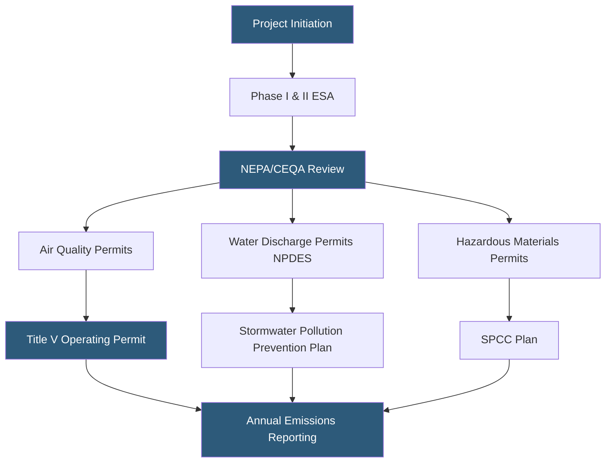

**Category:** Gigawatt Regulatory & Compliance
**Difficulty:** Intermediate
**Reading time:** 6 min read

---

Environmental regulations for gigawatt-scale datacenters span federal statutes including the Clean Air Act, Clean Water Act, and Resource Conservation and Recovery Act (RCRA), plus state-level equivalents and local ordinances. Compliance requires environmental impact assessments, pollution prevention plans, and ongoing monitoring and reporting to multiple agencies. Violations carry substantial fines and can halt operations, making proactive environmental management a business-critical function.

- **NEPA** — National Environmental Policy Act requiring federal agencies to assess environmental impacts before approving major actions
- **Clean Air Act Title V** — Major source operating permit required when air emissions exceed defined thresholds
- **NPDES permit** — National Pollutant Discharge Elimination System permit governing stormwater and process water discharges
- **RCRA** — Resource Conservation and Recovery Act governing generation, transport, and disposal of hazardous waste
- **Phase I ESA** — Environmental Site Assessment identifying recognized environmental conditions on a property
- **Phase II ESA** — Sampling and laboratory analysis confirming or characterizing contamination found in Phase I
- **Spill Prevention, Control, and Countermeasure (SPCC) Plan** — EPA-required plan for facilities with above-threshold petroleum storage
- **LEED/BREEAM** — Voluntary green building certification programs that demonstrate environmental performance above regulatory minimums

Environmental compliance for a gigawatt campus begins before a shovel breaks ground. Phase I ESA evaluates historical land uses and identifies potential contamination. If recognized environmental conditions are found, Phase II sampling determines the extent and cost of any required remediation — a factor that can materially affect site economics.

Air permitting is driven by diesel generator emissions. A campus with 200–300 MW of backup generation may operate hundreds of generator sets, each emitting NOx, PM2.5, and CO during testing and outages. In non-attainment areas for ozone or particulate matter, emissions may require offsets or Best Available Control Technology (BACT) installation such as selective catalytic reduction on generators. Title V major source permits require public comment periods and establish annual emission limits with quarterly monitoring.

Water compliance centers on stormwater management. NPDES construction general permits require a Stormwater Pollution Prevention Plan (SWPPP) during grading and construction. Post-construction, industrial stormwater permits may apply depending on outdoor material storage. Cooling tower blowdown — the water discharged when concentrated to control scale and corrosion — must meet local publicly owned treatment works (POTW) pretreatment standards before discharge to sewer.

Hazardous waste from battery bank replacements, refrigerant recovery, and transformer oil changes must be handled by licensed contractors and tracked through a manifest system. Facilities with large petroleum storage — diesel fuel for generators — must maintain SPCC plans with spill containment structures and documented inspection protocols.

- Securing a Title V air permit for a 500 MW campus with 250 MW of diesel backup generation
- Developing SWPPP documentation for a 200-acre greenfield construction project
- Managing RCRA hazardous waste from decommissioned UPS battery banks
- Conducting Phase I/II ESA prior to acquiring a former industrial site
- Preparing SPCC plan for 500,000-gallon diesel storage serving generator plant

| Advantage | Disadvantage |
|-----------|--------------|
| Proactive environmental compliance reduces regulatory enforcement risk | Air permitting in non-attainment areas can prohibit generator emissions beyond certain thresholds |
| SPCC planning protects against large fine exposure from petroleum spills | SPCC plan maintenance requires dedicated staff and annual drills |
| Phase I/II due diligence protects buyer from inherited remediation liability | Contaminated sites may require multi-year remediation delaying development |
| NPDES permit compliance demonstrates good corporate citizenship | Permit conditions impose ongoing monitoring and reporting costs |

- [Air Quality Permits](air-quality-permits.md)
- [Water Discharge Permits](water-discharge-permits.md)
- [Greenhouse Gas Reporting](greenhouse-gas-reporting.md)

---
*Part of the [Gigawatt Regulatory & Compliance](index.md) category · [Back to Master Index](../../index.md)*
