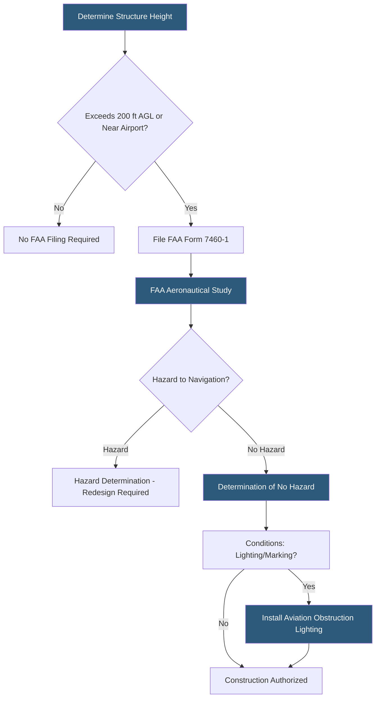

**Category:** Gigawatt Regulatory & Compliance
**Difficulty:** Beginner
**Reading time:** 5 min read

---

The Federal Aviation Administration (FAA) requires notice and aeronautical study for structures exceeding defined height thresholds near airports and navigational aids. For gigawatt-scale datacenters with tall cooling towers, generator stacks, or communication antennas, FAA Form 7460-1 filings are required, and the agency may issue hazard determinations requiring obstruction lighting or marking. Compliance protects airspace safety and is a prerequisite for building permit issuance in many jurisdictions.

- **FAA Form 7460-1** — Notice of Proposed Construction submitted to FAA for structures potentially affecting navigable airspace
- **Obstruction standard** — FAA defines structures as obstructions if they exceed 200 feet AGL or penetrate airport approach surfaces
- **Aeronautical study** — FAA evaluation of whether a proposed structure adversely affects safe and efficient use of navigable airspace
- **Hazard determination** — FAA finding that a structure constitutes a hazard to air navigation
- **No Hazard determination** — FAA finding that a structure does not constitute a hazard, often with conditions (marking/lighting)
- **Obstruction lighting** — Red or white aviation warning lights required on structures that may affect air navigation
- **Imaginary surfaces** — FAA-defined planes around airports (approach, transitional, horizontal, conical) that structures must not penetrate
- **Determination of No Hazard (DNH)** — Official FAA notification that a proposed structure is not a hazard, valid for 18 months

FAA review is triggered when a proposed structure exceeds 200 feet above ground level (AGL) or is located within specific proximity to an airport (within 20,000 feet for structures over 100 feet AGL, or within airport imaginary surfaces). Cooling towers, flue stacks, and communication towers at gigawatt campuses commonly trigger filing requirements.

Form 7460-1 is submitted electronically through the FAA's OE/AAA system. The filing initiates an aeronautical study that evaluates effects on instrument approach procedures, en route low-altitude airways, military training routes, and visual flight paths. Studies typically take 45–90 days.

A No Hazard determination may include conditions — typically, medium-intensity red obstruction lighting on the highest structure, with lower structures lit if they share the same campus. FAA Advisory Circular 70/7460-1L prescribes lighting types: red flashing (L-810), medium-intensity white strobe (L-865), or high-intensity white strobe (L-856) depending on structure height and location.

Campus locations within airport influence zones require coordination with airport authorities in addition to FAA filings. Some military airspace requirements impose stricter limits on structure heights along instrument approach corridors.

DNH determinations expire after 18 months if construction has not started. Extensions must be filed before expiration.

- Filing Form 7460-1 for a 180-foot cooling tower at a campus 4 miles from a regional airport
- Coordinating with FAA to minimize obstruction lighting conditions through structure height reduction
- Obtaining DNH for antenna structures on a datacenter rooftop
- Validating that proposed structures clear imaginary surfaces for a campus within airport influence zone
- Managing DNH renewal when construction phase is delayed beyond 18-month window

| Advantage | Disadvantage |
|-----------|--------------|
| FAA review is relatively streamlined for structures that clearly avoid hazard thresholds | Structures near airports or above 200 feet AGL face 45–90 day review delays |
| No Hazard with lighting condition provides construction authorization | Obstruction lighting installation and maintenance adds ongoing capital cost |
| Early filing identifies potential hazard issues before design is finalized | Hazard determinations can require significant height reductions affecting cooling system design |
| Online 7460-1 system provides status tracking and automatic notifications | System does not update in real time; telephone follow-up often required to expedite |

- [Building Code Compliance](building-code-compliance.md)
- [Historical Preservation Requirements](historical-preservation-requirements.md)
- [Telecommunications Licensing](telecommunications-licensing.md)

---
*Part of the [Gigawatt Regulatory & Compliance](index.md) category · [Back to Master Index](../../index.md)*
