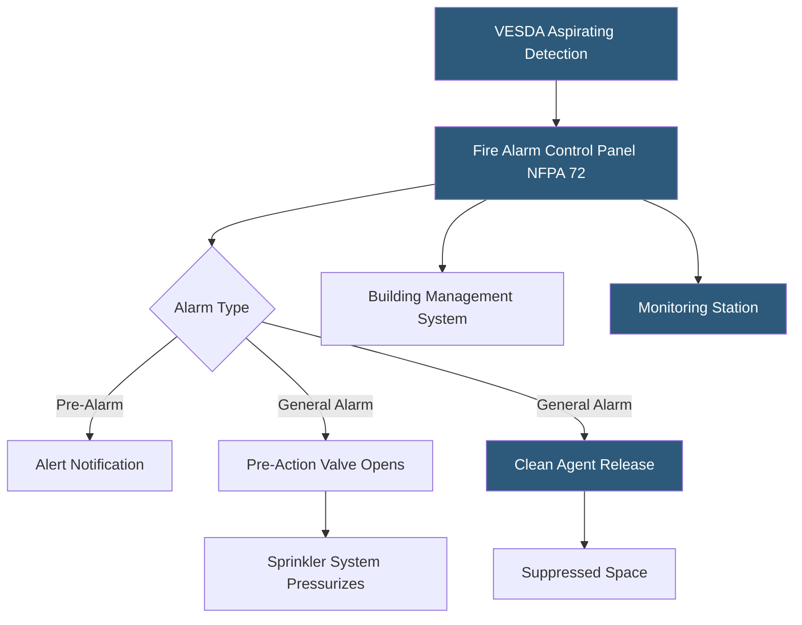

**Category:** Gigawatt Regulatory & Compliance
**Difficulty:** Intermediate
**Reading time:** 6 min read

---

NFPA standards — particularly NFPA 1 (Fire Code), NFPA 13 (Sprinkler Systems), NFPA 72 (Fire Alarm), NFPA 75 (IT Equipment), and NFPA 2001 (Clean Agent Systems) — establish fire protection requirements for gigawatt-scale datacenters. Compliance involves selecting appropriate suppression systems for server environments, designing early warning detection, and conducting functional acceptance testing with fire marshals. Failure to achieve fire code approval can delay certificate of occupancy and commissioning.

- **NFPA 75** — Standard for protection of information technology equipment, covering detection, suppression, and housekeeping
- **NFPA 2001** — Standard on Clean Agent Fire Extinguishing Systems, governing inert gas and chemical agent suppression
- **VESDA (Very Early Smoke Detection Apparatus)** — Aspirating smoke detection providing faster response than conventional detectors
- **Pre-action sprinkler system** — Dry-pipe system requiring two triggers before water releases, reducing accidental discharge risk
- **Total flooding** — Suppression approach that discharges agent throughout an enclosed volume to achieve uniform concentration
- **Abort station** — Manual device that delays or cancels agent discharge when actuation is accidental
- **Notified body** — Third-party organization that verifies compliance with NFPA standards on behalf of the AHJ
- **Seismic bracing** — Support system for sprinkler piping per NFPA 13 Chapter 9 to prevent failure during seismic events

NFPA 75 is the primary reference standard for IT equipment fire protection. It requires that datacenters with more than 0.093 square meters of IT equipment use automatic suppression systems and that subfloor and overhead spaces be independently protected. The standard distinguishes between equipment rooms and operations areas, applying different detection sensitivity requirements to each.

For raised-floor data halls, VESDA systems sample air continuously from underfloor and overhead spaces, detecting combustion products at concentrations 100–1,000 times lower than conventional spot detectors. This early warning enables orderly shutdown of equipment before a suppression system activates, preventing water or agent damage.

Pre-action sprinkler systems are standard in server halls. Single-interlock systems require only detector activation to open the pre-action valve; double-interlock systems require both detector activation and sprinkler head operation, virtually eliminating accidental discharge from mechanical sprinkler damage alone. NFPA 13 governs pipe sizing, hanger spacing, and seismic bracing.

Clean agent systems per NFPA 2001 use inert gases (IG-541, IG-55) or chemical agents (FK-5-1-12) that extinguish fire without leaving residue on IT equipment. Design concentration must be verified through computational fluid dynamics (CFD) modeling, and total flooding requires the space to be sealed before discharge. Abort stations and time-delay controls are mandatory.

Fire marshal acceptance testing involves witnessing all system functions — alarm sequences, discharge simulations (without agent), fan shutdown, and damper closure — before issuing final occupancy approval.

- Selecting between pre-action sprinkler and clean agent suppression for a Tier IV data hall
- Designing VESDA coverage patterns for an 80,000 square foot raised-floor environment
- Preparing for fire marshal functional acceptance testing and documentation packages
- Seismically bracing sprinkler systems in Zone 4 installations per NFPA 13 Chapter 9
- Coordinating NFPA 2001 agent room design with HVAC pressurization to ensure retention

| Advantage | Disadvantage |
|-----------|--------------|
| VESDA provides extremely early warning, enabling pre-suppression intervention | VESDA systems require frequent filter maintenance and calibration |
| Double-interlock pre-action systems virtually eliminate accidental water discharge | Greater complexity compared to wet-pipe systems increases maintenance burden |
| Clean agent systems extinguish fires without equipment damage | Clean agents are expensive and require recertification after partial discharge |
| NFPA 75 provides clear compliance checklist accepted by most AHJs | Standard updates every 3 years; systems designed to older editions may require upgrades |

- [Building Code Compliance](building-code-compliance.md)
- [Electrical Code Requirements (NEC)](electrical-code-requirements-nec.md)
- [Emergency Response Planning](emergency-response-planning.md)

---
*Part of the [Gigawatt Regulatory & Compliance](index.md) category · [Back to Master Index](../../index.md)*
