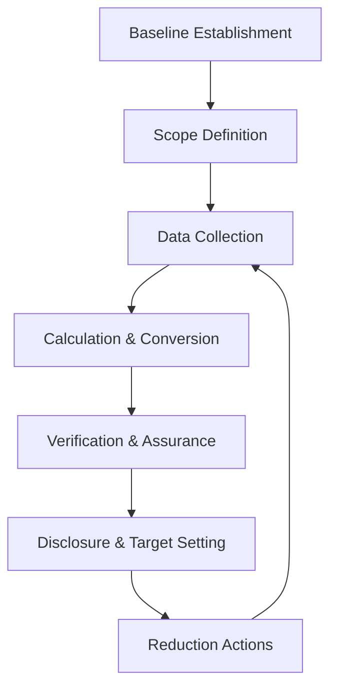

**Category:** Gigawatt Regulatory & Compliance
**Difficulty:** Intermediate
**Reading time:** 6 min read

---

Greenhouse gas (GHG) reporting involves quantifying and disclosing carbon dioxide, methane, and other heat-trapping gases emitted from data center operations. Both regulatory mandates and voluntary corporate commitments drive GHG tracking, enabling facilities to monitor climate impact and demonstrate decarbonization progress.

- **Scope 1 Emissions** — direct GHG emissions from sources owned or controlled by the facility (generators, refrigerants)
- **Scope 2 Emissions** — indirect emissions from purchased electricity generation by external utilities
- **Scope 3 Emissions** — value chain emissions from suppliers, business travel, and product usage
- **Carbon Equivalency** — expression of all GHGs in CO2 equivalent units using global warming potential factors
- **Reduction Targets** — science-based commitments to decrease emissions by specific percentages within defined timeframes

GHG reporting programs establish baseline emissions for comparison and progress tracking. Organizational boundaries are defined—which facilities and activities to include. Data collection captures fuel consumption, electricity usage, refrigerant quantities, and travel-related activity. Calculations apply emission factors converting activity units into CO2 equivalent tons. Scope 1 calculations multiply fuel consumption by combustion emission factors. Scope 2 multiplies electricity purchased by grid carbon intensity (kg CO2/MWh). Quality assurance reviews ensure accuracy and consistency. Third-party verification adds credibility for stakeholder disclosure. Facilities set science-based reduction targets aligned with climate pathways (1.5°C warming limit). Reduction strategies focus on renewable energy procurement, operational efficiency, and equipment upgrades. Progress is tracked and publicly disclosed through corporate reports or sustainability platforms.

- Renewable energy procurement tracking to reduce Scope 2 emissions
- Backup generator efficiency improvements to lower Scope 1 combustion emissions
- Refrigerant management and leak prevention reducing direct emissions
- Data center efficiency (PUE) improvements lowering electricity consumption
- Science-based target validation and Net Zero commitments

| Advantage | Disadvantage |
|-----------|--------------|
| Quantifies climate impact enabling credible reduction strategies | Methodologies evolve requiring frequent methodology updates |
| Enables corporate decarbonization commitments and Net Zero targets | Scope 3 emissions difficult to calculate and verify |
| Creates stakeholder transparency and ESG accountability | Renewable energy procurement premium costs |
| Identifies high-impact reduction opportunities for investment | Legacy equipment remediation requires capital expenditure |
| Aligns facility operations with climate science | Moving targets from evolving climate science standards |

- [Air Emissions Reporting](air-emissions-reporting.md)
- [Environmental Health and Safety](environmental-health-and-safety.md)
- [Sustainability Metrics](../../index.md)

---
*Part of the [Gigawatt Regulatory & Compliance](index.md) category · [Back to Master Index](../../index.md)*
