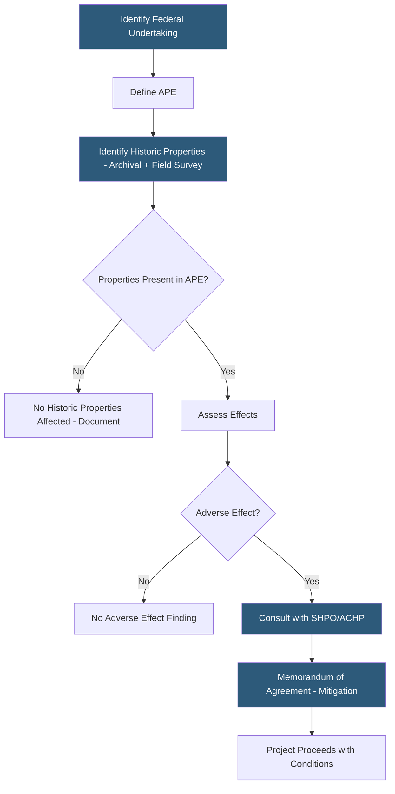

**Category:** Gigawatt Regulatory & Compliance
**Difficulty:** Beginner
**Reading time:** 5 min read

---

Section 106 of the National Historic Preservation Act (NHPA) requires federal agencies to consider effects on historic properties before approving projects with a federal nexus. For gigawatt-scale datacenters, federal permits (such as Army Corps 404 or FAA determinations) trigger Section 106 consultation with the State Historic Preservation Officer (SHPO) and potentially the Advisory Council on Historic Preservation (ACHP). Demolition or alteration of listed properties without authorization carries civil penalties and can trigger public opposition.

- **National Register of Historic Places (NRHP)** — Federal listing of districts, sites, buildings, and objects significant in American history, architecture, or culture
- **Section 106** — NHPA provision requiring federal agencies to consider effects on historic properties before taking undertakings
- **Area of Potential Effect (APE)** — Geographic area where the project may cause changes to historic properties
- **State Historic Preservation Officer (SHPO)** — State official who reviews Section 106 consultations and maintains state historic inventories
- **Adverse effect** — Finding that a project will diminish characteristics qualifying a property for NRHP listing
- **Memorandum of Agreement (MOA)** — Binding agreement between federal agency, SHPO, and project proponent outlining mitigation measures
- **Archaeological survey** — Field investigation to identify buried cultural resources within the APE
- **Section 4(f)** — U.S. DOT provision protecting historic properties from transportation projects; relevant for road access permits

Section 106 consultation is triggered by any federal undertaking that may affect historic properties. For datacenters, the most common triggers are Army Corps Section 404 wetland permits, FAA obstruction evaluations, and FCC telecommunications licensing. The lead federal agency — not the project proponent — is responsible for Section 106, though proponents typically manage the process on behalf of the agency.

The first step is defining the Area of Potential Effect, which encompasses the project footprint plus areas where visual, auditory, or atmospheric effects could alter the character of historic properties. An archival records search and field survey within the APE identify previously listed and potentially eligible properties including buildings, structures, archaeological sites, and cultural landscapes.

Archaeological surveys are required in undisturbed areas within the APE. Phase I pedestrian surveys and shovel tests identify surface and subsurface indicators of prehistoric and historic occupation. Phase II testing evaluates significance, and Phase III data recovery mitigates adverse effects by recovering information before site destruction.

Where historic properties are present and effects are adverse, SHPO consultation leads to an MOA specifying mitigation — documentation, physical relocation, design modifications, or interpretive programs. MOAs are binding and must be implemented before federal permits are finalized.

State and local historic preservation ordinances may impose parallel requirements independent of Section 106.

- Conducting Phase I archaeological survey on a former agricultural site in the Virginia Piedmont
- Negotiating MOA with SHPO for demolition of eligible farm structure within campus footprint
- Documenting visual effects on a National Register Historic District 0.5 miles from proposed campus
- Satisfying Section 106 consultation triggered by Army Corps 404 individual permit
- Assessing significance of industrial-era foundations discovered during construction grading

| Advantage | Disadvantage |
|-----------|--------------|
| Section 106 MOA provides regulatory certainty once signed | Archival and field surveys add 3–6 months to pre-development timeline |
| Early identification of archaeological resources avoids construction stoppage | Unexpected Phase III data recovery can cost $500,000–$2M and delay construction months |
| Documentation mitigation preserves historical record without stopping project | Visual effect consultations for historic districts can require redesign of building facades |
| Experienced cultural resources consultants expedite SHPO review | SHPO response times vary widely; some states take 90+ days per consultation round |

- [Environmental Regulations](environmental-regulations.md)
- [Land Use Regulations](land-use-regulations.md)
- [FAA Height Restrictions](faa-height-restrictions.md)

---
*Part of the [Gigawatt Regulatory & Compliance](index.md) category · [Back to Master Index](../../index.md)*
