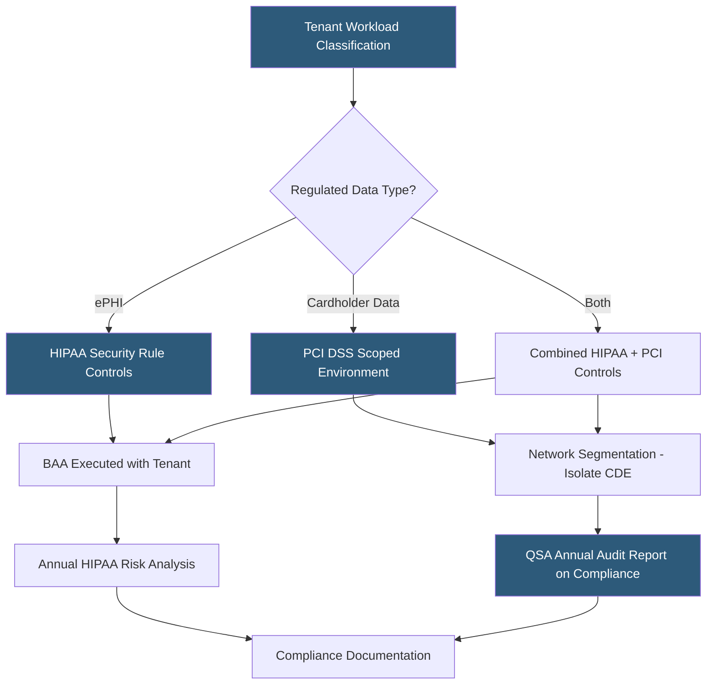

**Category:** Gigawatt Regulatory & Compliance
**Difficulty:** Advanced
**Reading time:** 7 min read

---

Industry-specific regulations such as HIPAA (Health Insurance Portability and Accountability Act) for healthcare data and PCI DSS (Payment Card Industry Data Security Standard) for cardholder data impose specific security and compliance requirements on datacenters hosting regulated workloads. These frameworks require Business Associate Agreements, dedicated infrastructure controls, penetration testing, and independent audits. Non-compliance with PCI DSS can result in card brand fines of $5,000–$100,000 per month and loss of payment processing privileges.

- **HIPAA Security Rule** — Federal regulation establishing administrative, physical, and technical safeguards for electronic protected health information (ePHI)
- **Business Associate Agreement (BAA)** — Contract between a covered entity and a business associate (e.g., datacenter operator) specifying ePHI handling obligations
- **PCI DSS** — Global standard maintained by the PCI Security Standards Council governing protection of cardholder data environments
- **Cardholder Data Environment (CDE)** — Systems and networks that store, process, or transmit cardholder data; subject to full PCI DSS requirements
- **SAQ (Self-Assessment Questionnaire)** — PCI DSS compliance self-assessment form for qualifying merchants; large datacenters typically require QSA audit
- **QSA (Qualified Security Assessor)** — PCI Security Standards Council-certified auditor who validates compliance for Level 1 service providers
- **Scope reduction** — Architecture strategy minimizing the number of systems in scope for PCI DSS to reduce compliance burden
- **HITRUST** — Certification framework that consolidates multiple regulatory standards including HIPAA, PCI, NIST, and ISO 27001

HIPAA applies to covered entities (healthcare providers, insurers, clearinghouses) and their business associates — a category that encompasses datacenters hosting ePHI. The Security Rule requires risk analysis to identify threats to ePHI confidentiality, integrity, and availability; risk management to implement identified safeguards; and documentation of all policies and procedures. Physical safeguards include facility access controls, workstation use policies, and device and media controls — requirements that map directly to datacenter access control and asset management practices.

BAAs define the scope of permitted ePHI uses, reporting obligations for breaches, and the disposition of ePHI at contract termination. HIPAA's Breach Notification Rule requires notification of affected individuals within 60 days of discovering a breach affecting ePHI, and notification of HHS for breaches affecting 500 or more individuals must be provided within 60 days and published on HHS's "Wall of Shame" website.

PCI DSS (currently version 4.0) applies to any system storing, processing, or transmitting cardholder data. Datacenter operators hosting payment environments are Level 1 service providers — the highest compliance tier — required to undergo annual on-site assessments by a QSA and quarterly network scans by an Approved Scanning Vendor (ASV). The 12 PCI DSS requirements span network security, access control, vulnerability management, encryption, monitoring, and information security policies.

Scope reduction is the most impactful strategy for managing PCI compliance cost and complexity. Network segmentation using firewalls or micro-segmentation to isolate the CDE from non-CDE systems can dramatically reduce the number of systems requiring full assessment. Point-to-point encryption (P2PE) at card terminals removes payment card data from merchant systems entirely, reducing scope to near zero.

HITRUST certification offers an integrated approach, mapping controls to HIPAA, PCI DSS, NIST, SOC 2, and ISO 27001 simultaneously, reducing audit fatigue for operators hosting multiple regulated workload types.

- Executing HIPAA BAAs for 200 healthcare SaaS customers hosted in a compliant environment
- Deploying network segmentation to isolate PCI CDE within a multi-tenant facility
- Preparing evidence package for PCI DSS QSA annual on-site assessment
- Conducting annual HIPAA Security Rule risk analysis and updating risk management plan
- Pursuing HITRUST r2 certification to satisfy multiple customer compliance requirements simultaneously

| Advantage | Disadvantage |
|-----------|--------------|
| HIPAA-compliant hosting enables high-value healthcare market segment | BAA obligations require breach detection and 60-day notification workflows |
| PCI DSS scope reduction through segmentation reduces compliance burden | Proper segmentation requires dedicated networking infrastructure and ongoing validation |
| QSA audit produces Report on Compliance (ROC) accepted by all card brands | Level 1 QSA assessments cost $50,000–$200,000+ annually |
| HITRUST certification covers multiple frameworks simultaneously | HITRUST r2 certification requires 18+ months and significant upfront investment |

- [Privacy Law Compliance (GDPR, CCPA)](privacy-law-compliance-gdpr-ccpa.md)
- [Data Residency Regulations](data-residency-regulations.md)
- [Cybersecurity Requirements](cybersecurity-requirements.md)

---
*Part of the [Gigawatt Regulatory & Compliance](index.md) category · [Back to Master Index](../../index.md)*
