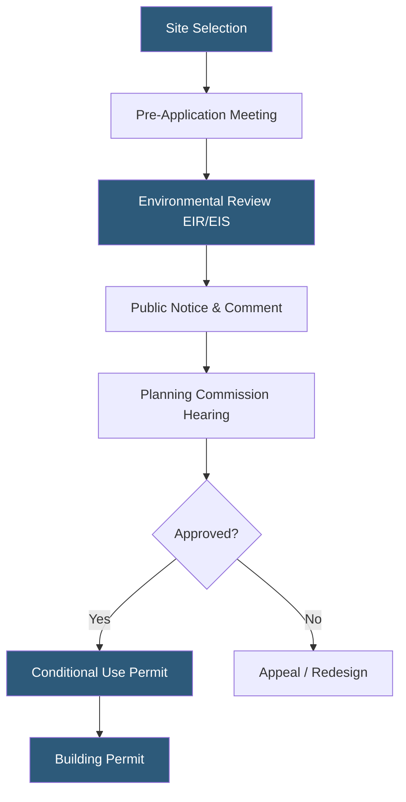

**Category:** Gigawatt Regulatory & Compliance
**Difficulty:** Intermediate
**Reading time:** 6 min read

---

Land use regulations govern where and how gigawatt-scale datacenter campuses can be built, dictating zoning classifications, setback requirements, and permissible site activities. Securing appropriate zoning entitlements is often the longest lead-time item in a hyperscale datacenter development. Early engagement with local planning authorities and community stakeholders is essential to navigate these constraints.

- **Zoning entitlement** — Official approval that classifies a parcel for a specific use such as heavy industrial or technology campus
- **Setback requirement** — Minimum distance between a structure and property boundary, road, or sensitive receptor
- **Conditional use permit (CUP)** — Permission to operate a use not automatically allowed in a zone, subject to conditions
- **Environmental impact report (EIR/EIS)** — Formal assessment of a project's effects on the surrounding environment required under CEQA or NEPA
- **Variance** — Deviation from standard zoning rules granted when strict application causes hardship
- **Rezoning** — Legislative action changing the designated classification of a parcel
- **Development agreement** — Contractual arrangement between a developer and jurisdiction locking in entitlement conditions
- **CEQA/NEPA** — California Environmental Quality Act and National Environmental Policy Act; state and federal environmental review frameworks

Land use regulations for gigawatt-scale facilities operate across multiple governmental layers simultaneously. At the state level, environmental review laws such as CEQA in California or NEPA federally require project proponents to identify and mitigate significant impacts on traffic, air quality, water, and noise before approvals are granted. This process routinely takes 12–36 months for large campuses.

At the local level, planning departments evaluate whether the proposed use conforms to the general plan — the municipality's long-range land use blueprint. Datacenters, classified as heavy technology or light industrial, must be sited in compatible zones. Where the general plan does not contemplate the use, a general plan amendment and concurrent rezoning must proceed, both requiring elected council votes and extended public engagement.

Setback requirements protect neighboring land uses. Industrial sites typically demand 50–200 foot setbacks from residential zones, sometimes forcing facility layouts to shrink usable footprint substantially. Developers negotiate development agreements that may include community benefits — road improvements, local hiring commitments, or utility upgrades — in exchange for entitlement certainty.

Post-entitlement, building permits require architectural, structural, mechanical, and electrical plan reviews. Phased projects must re-enter the permit process for each subsequent phase, though a master environmental impact report can cover the entire campus footprint and reduce future review cycles.

- Selecting a greenfield site in a rural county with favorable industrial zoning
- Seeking a variance to build closer to a property line to maximize site density
- Negotiating a development agreement with infrastructure-for-entitlement trade-offs
- Managing CEQA review for a campus expansion adding 200 MW of load
- Converting a brownfield industrial site requiring environmental remediation before datacenter use

| Advantage | Disadvantage |
|-----------|--------------|
| Development agreements provide entitlement certainty across political cycles | Rezoning and EIR processes can add 2–4 years to project timelines |
| Pre-zoned industrial land eliminates legislative approval steps | Industrial-zoned land near power infrastructure is increasingly scarce |
| Community benefit packages build local support and reduce opposition | Benefit obligations increase capital costs and ongoing operating commitments |
| Master EIR covers full campus, reducing future review cycles | Master EIR scope must anticipate all future phases, limiting flexibility |

- [Building Code Compliance](building-code-compliance.md)
- [Environmental Regulations](environmental-regulations.md)
- [Data Sovereignty Requirements](data-sovereignty-requirements.md)

---
*Part of the [Gigawatt Regulatory & Compliance](index.md) category · [Back to Master Index](../../index.md)*
