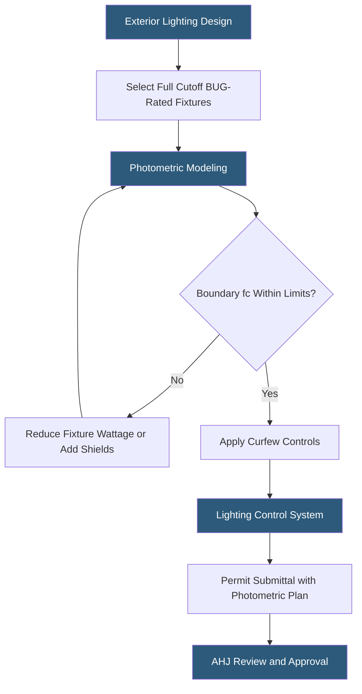

**Category:** Gigawatt Regulatory & Compliance
**Difficulty:** Beginner
**Reading time:** 5 min read

---

Light pollution regulations restrict the intensity, direction, and color of exterior lighting from gigawatt-scale campuses to protect neighboring residential areas, wildlife habitats, and astronomical observatories. Compliance typically requires full cutoff fixtures, maximum foot-candle levels at property boundaries, and curfew hours for non-security lighting. These requirements are enforced through conditional use permits and building code provisions.

- **Full cutoff fixture** — Light fixture that emits zero lumens above the horizontal plane, directing all light downward
- **Foot-candle** — Unit of illuminance equal to one lumen per square foot; typical ordinances limit boundary illuminance to 0.1–1.0 fc
- **Backlight-Uplight-Glare (BUG) rating** — IES classification system rating fixture performance in three directions
- **Dark-sky compliance** — Designation from the International Dark-Sky Association for lighting meeting strict limits on upward light emission
- **Light trespass** — Illumination falling beyond property boundaries onto neighboring land
- **Skyglow** — Brightening of the night sky over populated areas from reflected and scattered artificial light
- **Curfew hour** — Time after which non-essential lighting must be reduced or extinguished per local ordinance
- **Correlated Color Temperature (CCT)** — Spectral character of light; warm white (2700–3000K) is less harmful to wildlife and sky quality than cool white (5000K+)

Light pollution compliance is governed at the local level through zoning ordinances, dark-sky overlay zones, or conditions attached to use permits. Facilities near residential areas face the most stringent limits; campus boundaries adjacent to residences are often limited to 0.1–0.5 foot-candles of illuminance from facility-generated light.

Photometric planning begins by modeling the proposed lighting layout using IES files (photometric data) from fixture manufacturers. Software such as AGi32 or DIALux calculates illuminance at property lines and identifies fixtures requiring adjustment. Full cutoff (BUG rating of U0) fixtures prevent upward light emission; optical shields further control side spill where boundary setbacks are tight.

Security lighting requirements — often mandated by the same use permit that limits light pollution — create a tension between safety and neighbor impact. Programmable dimming systems that reduce fixture output to 20–30% during off-peak hours satisfy both needs: maintaining adequate security illuminance while reducing nighttime light trespass. Motion-activated lighting in low-traffic areas reduces average illuminance further.

Color temperature selection matters for facilities near sensitive wildlife habitats or dark-sky preserves. Warm white LEDs (2700–3000K) emit less blue-spectrum light, which scatters more in the atmosphere and is more disruptive to nocturnal species. Some jurisdictions prohibit fixtures above 3000K within defined buffer zones.

Photometric plans are submitted with building permit applications and reviewed for ordinance compliance before permits are issued. Post-installation verification measurements may be required.

- Designing perimeter lighting at a rural campus adjacent to a dark-sky observatory buffer zone
- Meeting foot-candle limits at residential property boundaries while satisfying security requirements
- Programming dimming schedules to reduce off-hours light trespass below 0.1 fc at boundary
- Selecting 2700K fixtures for a campus near a wildlife corridor
- Submitting photometric plans for AHJ review as part of conditional use permit compliance

| Advantage | Disadvantage |
|-----------|--------------|
| Full cutoff fixtures reduce glare for workers on site while limiting trespass | Downward-only lighting may reduce perceived safety in parking areas |
| LED dimming systems reduce energy costs and light pollution simultaneously | Advanced dimming controls add upfront cost and require commissioning |
| Dark-sky compliance builds goodwill with neighboring communities | Strict limits may require expensive shielded fixtures not available from all vendors |
| Warm-white LED selection reduces ecological impact | 2700K LEDs have slightly lower efficacy (lumens/watt) than 4000K+ alternatives |

- [Noise Ordinance Compliance](noise-ordinance-compliance.md)
- [Environmental Regulations](environmental-regulations.md)
- [Land Use Regulations](land-use-regulations.md)

---
*Part of the [Gigawatt Regulatory & Compliance](index.md) category · [Back to Master Index](../../index.md)*
