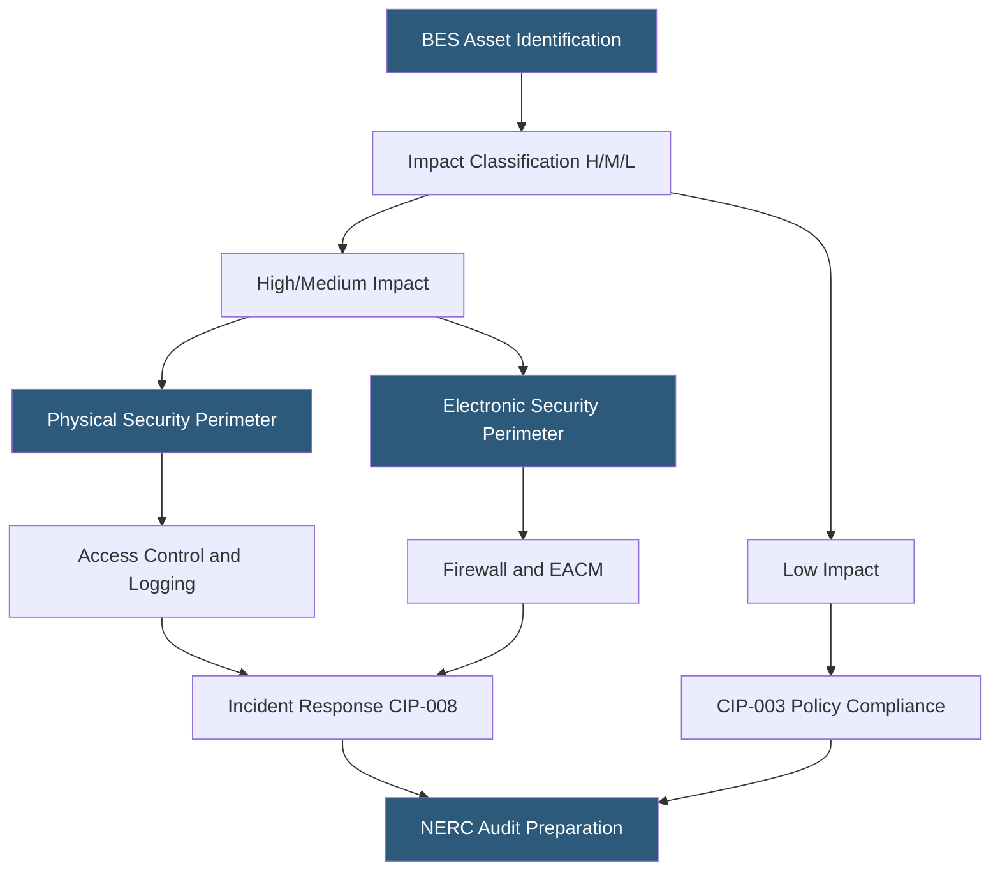

**Category:** Gigawatt Regulatory & Compliance
**Difficulty:** Advanced
**Reading time:** 7 min read

---

NERC CIP (North American Electric Reliability Corporation Critical Infrastructure Protection) standards apply to bulk electric system (BES) assets and, increasingly, to large datacenter operators whose facilities contain High or Medium impact BES Cyber Systems. The standards mandate physical security perimeters, electronic security perimeters, incident reporting, and configuration management for covered systems. Non-compliance fines reach $1 million per violation per day, making NERC CIP one of the most financially consequential compliance regimes for grid-connected gigawatt facilities.

- **BES Cyber System (BCS)** — Group of BES Cyber Assets that perform reliability tasks; classified as High, Medium, or Low impact
- **Electronic Security Perimeter (ESP)** — Logical boundary around cyber assets connected to BES through external routable connectivity
- **Physical Security Perimeter (PSP)** — Physical boundary protecting High and Medium impact BES Cyber Systems
- **Electronic Access Control and Monitoring (EACM)** — Systems enforcing electronic access to ESP and monitoring for unauthorized access
- **NERC CIP-013** — Standard governing supply chain risk management for BES Cyber Systems
- **CIP-014** — Physical security planning standard for Transmission Stations and Substations
- **CIP-003** — Standard governing cybersecurity policies for Low impact BES Cyber Assets
- **TFE (Technical Feasibility Exception)** — NERC process for documenting inability to implement a specific CIP requirement due to technical constraints

NERC CIP applicability to a gigawatt datacenter depends on whether the facility owns or operates BES Cyber Systems. Datacenters that host utility operator control centers, energy management systems, or substation automation meet this threshold. The large on-site substations at gigawatt campuses — which receive power at 115 kV to 500 kV from the transmission system — may themselves be subject to CIP-014 physical security planning if they exceed the defined impact threshold.

High impact BES Cyber Systems require the most comprehensive controls: defined Physical Security Perimeters (typically a caged or walled area with access logging), Electronic Security Perimeters limiting electronic access to only authorized connections, multi-factor authentication for Interactive Remote Access, and security patch management processes. All personnel with access to High impact areas must complete background investigations.

CIP-013 supply chain risk management is one of the most challenging standards for large operators. It requires documented processes for evaluating cybersecurity risks from vendors, software, and hardware entering BES Cyber System supply chains — including software integrity verification, vendor remote access controls, and vendor incident reporting requirements. Compliance requires working with vendors to obtain required documentation and attestations.

Evidence management is the operational backbone of NERC CIP compliance. Every control requires documented evidence of implementation: access logs, configuration baselines, patch management records, and training completion records. Evidence must be retained for 3 years (some standards require longer) and must be producible within days during a NERC or regional entity audit. Compliance management platforms specifically designed for NERC CIP automate evidence collection and audit preparation.

- Identifying BES Cyber System components in a campus substation and classifying impact levels
- Implementing Electronic Security Perimeters around campus energy management systems
- Developing CIP-013 supply chain risk management procedures for substation equipment vendors
- Managing NERC CIP evidence repository to support regional entity audits
- Submitting technical feasibility exception for legacy control system that cannot meet CIP-007 patch requirements

| Advantage | Disadvantage |
|-----------|--------------|
| Strong CIP compliance program demonstrates grid reliability stewardship | NERC CIP audit preparation requires dedicated compliance staff and management platform |
| PSP and ESP controls align with physical and cybersecurity best practices beyond compliance | Specific CIP requirements (e.g., 35-day patch windows) may not align with operational patching cycles |
| CIP-013 supply chain requirements drive rigorous vendor management | Vendor compliance documentation requirements create friction with smaller specialized vendors |
| NERC CIP certification improves standing with utility partners and regulators | Violations discovered during audits carry fines up to $1M/day/violation |

- [Critical Infrastructure Protection](critical-infrastructure-protection.md)
- [Cybersecurity Requirements](cybersecurity-requirements.md)
- [Physical Security Standards](physical-security-standards.md)

---
*Part of the [Gigawatt Regulatory & Compliance](index.md) category · [Back to Master Index](../../index.md)*
