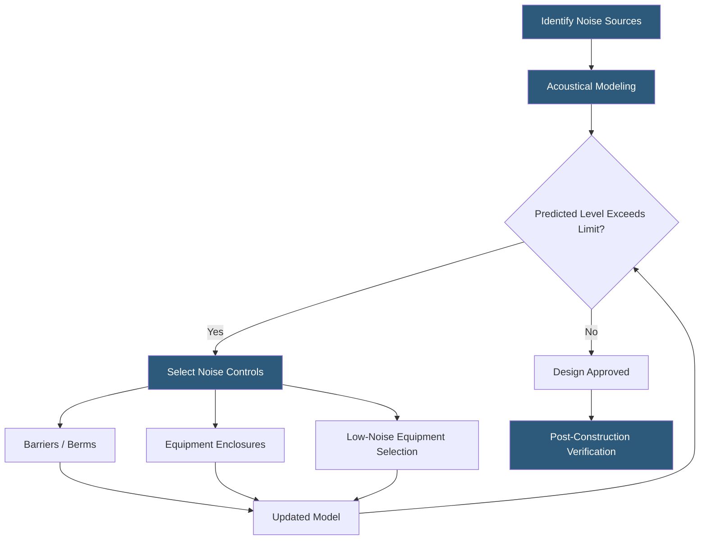

**Category:** Gigawatt Regulatory & Compliance
**Difficulty:** Beginner
**Reading time:** 5 min read

---

Noise ordinances establish maximum allowable sound pressure levels at property boundaries or at receptors such as residences, hospitals, and schools near gigawatt-scale datacenter campuses. Primary noise sources include cooling towers, rooftop HVAC units, diesel generators, and transformer hum. Compliance requires acoustical modeling during design, physical noise controls such as barriers and enclosures, and post-construction verification measurements.

- **dB(A)** — A-weighted decibel scale approximating human hearing sensitivity; standard unit in noise ordinances
- **Sound pressure level (SPL)** — Measure of local pressure variation caused by a sound wave at a receiver location
- **Noise barrier** — Wall, berm, or enclosure that attenuates sound propagation between source and receiver
- **Acoustical insertion loss** — Reduction in sound level achieved by a barrier or enclosure, measured in dB
- **Ambient noise level** — Pre-existing background sound level at a location before the project is built
- **Octave band analysis** — Frequency-specific sound measurement used to select appropriate noise controls
- **Generator enclosure** — Acoustic housing that reduces noise from diesel generators to typically 65–75 dB(A) at 1 meter
- **Cooling tower noise** — Low-frequency broadband noise from fan operation and water splash, typically at 60–75 dB(A)

Noise ordinance compliance begins with characterizing the noise environment surrounding a proposed site. Ambient sound level monitoring — typically a 7-day continuous record — establishes the baseline against which the project's contribution is compared. Many ordinances limit project noise to a fixed level (e.g., 55 dB(A) at residential receivers at night) or prohibit increases above ambient exceeding 3–5 dB(A).

Acoustical modeling uses point-source algorithms or full 3D propagation software to predict sound levels at receptors from each identified source: cooling towers, HVAC equipment, generators, and electrical transformers. Transformer hum produces tonal noise at 120 Hz (twice line frequency) that is particularly annoying to nearby residents and may trigger special tonal penalties in some ordinances.

Noise controls are evaluated in order of effectiveness. Source substitution — selecting quieter equipment — is most effective and least expensive. Low-noise cooling tower fans, acoustically rated transformer designs, and generator enclosures are standard measures. Where source substitution alone is insufficient, barriers between sources and receptors provide 5–15 dB(A) of attenuation depending on barrier height and geometry. Earthen berms offer better low-frequency attenuation than thin concrete walls and often serve dual purposes as visual screening.

Post-construction verification measurements are often required by the use permit or conditional approval. Measurements must typically be conducted at the property boundary or at the nearest receptor under worst-case operating conditions — maximum cooling load with all generators running.

- Conducting ambient monitoring survey at residential neighbors before permit application
- Modeling cooling tower noise impacts at 500-foot residential setback
- Designing acoustic barriers to achieve 10 dB(A) insertion loss between generators and neighborhood
- Specifying low-noise transformer designs to eliminate tonal hum complaints
- Performing post-construction noise verification required by conditional use permit

| Advantage | Disadvantage |
|-----------|--------------|
| Early acoustical modeling avoids costly redesign during permitting | Acoustical consultants add cost and schedule time to design process |
| Low-noise equipment selection is more cost-effective than post-installation barriers | Premium equipment may have longer lead times affecting construction schedule |
| Acoustic barriers provide flexibility to address unanticipated noise issues | Barriers require setback space that competes with equipment footprint |
| Continuous ambient monitoring builds credible compliance record | Monitoring equipment requires calibration and maintenance |

- [Light Pollution Regulations](light-pollution-regulations.md)
- [Environmental Regulations](environmental-regulations.md)
- [Land Use Regulations](land-use-regulations.md)

---
*Part of the [Gigawatt Regulatory & Compliance](index.md) category · [Back to Master Index](../../index.md)*
