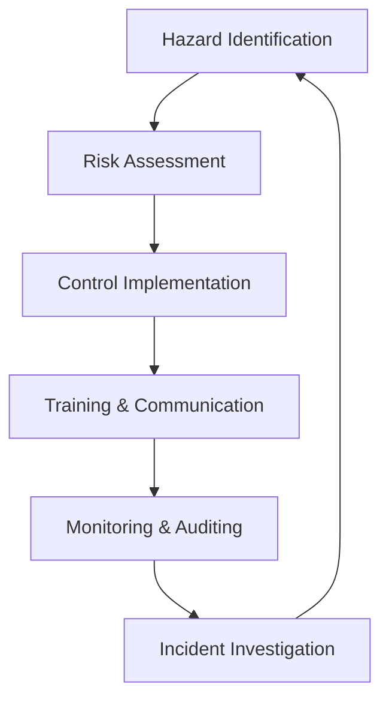

**Category:** Gigawatt Regulatory & Compliance
**Difficulty:** Intermediate
**Reading time:** 6 min read

---

Occupational health and safety (OHS) encompasses policies, procedures, and practices designed to protect workers from hazards and injuries in the workplace. For data center operations, OHS addresses physical safety, electrical hazards, thermal management, and ergonomic concerns specific to high-performance computing environments.

- **Hazard Identification** — systematic process of recognizing workplace dangers including electrical, thermal, and mechanical hazards
- **Risk Assessment** — evaluation of probability and severity of potential injuries from identified hazards
- **Control Hierarchy** — prioritized approach: elimination, substitution, engineering controls, administrative controls, PPE
- **Incident Reporting** — mandatory documentation and investigation of workplace injuries and near-misses
- **Training and Competency** — ensuring workers understand hazards and proper safety procedures through education

OHS programs begin with systematic identification of workplace hazards through site walkthroughs, hazard checklists, and worker input. Risk assessment evaluates the likelihood and consequences of each hazard. Controls are implemented following the hierarchy: eliminating hazards where possible, substituting hazardous processes with safer alternatives, engineering controls (guards, ventilation, isolation), administrative procedures (SOPs, scheduling), and personal protective equipment. Training ensures all personnel understand hazards and proper work procedures. Monitoring includes regular safety audits, near-miss tracking, and incident investigations. Incident analysis identifies root causes and implements preventive measures to avoid recurrence.

- Electrical safety protocols for high-voltage equipment and power distribution
- Thermal management and cooling system monitoring to prevent heat-related injuries
- Equipment maintenance procedures with lockout/tagout (LOTO) protocols
- Ergonomic assessments for equipment installation and rack management
- Emergency response procedures for fires, electrical incidents, and medical emergencies

| Advantage | Disadvantage |
|-----------|--------------|
| Prevents worker injuries and associated costs | Requires ongoing resource investment and training |
| Reduces operational disruptions from incidents | Can slow productivity if controls are excessive |
| Improves workplace morale and retention | Regulatory compliance adds administrative burden |
| Demonstrates corporate responsibility | Requires specialized expertise to implement effectively |
| Minimizes legal liability exposure | Poor controls can create false sense of security |

- [OSHA Compliance](osha-compliance.md)
- [Environmental Health and Safety](environmental-health-and-safety.md)
- [Emergency Response Planning](emergency-response-planning.md)

---
*Part of the [Gigawatt Regulatory & Compliance](index.md) category · [Back to Master Index](../../index.md)*
