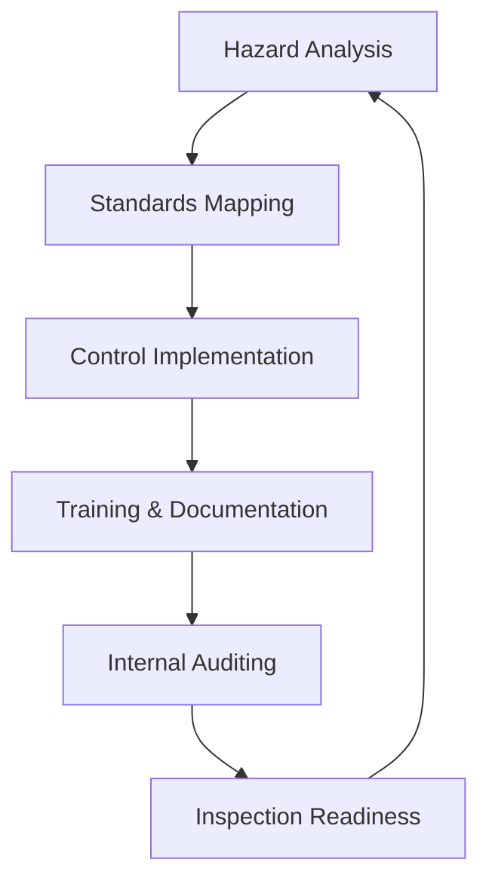

**Category:** Gigawatt Regulatory & Compliance
**Difficulty:** Intermediate
**Reading time:** 6 min read

---

OSHA (Occupational Safety and Health Administration) compliance refers to adherence to federal regulations that establish workplace safety and health standards in the United States. For data center operations, OSHA compliance ensures worker protection from electrical, thermal, and ergonomic hazards specific to industrial computing environments.

- **General Duty Clause** — employer responsibility to provide safe working conditions free from recognized hazards
- **Standards Compliance** — adherence to specific OSHA regulations for electrical safety, hazard communication, and PPE
- **Record Keeping** — documentation of injuries, illnesses, safety training, and medical examinations
- **Inspections and Citations** — OSHA authority to inspect workplaces and issue citations for violations
- **Penalties and Fines** — financial consequences ranging from thousands to millions based on violation severity

OSHA compliance programs begin by mapping workplace hazards to applicable OSHA standards covering electrical safety (1910.303), hazard communication (1910.1200), personal protective equipment (1910.132), and data center-specific concerns. Employers implement engineering and administrative controls to meet minimum compliance levels. Training documentation must demonstrate worker understanding of hazards and safe procedures. Injury and illness logs (OSHA 300 forms) track workplace incidents. Internal audits verify control effectiveness. When OSHA inspectors conduct investigations, companies must demonstrate proactive safety culture through documentation, training records, and hazard assessments. Violations trigger citations with compliance deadlines and penalties. Severity levels (other-than-serious, serious, willful, repeat) determine fine amounts.

- Electrical safety certifications and training for technicians working with power systems
- Hazard communication labeling and safety data sheets for chemicals used in facilities
- Personal protective equipment requirements and compliance documentation
- Injury and illness reporting meeting OSHA record-keeping standards
- OSHA inspection preparation and defense strategies

| Advantage | Disadvantage |
|-----------|--------------|
| Establishes minimum safety standards protecting workers | Compliance costs can be substantial for large facilities |
| Creates legal safe harbor against worker liability | Regulations may be prescriptive rather than performance-based |
| Standardizes safety practices across organizations | OSHA enforcement can be unpredictable by region |
| Forces documentation creating accountability | Penalties for first-time unintentional violations seem harsh |
| Improves overall safety culture and awareness | Compliance may not address unique facility hazards |

- [Occupational Health and Safety](occupational-health-and-safety.md)
- [Environmental Health and Safety](environmental-health-and-safety.md)
- [Emergency Response Planning](emergency-response-planning.md)

---
*Part of the [Gigawatt Regulatory & Compliance](index.md) category · [Back to Master Index](../../index.md)*
