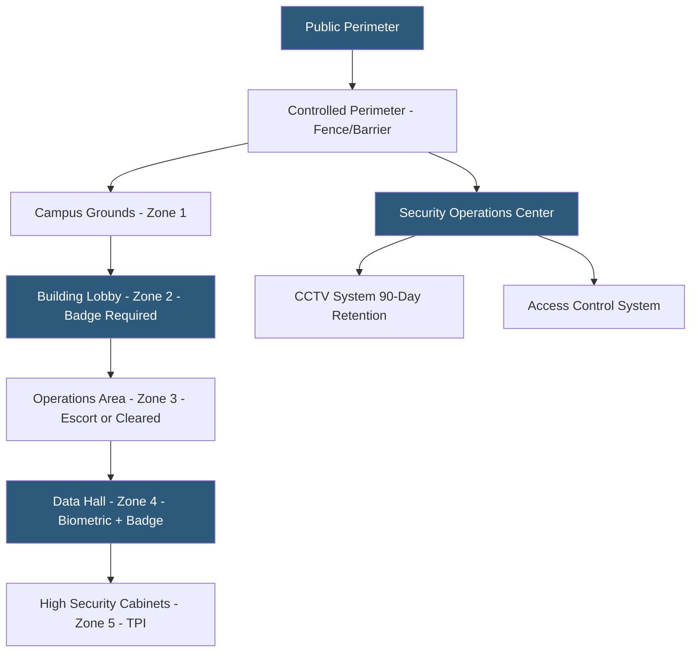

**Category:** Gigawatt Regulatory & Compliance
**Difficulty:** Intermediate
**Reading time:** 6 min read

---

Physical security standards for gigawatt-scale datacenters are drawn from multiple frameworks including ANSI/ASIS PSC.1, NERC CIP physical security requirements, and customer-mandated standards from hyperscalers and government tenants. These standards establish requirements for perimeter security, access control, video surveillance, security staffing, and incident response. Compliance with physical security standards is evaluated during customer audits, third-party certifications, and regulatory inspections.

- **Defense in depth** — Security principle applying multiple independent protective layers so that defeating one layer does not grant full access
- **Security zone** — Defined area with consistent access control and monitoring standards, typically classified by sensitivity level
- **ANSI/ASIS PSC.1** — American National Standard for Physical Security Professional certification and management system frameworks
- **Mantrap** — Two-door airlock entry vestibule preventing tailgating; entry requires credential validation before exit door opens
- **CCTV retention** — Minimum video recording retention period; many standards require 30–90 days minimum
- **Security information and event management (PSIM)** — Platform integrating alarms from access control, CCTV, and intrusion detection into unified operator console
- **Two-person integrity (TPI)** — Requirement that two authorized individuals be present during specific high-risk activities
- **Chain of custody** — Documented transfer of physical assets or evidence between individuals with accountability at each step

Physical security at gigawatt campuses is organized around a defense-in-depth model with concentric security zones, each requiring stronger authentication and imposing stricter access controls than the zone preceding it. The outermost zone is the public perimeter; the innermost zones are data halls and high-security equipment areas.

Perimeter security begins at the property boundary with security fencing (typically 8-foot chain-link with barbed wire or anti-climb topping), vehicle barriers at road entries, and CCTV coverage with no blind spots along the entire fence line. Vehicle barriers are rated to resist specific vehicle weights and speeds — a K4 barrier stops a 15,000-pound vehicle at 30 mph; K12 stops the same vehicle at 50 mph.

Building access requires badge authentication. Lobbies typically use unmanned kiosk check-in for visitors followed by escort by badged employees. Data halls require multi-factor authentication — badge plus PIN or biometric. Mantraps at data hall entries physically prevent tailgating by requiring the entry door to close before the inner door opens. Anti-tailgating software integrated with access control detects when two bodies pass a single badge swipe.

Video surveillance provides audit trail and real-time monitoring. Cameras cover all entry/exit points, data hall corridors, and server aisles. 90-day retention is the common baseline; some government standards require 180 days or longer. Video analytics — motion detection, person-of-interest alerts, object removal detection — reduce operator alert fatigue.

Security staff conduct patrol tours using electronic tour systems that verify completion of defined routes at required intervals.

- Designing a five-zone physical security model for a new 500 MW campus
- Specifying K12 vehicle barriers at main entrance to protect against vehicle-borne threats
- Implementing biometric plus badge multi-factor authentication at data hall entries
- Deploying CCTV video analytics to detect tailgating attempts at campus perimeter
- Conducting quarterly physical security assessments against customer-mandated standards

| Advantage | Disadvantage |
|-----------|--------------|
| Multi-zone defense in depth limits insider threat blast radius | Complex access control architectures require significant enrollment and administration overhead |
| Mantraps effectively prevent tailgating without security staff at every entry | Mantraps create bottlenecks during high-volume access periods such as equipment deliveries |
| 90+ day CCTV retention provides full forensic timeline for investigations | Long video retention requires substantial storage infrastructure for dozens of HD cameras |
| Electronic patrol tour systems verify guard route compliance | Systems can be gamed; physical presence alone does not guarantee security effectiveness |

- [Cybersecurity Requirements](cybersecurity-requirements.md)
- [NERC CIP Compliance](nerc-cip-compliance.md)
- [OSHA Compliance](osha-compliance.md)

---
*Part of the [Gigawatt Regulatory & Compliance](index.md) category · [Back to Master Index](../../index.md)*
