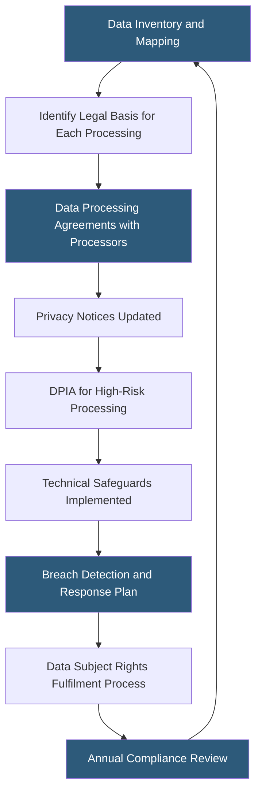

**Category:** Gigawatt Regulatory & Compliance
**Difficulty:** Advanced
**Reading time:** 7 min read

---

The EU's General Data Protection Regulation (GDPR) and California's Consumer Privacy Act (CCPA/CPRA) impose obligations on organizations that process personal data, including datacenter operators who act as data processors on behalf of cloud tenants. GDPR fines can reach €20 million or 4% of global annual revenue; CCPA statutory damages reach $7,500 per intentional violation. Compliance requires data processing agreements, privacy impact assessments, breach notification processes, and technical safeguards for all personal data handled.

- **Data controller** — Entity that determines the purposes and means of processing personal data
- **Data processor** — Entity that processes personal data on behalf of a controller (e.g., a datacenter operator)
- **Data Processing Agreement (DPA)** — Contract required by GDPR between controller and processor specifying processing instructions and security obligations
- **Privacy Impact Assessment (DPIA/PIA)** — Risk assessment required for high-risk processing activities under GDPR Article 35
- **Right to erasure** — Data subject's right under GDPR to request deletion of their personal data
- **Breach notification** — Obligation to notify supervisory authority within 72 hours (GDPR) or affected consumers (CCPA) of certain breaches
- **Sensitive personal information (SPI)** — CPRA category including precise geolocation, biometrics, and health data with enhanced protection requirements
- **Purpose limitation** — GDPR principle that data may only be used for the specific purpose for which it was collected

For gigawatt-scale datacenter operators, GDPR and CCPA compliance intersects the business in two ways: as data processors hosting customers' personal data, and as data controllers processing employee and visitor data.

As processors, operators must execute DPAs with all customers (controllers) specifying the categories of data processed, processing instructions, security measures, sub-processor lists, deletion timelines, and breach notification obligations. GDPR Article 28 mandates that DPAs include specific clauses; non-compliant DPAs expose both controller and processor to enforcement. Operators must also maintain records of processing activities under Article 30.

Security obligations under GDPR Article 32 require "appropriate technical and organisational measures" — a risk-based standard. Datacenter operators satisfy this through encryption at rest and in transit, access controls, segregation of customer data, security monitoring, and staff training. ISO 27001 certification provides evidence of systematic security management aligned with GDPR expectations.

Breach notification obligations are strict under GDPR: 72 hours to the supervisory authority for breaches likely to risk individuals' rights and freedoms. Datacenter operators must notify their customers (controllers) within agreed contractual timeframes — typically 24–48 hours — so controllers can assess notification obligations to authorities and affected individuals.

CCPA/CPRA compliance for facilities processing California residents' data adds obligations around data subject rights (right to know, delete, opt out of sale/sharing), annual privacy notices, and data minimization. The CPRA established the California Privacy Protection Agency as the primary enforcement authority with independent rulemaking authority.

- Drafting GDPR-compliant DPAs for 500 enterprise customers across EU member states
- Conducting DPIA for a new AI-driven physical security system processing visitor biometrics
- Implementing 72-hour breach notification workflow triggered by security monitoring alerts
- Responding to data subject erasure requests for employee records under GDPR Article 17
- Certifying CCPA compliance for California resident data processed in a North American campus

| Advantage | Disadvantage |
|-----------|--------------|
| DPA standardization reduces legal review time for each new customer | Customers may negotiate DPA modifications, increasing legal costs and delay |
| ISO 27001 certification provides reusable evidence for GDPR Article 32 compliance | Certification requires annual audits and significant ongoing documentation effort |
| 72-hour breach notification discipline improves security incident response overall | Short notification windows require pre-built workflows and 24/7 security coverage |
| CPRA simplifies California compliance with unified framework | CPPA rulemaking is ongoing; requirements evolve and require continuous legal monitoring |

- [Data Sovereignty Requirements](data-sovereignty-requirements.md)
- [Data Residency Regulations](data-residency-regulations.md)
- [Cybersecurity Requirements](cybersecurity-requirements.md)

---
*Part of the [Gigawatt Regulatory & Compliance](index.md) category · [Back to Master Index](../../index.md)*
