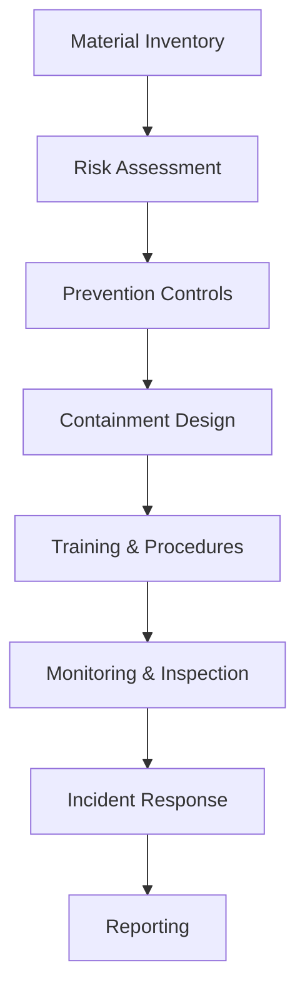

**Category:** Gigawatt Regulatory & Compliance
**Difficulty:** Intermediate
**Reading time:** 6 min read

---

Spill Prevention Plans (SPPs) are regulatory-mandated procedures for preventing releases of hazardous materials like refrigerants, oils, and fuels from equipment and storage facilities. These plans address prevention, containment, and cleanup to minimize environmental and occupational hazards in data center operations.

- **Secondary Containment** — physical structures (drip pans, bunds) designed to contain 110% of the largest vessel's contents
- **Preventive Maintenance** — regular inspection and servicing of equipment to detect and repair leaks before they become spills
- **Spill Kits and Response Materials** — pre-positioned supplies for immediate containment and cleanup of spills
- **Training and Procedures** — documented protocols for handling hazardous materials and responding to accidental releases
- **Compliance Reporting** — notification of significant spills to environmental agencies and emergency responders

SPPs begin with comprehensive inventories of hazardous materials including locations, quantities, and tank specifications. Risk assessment evaluates failure probability and consequence severity for each storage location. Prevention controls include proper handling procedures, equipment maintenance schedules, and condition monitoring (pressure gauges, level sensors). Secondary containment systems are engineered to capture spills and prevent environmental release. Training ensures personnel understand material hazards and proper handling techniques. Regular inspections check for corrosion, leaks, and containment integrity. When spills occur, response procedures activate containment measures, notifying management and environmental authorities if necessary. Cleanup uses absorbent materials and proper disposal methods. Post-incident analysis identifies root causes and implements preventive measures.

- Refrigerant leak containment for HVAC cooling systems
- Diesel fuel storage and generator maintenance spill prevention
- Hydraulic fluid and oil storage for backup power systems
- Chemical storage areas for facility operations and maintenance
- Emergency response procedures for accidental spills

| Advantage | Disadvantage |
|-----------|--------------|
| Prevents environmental contamination and regulatory fines | Secondary containment reduces available storage space |
| Rapid spill response minimizes impact and cleanup costs | Maintenance and inspection require ongoing effort |
| Demonstrates environmental stewardship and compliance | False alarms can disrupt operations unnecessarily |
| Protects groundwater and soil from hazardous materials | Aging facilities may require expensive retrofitting |
| Creates accountability through formal documentation | Training effectiveness depends on worker engagement |

- [Storm Water Management](storm-water-management.md)
- [Environmental Health and Safety](environmental-health-and-safety.md)
- [Emergency Response Planning](emergency-response-planning.md)

---
*Part of the [Gigawatt Regulatory & Compliance](index.md) category · [Back to Master Index](../../index.md)*
