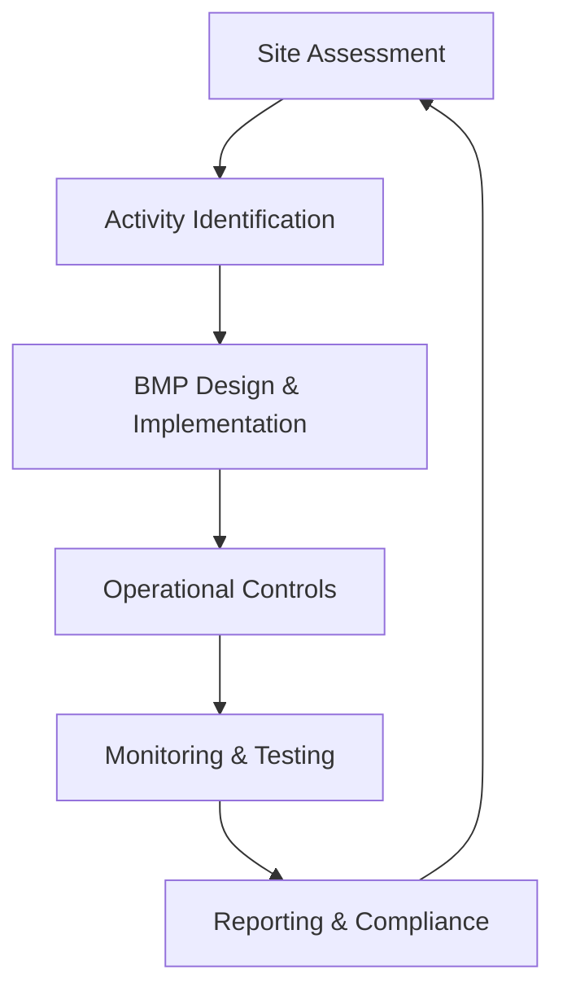

**Category:** Gigawatt Regulatory & Compliance
**Difficulty:** Intermediate
**Reading time:** 6 min read

---

Storm water management encompasses procedures and infrastructure designed to prevent pollution of water resources from runoff during precipitation events. For data centers, storm water controls address runoff from roofs, yards, and parking areas that could carry contaminants into local watersheds.

- **Best Management Practices (BMPs)** — techniques like detention ponds, rain gardens, and permeable surfaces that reduce runoff volume
- **Pollution Prevention Plan** — documentation of activities that could contaminate stormwater and controls to prevent such pollution
- **Sediment and Erosion Control** — temporary measures during construction including silt fences and erosion control mats
- **Stormwater Monitoring** — sampling and testing of runoff quality to verify compliance with discharge standards
- **Industrial Activity Monitoring** — tracking of activities that could generate pollutants (fueling, maintenance, material storage)

Storm water compliance programs begin with site assessments identifying impervious surfaces, drainage patterns, and areas where pollutants could enter runoff. Activities are categorized by pollution potential: fueling operations, equipment maintenance, material storage, and waste handling. Engineering controls include constructed wetlands, detention basins, and permeable paving that filter and absorb runoff. Operational controls establish procedures for fuel and material handling, spill prevention, and housekeeping that minimize pollution sources. Monitoring includes visual inspections of storm drains and periodic water sampling to verify contaminant levels. Discharge standards vary by receiving waterway and local regulations. Annual reports document control effectiveness and monitoring results. Non-compliance can trigger EPA enforcement including penalties and facility permits revocation.

- Cooling tower blowdown management to prevent excessive chlorine discharge
- Parking and vehicle maintenance areas with oil/fuel contamination prevention
- Hazardous material storage areas with impermeable pads and drainage control
- Rooftop runoff management through rain gardens and cisterns
- Construction site erosion control during facility expansion or renovation

| Advantage | Disadvantage |
|-----------|--------------|
| Protects local water quality and aquatic ecosystems | Infrastructure improvements require significant capital |
| Prevents regulatory enforcement and fines | Monitoring and maintenance add operational burden |
| Improves facility sustainability profile | Permeable surfaces may reduce facility footprint |
| Reduces combined sewer overflows in some regions | Unfamiliar technology adoption may encounter resistance |
| Captures water for reuse in cooling systems | Aging facilities require costly retrofitting |

- [Spill Prevention Plans](spill-prevention-plans.md)
- [Environmental Health and Safety](environmental-health-and-safety.md)
- [Air Emissions Reporting](air-emissions-reporting.md)

---
*Part of the [Gigawatt Regulatory & Compliance](index.md) category · [Back to Master Index](../../index.md)*
