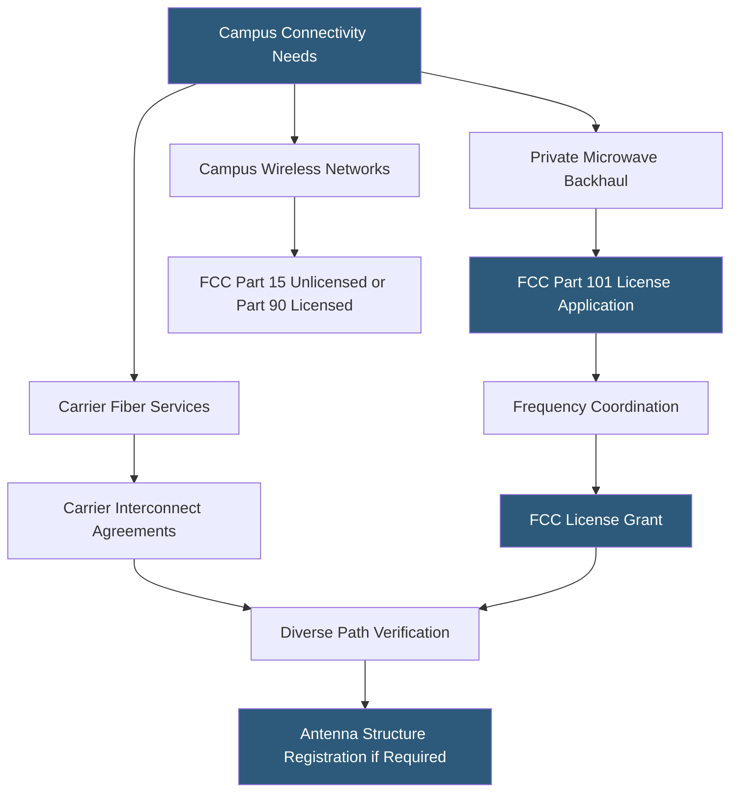

**Category:** Gigawatt Regulatory & Compliance
**Difficulty:** Intermediate
**Reading time:** 6 min read

---

Gigawatt-scale datacenters rely on diverse telecommunications infrastructure — fiber networks, microwave backhaul, satellite uplinks, and private wireless networks — each subject to distinct licensing requirements from the FCC and international equivalents. Operating unlicensed equipment on licensed frequencies, failing to register antenna structures, or neglecting carrier interconnection agreements exposes facilities to service disruptions and regulatory enforcement. A comprehensive telecommunications licensing program ensures uninterrupted connectivity across all campus communication systems.

- **FCC license** — Authorization from the Federal Communications Commission to operate a radio frequency transmitter
- **Part 101** — FCC rules governing point-to-point microwave systems used for private network backhaul
- **Antenna Structure Registration (ASR)** — Required FCC registration for antenna structures over 200 feet AGL or near airports
- **CLEC** — Competitive Local Exchange Carrier; a telecom provider that competes with the incumbent LEC for local services
- **Dark fiber** — Unlit fiber optic cable available for lease; datacenter operators often purchase or lease dark fiber for diverse paths
- **Internet Exchange Point (IXP)** — Physical location where networks exchange traffic; gigawatt campuses may host or peer at IXPs
- **Carrier interconnect agreement** — Contract between a datacenter and telecommunications carrier specifying service terms, SLAs, and handoff specifications
- **Diverse routing** — Requirement that redundant fiber paths physically separate to prevent single conduit failures from cutting all connectivity

Telecommunications licensing for a gigawatt campus begins with identifying all radio frequency-emitting systems. Fiber-optic systems do not require FCC licenses, but the wireless systems used for facility management, security, and backup communications do. Private microwave backhaul systems operating under FCC Part 101 require individual licenses obtained through frequency coordination — a process ensuring no interference with existing licensed systems on the same path.

Frequency coordination for microwave systems is performed by accredited coordinators who search existing FCC databases and propose frequency assignments with appropriate frequency separations. Coordination typically takes 30–60 days; the FCC license is then filed and usually granted within 30 days. Licenses specify frequency, power, antenna parameters, and authorized locations — any changes require modification applications.

Antenna structures over 200 feet AGL or near airports must be registered in the FCC's Antenna Structure Registration database. ASR records link structure coordinates, height, and obstruction lighting specifications to a registered owner responsible for maintaining the required lighting. Failure to maintain lighting is an FCC violation subject to fines.

Campus private LTE/5G networks for IoT, security, and operations are increasingly common. These operate under CBRS (Citizens Broadband Radio Service) in the 3.5 GHz band using a tiered access system — Priority Access Licenses obtained at auction, or General Authorized Access operating without a license but subject to automated interference management by the Spectrum Access System.

Carrier interconnect agreements should specify geographic diversity requirements, minimum number of physical fiber paths, handoff specifications, and escalation procedures for outages.

- Licensing a microwave diversity path for an alternative communications route to a remote campus
- Deploying a CBRS private LTE network for campus IoT sensor management
- Registering antenna structures for new microwave towers at campus
- Negotiating carrier interconnect agreements requiring four diverse fiber entries
- Managing FCC license renewals across a portfolio of 50+ campus locations

| Advantage | Disadvantage |
|-----------|--------------|
| Licensed microwave provides protected spectrum with interference enforcement rights | FCC license applications and frequency coordination add 60–90 days to deployment timeline |
| CBRS private LTE provides enterprise-controlled wireless without full licensing burden | CBRS General Authorized Access offers no interference protection from Priority Access Licensees |
| Carrier interconnect SLAs define accountability for outages | SLA remedies (credits) rarely compensate for actual business impact of connectivity outages |
| Diverse fiber paths eliminate single-carrier dependency | Diversity routing requires detailed verification as carriers share conduit in many urban routes |

- [Data Sovereignty Requirements](data-sovereignty-requirements.md)
- [FAA Height Restrictions](faa-height-restrictions.md)
- [Cybersecurity Requirements](cybersecurity-requirements.md)

---
*Part of the [Gigawatt Regulatory & Compliance](index.md) category · [Back to Master Index](../../index.md)*
