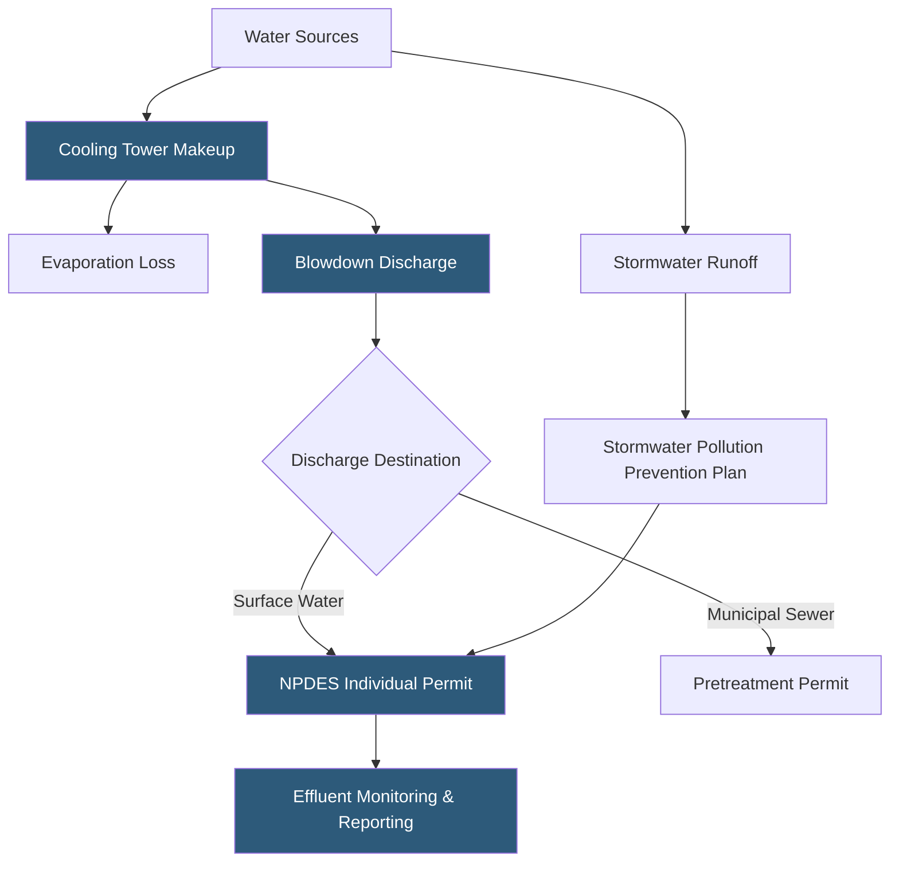

**Category:** Gigawatt Regulatory & Compliance
**Difficulty:** Intermediate
**Reading time:** 6 min read

---

Water discharge permits under the Clean Water Act's NPDES program regulate all facility discharges to surface waters and municipal sewer systems, including stormwater runoff, cooling tower blowdown, and process wastewater. Gigawatt-scale datacenters consume millions of gallons daily for cooling, making discharge chemistry — particularly biocide residuals, scale inhibitors, and heavy metals from corrosion — subject to strict effluent limits. Non-compliance can trigger fines exceeding $25,000 per day and operational curtailments.

- **NPDES permit** — National Pollutant Discharge Elimination System permit authorizing discharge of specified pollutants at defined concentrations
- **Cooling tower blowdown** — Water discharged from cooling towers to prevent excessive concentration of dissolved solids
- **Cycles of concentration** — Ratio of dissolved solids in blowdown versus makeup water; higher cycles reduce water consumption
- **Pretreatment standard** — Discharge limits applied to industrial users discharging to municipal sewer to protect wastewater treatment plants
- **General Construction Permit** — Statewide NPDES permit covering stormwater discharges during land disturbance over 1 acre
- **Industrial Stormwater Permit** — Permit required for stormwater discharges from industrial facilities based on Standard Industrial Classification
- **Best Management Practice (BMP)** — Operational or structural control measure that reduces pollutant loading in stormwater
- **Effluent guideline** — Technology-based discharge standard established by EPA for specific industrial categories

Cooling tower blowdown is the largest regulated discharge stream from a gigawatt-scale datacenter. As makeup water evaporates, dissolved minerals concentrate in the tower basin. To prevent scale and corrosion, blowdown water is discharged and replaced with fresh makeup. At typical cycles of concentration (3–5), a 300 MW campus may discharge 500,000–1,000,000 gallons per day of blowdown containing elevated concentrations of total dissolved solids, chlorides, biocides, and heavy metals leached from system components.

If blowdown discharges to a municipal sewer, pretreatment standards apply. Local limits for copper, zinc, molybdate, and residual chlorine must be met before discharge. Water treatment chemistry programs must be designed around effluent constraints, sometimes limiting biocide selection or requiring dechlorination before discharge.

Direct discharge to surface waters requires an individual NPDES permit specifying numeric limits for each pollutant, sampling frequency, and reporting schedule. Limits are derived from water quality standards of the receiving water body, which vary by state and designated use (e.g., aquatic life, drinking water supply).

Stormwater compliance begins with the construction general permit, which requires developing and implementing a SWPPP — documenting BMPs for erosion and sediment control. Post-construction, facilities in certain SIC codes must obtain industrial stormwater permits and sample stormwater discharges annually, reporting results to the state agency.

- Designing cooling tower water treatment chemistry within POTW pretreatment discharge limits
- Developing SWPPP for a 100-acre campus construction project with multiple discharge points
- Monitoring and reporting cooling tower blowdown parameters to meet individual NPDES permit limits
- Evaluating zero liquid discharge (ZLD) systems to eliminate cooling tower blowdown permits
- Managing copper and zinc levels in blowdown to comply with local sewer discharge limits

| Advantage | Disadvantage |
|-----------|--------------|
| Higher cycles of concentration reduce water consumption and discharge volume | Higher cycles increase corrosion risk and scaling potential in cooling systems |
| Zero liquid discharge eliminates NPDES compliance burden | ZLD systems add capital cost of $1–5M and significant energy consumption |
| Pretreatment programs provide more operational flexibility than surface water permits | Pretreatment limits vary by municipality and may change when POTW upgrades |
| Stormwater BMPs demonstrate environmental stewardship | BMP installation and maintenance require ongoing capital and labor investment |

- [Environmental Regulations](environmental-regulations.md)
- [Air Quality Permits](air-quality-permits.md)
- [Storm Water Management](storm-water-management.md)

---
*Part of the [Gigawatt Regulatory & Compliance](index.md) category · [Back to Master Index](../../index.md)*
