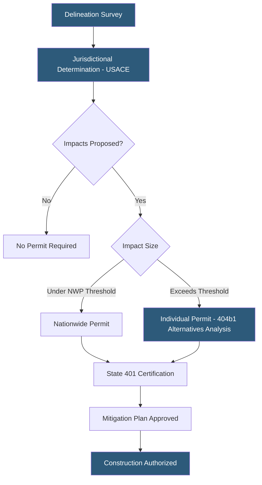

**Category:** Gigawatt Regulatory & Compliance
**Difficulty:** Intermediate
**Reading time:** 6 min read

---

Section 404 of the Clean Water Act requires permits from the U.S. Army Corps of Engineers (USACE) for discharge of dredged or fill material into waters of the United States, including wetlands. Gigawatt-scale datacenter development on sites with jurisdictional wetlands must either avoid impacts, minimize unavoidable impacts, and compensate for residual losses through mitigation banking or permittee-responsible mitigation. The 404 permitting process adds 6–24 months to project timelines depending on impact scale.

- **Jurisdictional determination (JD)** — USACE confirmation of whether specific areas meet legal criteria as waters of the United States
- **Section 404 permit** — USACE authorization required for fill of jurisdictional wetlands and waters
- **Nationwide Permit (NWP)** — Pre-authorized 404 permit covering minor impacts below defined thresholds (e.g., NWP 39 for up to 0.5 acre fill)
- **Individual permit** — Full 404 permit required when impacts exceed NWP thresholds or involve special aquatic sites
- **Section 401 certification** — State water quality certification required before USACE issues a Section 404 permit
- **Sequential mitigation** — EPA/USACE standard requiring avoidance, minimization, then compensation in that order
- **Mitigation banking** — Pre-established wetland restoration sites that sell credits to offset impacts from other projects
- **Compensatory mitigation ratio** — Multiple of impacted area that must be restored; typically 1.5:1 to 3:1 depending on wetland type

Wetland compliance begins with a delineation survey by a certified wetland scientist, who applies the 1987 Corps Wetland Delineation Manual to identify areas meeting hydrology, hydric soil, and hydrophytic vegetation criteria. The delineation is submitted to USACE for a jurisdictional determination (JD) — a formal agency determination of which areas are regulated.

For impacts below Nationwide Permit thresholds (typically 0.5 acres for NWP 39), authorization can be obtained in 45 days through a streamlined process. For larger impacts, an Individual Permit application requires a Section 404(b)(1) alternatives analysis demonstrating that no practicable alternatives exist that avoid or reduce wetland impacts — a high legal bar that often requires redesigning site plans to avoid the most sensitive areas.

Sequential mitigation — avoid, then minimize, then compensate — is the mandatory framework. Site layouts must demonstrably avoid the highest-value wetlands; unavoidable impacts must be minimized through grading design. Residual impacts are compensated through mitigation bank credit purchases, in-lieu fee program payments, or permittee-responsible mitigation such as on-site or off-site wetland creation.

Mitigation banking is the preferred option because bank sites are already established and monitored by regulators. Credits are purchased based on a service area matching the impact watershed, and ratios are set by USACE based on wetland type and regional guidance. Vernal pools and tidal wetlands command ratios of 3:1 or higher; palustrine emergent wetlands may be offset at 1.5:1.

State 401 certification must be obtained concurrently, as states can impose additional conditions or deny certification entirely, which blocks the federal permit.

- Commissioning wetland delineation and JD for a 300-acre potential campus site
- Redesigning site layout to avoid 2.5 acres of jurisdictional vernal pools
- Purchasing mitigation bank credits at 2:1 ratio to offset 0.3-acre fill of palustrine emergent wetland
- Navigating California 401 certification by Regional Water Quality Control Board
- Conducting alternatives analysis demonstrating no practicable alternative to 1.2-acre wetland fill

| Advantage | Disadvantage |
|-----------|--------------|
| Nationwide Permits provide relatively fast authorization for minor impacts | NWP thresholds are low (0.5 acre); many campuses trigger Individual Permit requirements |
| Mitigation banking provides permanent, verified offsets with regulatory acceptance | Credit availability varies by watershed; scarce supply drives high prices |
| Early delineation identifies fatal flaws before site acquisition | JDs expire after 5 years and may need to be redone if project is delayed |
| Section 401 certification process is concurrent with 404, not sequential | States can impose conditions or deny certification, blocking federal approval |

- [Environmental Regulations](environmental-regulations.md)
- [Endangered Species Considerations](endangered-species-considerations.md)
- [Storm Water Management](storm-water-management.md)

---
*Part of the [Gigawatt Regulatory & Compliance](index.md) category · [Back to Master Index](../../index.md)*
