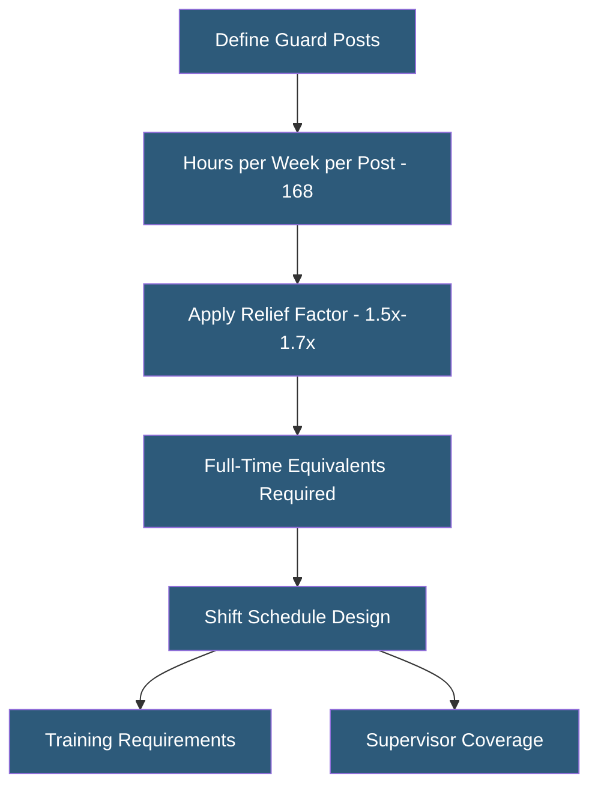

**Category:** Gigawatt Security & Access Control
**Difficulty:** Intermediate
**Reading time:** 5 min read

---

Continuous 24/7 security staffing at gigawatt facilities requires workforce planning, shift scheduling, training programs, and management systems to maintain consistent security posture across all hours. Staffing levels are determined by facility size, threat assessment, regulatory requirements, and the balance between human guards and automated systems.

- **Post order** — documented instructions defining duties, procedures, and responsibilities for each guard post
- **Shift rotation** — system for scheduling guards across three shifts covering 24 hours
- **Overtime management** — controlling additional hours worked beyond standard schedule
- **Guard-to-area ratio** — number of guards required per unit of facility area or number of posts
- **Contract security** — third-party security company providing guard services under contract
- **Proprietary security** — in-house security department with direct-employed personnel
- **Security supervisor** — senior guard responsible for shift management, incident command, and team performance
- **Relief factor** — multiplier applied to post count to account for days off, vacation, training, and sick leave

Staffing calculations begin with post analysis—defining every position that requires continuous or scheduled coverage. A basic gigawatt facility might require: one SOC operator (24/7), one gate officer (24/7), two perimeter patrol officers (24/7), and one supervisor (24/7). Each 24/7 post requires approximately 4.5 full-time equivalents when accounting for the relief factor (days off, vacation, sick leave, training, holidays).

Contract versus proprietary security is a fundamental decision. Contract security companies provide trained personnel with built-in backup (replacement officers for absences) and reduced administrative burden. They are appropriate for standard guard functions. Proprietary security personnel often demonstrate stronger facility loyalty, better institutional knowledge, and greater accountability—preferred for high-security or sensitive positions. Many large facilities use a hybrid: contract guards for standard posts and proprietary staff for sensitive roles.

Training requirements for critical infrastructure guards exceed those for standard commercial security. Relevant certifications include: state guard license, CPR/AED, active threat response, facility-specific training on access control systems and emergency procedures, and for NERC CIP-regulated facilities, insider threat awareness training. Annual retraining and qualification verification must be documented.

Guard tour systems use electronic wand readers or NFC-enabled smartphones to verify that guards patrol defined checkpoints on schedule. Missed checkpoints trigger supervisor alerts. This creates an audit trail of patrol activity and deters guards from skipping required posts.

- Utility substation staffing with gate officer, patrol, and SOC operator posts
- Hyperscale datacenter guard force covering entry points and data halls
- Solar farm staffing combining remote monitoring with on-site patrol
- Hybrid staffing model with remote SOC and local response officers
- Temporary security surge staffing during construction or maintenance events

| Advantage | Disadvantage |
|-----------|--------------|
| Human judgment handles novel situations that automation cannot | Personnel cost is the largest component of physical security budget |
| On-site presence deters threats through visibility | Shift change periods are vulnerability windows requiring management |
| Contract guards provide built-in relief pool for absences | Consistency of contract guard quality can vary |
| Proprietary guards develop facility-specific expertise | Proprietary security carries full employment overhead (benefits, HR) |

- [Security Guard Tour Systems](security-guard-tour-systems.md)
- [Security Operations Center (SOC) Design](security-operations-center-soc-design.md)
- [Insider Threat Mitigation](insider-threat-mitigation.md)

---
*Part of the [Gigawatt Security & Access Control](index.md) category · [Back to Master Index](../../index.md)*
