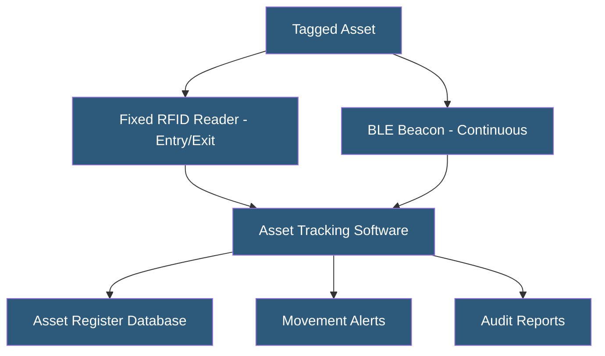

**Category:** Gigawatt Security & Access Control
**Difficulty:** Intermediate
**Reading time:** 5 min read

---

Asset tracking systems maintain real-time or periodic visibility into the location and status of physical assets—servers, tools, test equipment, and portable media—within gigawatt facilities. They support audit compliance, theft prevention, and operational efficiency by ensuring that assets can be located and their movement history audited.

- **RFID (Radio Frequency Identification)** — passive or active tags attached to assets, read by fixed or handheld readers
- **Barcode/QR code** — optical tags requiring line-of-sight scanning; lower cost than RFID
- **BLE beacon** — Bluetooth Low Energy transmitter in assets providing real-time location data
- **RTLS (Real-Time Location System)** — infrastructure providing continuous asset location tracking
- **Asset register** — database of all tracked assets with attributes, location, and assigned custodian
- **Chain of custody** — documented record of who possessed an asset and when
- **Tamper-evident label** — adhesive tag that shows visible evidence if removed or moved
- **Inventory audit** — periodic physical verification of asset register against physical inventory

Asset tracking deployments typically use tiered technology based on asset value and tracking requirements. High-value assets (servers, networking equipment, medical devices) warrant RFID or BLE tags providing real-time location tracking. Lower-value assets (tools, cables, consumables) may use barcode labels and periodic scanning.

Fixed RFID readers installed at security zone doorways automatically capture tag reads when tagged equipment passes through. This provides automatic, non-manual recording of equipment entering and leaving secured zones. If a tagged server attempts to leave a zone without an authorized removal ticket, the system can trigger an alarm. For NERC CIP compliance, this automated tracking provides evidence of physical access to Cyber Assets.

RTLS deployments using BLE beacons provide room-level or even sub-room location accuracy. Each asset carries a small BLE tag that broadcasts periodically. Fixed receivers throughout the facility triangulate the tag's position. Security operations staff can locate any tracked asset in real time, which is valuable for large facilities where equipment searches are time-consuming.

Software asset management platforms (ServiceNow, ManageEngine ServiceDesk) integrate with physical tracking systems, linking physical location data to logical asset records. The combined view shows which server is in which rack, what software it runs, and who is responsible for it. Discrepancies between the physical tracking system and the software inventory flag assets that may have been moved without proper process.

- Datacenter server tracking with RFID at data hall entry points
- Tool tracking in maintenance shops to prevent loss and ensure calibration compliance
- Portable media (USB drives, hard drives) tracking per data security policy
- Laboratory equipment tracking for calibration scheduling and location
- Medical device tracking in healthcare facility for regulatory compliance

| Advantage | Disadvantage |
|-----------|--------------|
| Automatic movement logging without manual scanning | Initial tagging of existing asset inventory is labor-intensive |
| Real-time location enables rapid asset recovery | RTLS infrastructure requires significant reader deployment cost |
| Audit trail supports compliance and insurance claims | RFID tags add cost per asset; impractical for very low-value items |
| Unauthorized movement alerts provide real-time theft detection | Tag removal or shielding can defeat RFID-based tracking |

- [Equipment Serialization](equipment-serialization.md)
- [Chain of Custody Procedures](chain-of-custody-procedures.md)
- [Badge Access Control Systems](badge-access-control-systems.md)

---
*Part of the [Gigawatt Security & Access Control](index.md) category · [Back to Master Index](../../index.md)*
