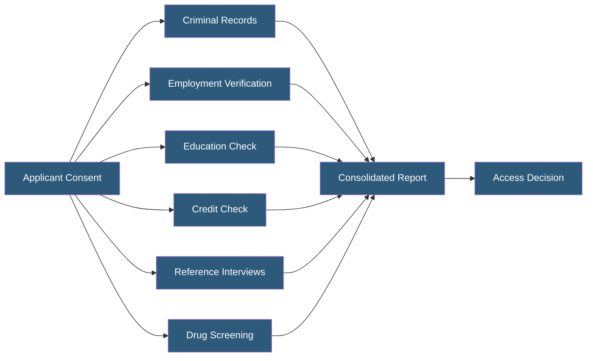

**Category:** Gigawatt Security & Access Control
**Difficulty:** Beginner
**Reading time:** 5 min read

---

Background check processes verify that candidates and employees meet the trustworthiness standards required for access to critical infrastructure. Comprehensive pre-employment screening combined with periodic reinvestigation and continuous screening helps organizations identify security risks before they cause harm.

- **Criminal history check** — search of county, state, and federal criminal records
- **Employment verification** — confirming prior employment history and reasons for departure
- **Education verification** — confirming claimed degrees and certifications
- **Credit check** — financial history review for roles with financial responsibility or access to valuable assets
- **Reference check** — direct interviews with former managers and colleagues
- **Drug screening** — pre-employment and random testing for substance use
- **Social media screening** — review of public social media profiles for disqualifying content
- **Continuous monitoring** — ongoing automated checks for new criminal filings or watchlist additions

Background checks are governed by the Fair Credit Reporting Act (FCRA) in the United States. Employers must obtain written consent from the candidate, use a Consumer Reporting Agency (CRA) compliant with FCRA, and follow adverse action procedures (pre-adverse action notice, opportunity to dispute) if information from the check is used to deny employment.

Criminal history checks are the most critical component for security-sensitive roles. Searches should cover all counties where the candidate has lived, worked, or studied for the past 7–10 years, plus a federal criminal record search. Sex offender registry and global sanctions/watchlist searches are performed separately. Adverse findings are evaluated in context: the nature of the offense, time elapsed, and relevance to the position all inform the decision under EEOC guidelines (which discourage blanket criminal exclusion policies).

Employment verification confirms that the candidate's stated work history is accurate. Significant gaps, contradictions, or unexplained departures are red flags. For senior or sensitive positions, direct supervisor references provide richer qualitative insight than HR records alone.

Continuous screening programs use automated monitoring services that check enrolled employees against criminal record databases, sex offender registries, and OFAC watchlists on an ongoing basis. If a new criminal filing appears for an enrolled employee, the HR or security team is immediately notified, enabling proactive response rather than waiting for the next periodic reinvestigation.

- Pre-employment screening for all personnel with access to critical infrastructure zones
- Contractor background check requirements written into vendor contracts
- Periodic reinvestigation (every 5 years) for employees in sensitive positions
- Continuous monitoring program for cleared staff and privileged system administrators
- Enhanced screening (federal standards equivalent) for staff accessing NERC CIP-regulated systems

| Advantage | Disadvantage |
|-----------|--------------|
| Identifies disqualifying history before employment begins | Background checks introduce hiring delays, especially for comprehensive international checks |
| Continuous monitoring catches post-hire changes in risk profile | FCRA compliance adds administrative overhead and potential legal risk |
| Reference interviews provide qualitative insight not in records | Credit checks and some searches are not permitted in all jurisdictions |
| Creates documented due diligence for regulatory and legal purposes | Thorough checks for large workforces are expensive |

- [Security Clearance Requirements](security-clearance-requirements.md)
- [Insider Threat Mitigation](insider-threat-mitigation.md)
- [Visitor Management at Scale](visitor-management-at-scale.md)

---
*Part of the [Gigawatt Security & Access Control](index.md) category · [Back to Master Index](../../index.md)*
