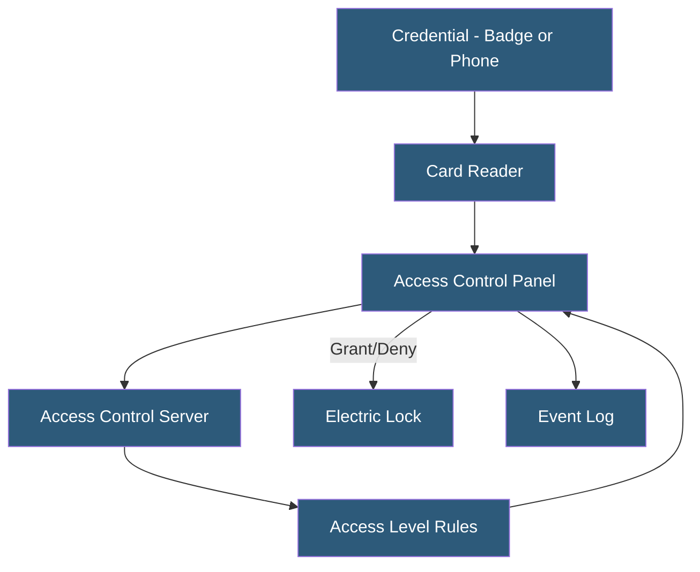

**Category:** Gigawatt Security & Access Control
**Difficulty:** Intermediate
**Reading time:** 6 min read

---

Badge access control systems manage physical entry to secured areas using electronically readable credentials—proximity cards, smart cards, or mobile credentials. They enforce access policies, log all access events for audit purposes, and integrate with other security systems for comprehensive facility control.

- **Access control panel** — hardware controller managing door readers, locks, and making access decisions
- **Proximity card (prox)** — passive RFID card read at short range (2–4 inches); older technology, lower security
- **Smart card** — contact or contactless card with onboard processor; supports cryptographic authentication
- **Mobile credential** — smartphone-based credential using NFC or BLE; replaces physical card
- **Wiegand protocol** — legacy communication protocol between card reader and access panel; unencrypted
- **OSDP (Open Supervised Device Protocol)** — modern encrypted, bidirectional reader-to-panel protocol
- **Access level** — predefined set of doors a credential can open during specified time periods
- **Card-not-present alert** — alarm when a valid card is used at a door that was propped open without badge use

Access control systems consist of three layers: credentials held by users, readers that capture credential data, and access control panels that make access decisions. When a credential is presented to a reader, the reader sends the credential identifier to the access control panel. The panel checks the identifier against its local database of access rules (which credentials can open which doors at which times) and sends an unlock signal to the door lock if access is granted. All events are logged to the access control server.

Modern large-scale deployments use IP-connected panels (PoE) managed by a central access control software platform (Lenel OnGuard, Software House C-Cure, Genetec Security Center, AMAG Symmetry). These platforms provide centralized credential management, real-time monitoring, report generation, and integration with video surveillance systems. When an access event occurs, the corresponding camera view automatically appears on the security officer's screen.

The choice of card technology is a significant security decision. Legacy 125 kHz proximity cards are trivially cloned with inexpensive readers available online. 13.56 MHz smart cards (HID iCLASS, MIFARE DESFire) with cryptographic authentication are substantially more resistant to cloning. OSDP v2 replaces the legacy Wiegand protocol with encrypted, monitored communication between readers and panels, preventing eavesdropping attacks on the reader-to-panel wire.

Mobile credentials using smartphones provide convenience (no card to lose) and can incorporate phone biometrics as a second factor. BLE-based credentials can enable hands-free access—the door unlocks as an authorized phone approaches.

- Datacenter colocation cage access with per-customer access levels
- Gigawatt facility zone access control with time-of-day restrictions
- Server room access logging for SOC 2 and ISO 27001 compliance
- Critical infrastructure facilities meeting NERC CIP-006 physical access requirements
- Multi-building campus with centralized access management

| Advantage | Disadvantage |
|-----------|--------------|
| Comprehensive audit trail of every access event | Legacy proximity card technology is easily compromised |
| Centralized management enables instant credential revocation | Access control server is a critical system requiring its own HA |
| Time-based access levels reduce insider threat exposure | Integration complexity with multiple building systems |
| Mobile credentials eliminate physical card management costs | BYOD mobile credential programs require MDM integration |

- [Biometric Authentication Deployment](biometric-authentication-deployment.md)
- [Multi-Factor Authentication Infrastructure](multi-factor-authentication-infrastructure.md)
- [Security Audit and Compliance](security-audit-and-compliance.md)

---
*Part of the [Gigawatt Security & Access Control](index.md) category · [Back to Master Index](../../index.md)*
