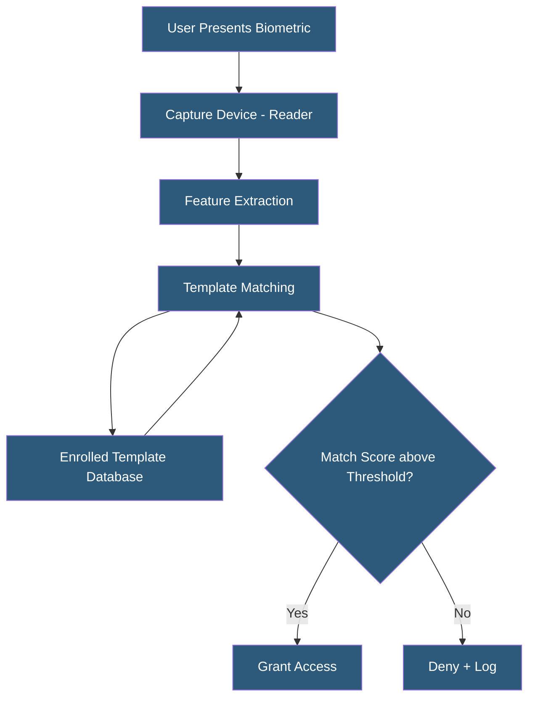

**Category:** Gigawatt Security & Access Control
**Difficulty:** Advanced
**Reading time:** 7 min read

---

Biometric authentication deploys physiological or behavioral characteristics—fingerprints, iris patterns, facial geometry—as identity verification factors for physical access control. Unlike cards or PINs, biometrics cannot be shared or forgotten, making them effective for high-security zones where credential lending is a primary threat.

- **FAR (False Acceptance Rate)** — probability that an unauthorized person is incorrectly granted access
- **FRR (False Rejection Rate)** — probability that an authorized person is incorrectly denied access
- **EER (Equal Error Rate)** — threshold where FAR equals FRR; used to compare biometric systems
- **Fingerprint recognition** — most common biometric; reads ridge patterns from fingertip
- **Iris recognition** — reads unique iris patterns at distance; highly accurate with low FAR
- **Facial recognition** — matches facial geometry from camera image; useful for high-throughput access
- **Vein pattern recognition** — reads subcutaneous vein patterns; difficult to spoof
- **Template** — stored mathematical representation of biometric data; not the raw biometric

Biometric systems operate through enrollment and verification phases. During enrollment, the system captures multiple samples of the biometric (typically 3–5 finger scans or iris captures), extracts a mathematical feature set (template), and stores it in a database associated with the person's identity record. The raw biometric image is typically discarded; only the mathematical template is retained, which cannot be reverse-engineered into the original biometric.

During verification, the reader captures a live biometric sample, extracts features using the same algorithm used during enrollment, and compares the extracted template against stored templates. The comparison produces a match score. If the score exceeds the configured threshold, access is granted. Threshold configuration balances FAR against FRR—lower threshold accepts more variation (reduced FRR but increased FAR); higher threshold requires closer match (reduced FAR but increased FRR).

For high-security zones in gigawatt facilities, biometrics are deployed as part of multi-factor authentication: something you have (badge), something you know (PIN), and something you are (biometric). This combination defeats credential sharing (the biometric cannot be shared) and lost/stolen card attacks (a card alone is insufficient).

Iris recognition is favored for high-accuracy requirements due to its extremely low FAR (1 in 1.2 million). Modern iris cameras capture at distances of 20–40 cm without user contact. Fingerprint scanners remain the most cost-effective deployment but are susceptible to spoofing with high-quality replicas; liveness detection (detecting pulse, temperature, or multi-spectral image characteristics) mitigates this.

Privacy regulations (BIPA in Illinois, GDPR in EU) impose specific requirements on biometric data storage, consent, and retention. Templates must be protected with encryption, access controls, and defined retention periods.

- Mantrap entry to critical infrastructure zone requiring biometric verification
- Server room access for SOC 2 compliance with non-repudiable access logs
- Payroll and time-attendance systems preventing buddy punching
- Border control and identity verification at secure facility checkpoints
- Financial vault access requiring multi-factor biometric authentication

| Advantage | Disadvantage |
|-----------|--------------|
| Cannot be shared, forgotten, or lost like cards or PINs | Initial enrollment effort required for all personnel |
| Creates non-repudiable access records | Biometric data breach is permanent—cannot reissue a fingerprint |
| Iris and vein recognition resistant to spoofing | Higher upfront hardware cost than card-only systems |
| Liveness detection defeats replica attacks | Environmental factors (gloves, injuries) cause FRR spikes |

- [Badge Access Control Systems](badge-access-control-systems.md)
- [Multi-Factor Authentication Infrastructure](multi-factor-authentication-infrastructure.md)
- [Mantrap Entry Systems](mantrap-entry-systems.md)

---
*Part of the [Gigawatt Security & Access Control](index.md) category · [Back to Master Index](../../index.md)*
