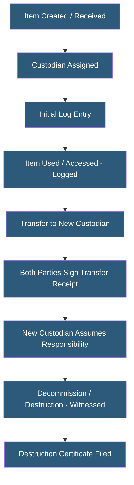

**Category:** Gigawatt Security & Access Control
**Difficulty:** Intermediate
**Reading time:** 5 min read

---

Chain of custody procedures create a documented, unbroken record of who possessed a specific item at every point in time. For critical infrastructure, these procedures apply to sensitive equipment, storage media, cryptographic material, and evidence from security incidents—ensuring accountability and legal defensibility.

- **Chain of custody** — documented sequence of possession, transfers, and locations for a specific item
- **Custodian** — individual currently responsible for an item's safekeeping and authorized use
- **Transfer receipt** — signed documentation when custody transfers from one person to another
- **Two-person integrity (TPI)** — requirement for two authorized individuals to access certain items together
- **Tamper-evident seal** — physical seal providing visible evidence of unauthorized access to a container
- **Evidence handling** — specific chain of custody requirements for items that may be used in legal proceedings
- **Cryptographic key material** — HSM tokens, smart cards, or paper keys requiring strict custody procedures
- **Media custody log** — specific register for removable storage media documenting movement and use

Chain of custody procedures are most critical for high-value, sensitive, or legally significant items. Categories requiring strict chain of custody at gigawatt facilities include: cryptographic key material (HSMs, smart cards, seed phrases), backup media containing sensitive data, equipment removed from production that contains data, and any items collected as evidence following a security incident.

For cryptographic key material, procedures typically require that keys are never possessed by a single individual alone (two-person integrity), that each access to key material is logged with purpose and duration, and that tamper-evident seals are inspected before use. Any seal breakage without a corresponding log entry triggers investigation.

Storage media custody logs track every removable drive, USB device, or backup tape from creation through destruction. Log entries record: creation date, content description, custodian name, checkout events (who took it, when, for what purpose), check-in events, and final disposition. Media that leaves the facility requires additional authorization and secure transport procedures.

Incident evidence handling follows forensic standards. When a security incident occurs and physical items are collected as potential evidence, the chain of custody must be maintained for the evidence to be admissible in legal proceedings. Items are bagged and tagged, each transfer between persons is documented with signature and timestamp, and storage is in a locked, access-controlled evidence room with a log of everyone who accessed it.

Digital forensic evidence follows similar principles—forensic images are hash-verified and stored with associated chain of custody documentation linking the physical device serial number to the digital copy.

- Cryptographic key material custody for HSM-protected critical systems
- Backup media custody log for off-site media containing customer data
- Evidence handling following a suspected insider theft incident
- Portable storage media control program in high-security facilities
- Drive removal and destruction procedures with witnessed destruction records

| Advantage | Disadvantage |
|-----------|--------------|
| Creates legally defensible evidence of proper handling | Transfer procedure overhead slows operational workflows |
| TPI requirements prevent unilateral access to sensitive items | Paper-based logs are vulnerable to loss or falsification |
| Tamper-evident seals provide physical evidence of unauthorized access | Digital chain of custody systems require integration investment |
| Required for legal proceedings and regulatory audit defense | Strict procedures may be bypassed under operational pressure without culture reinforcement |

- [Equipment Serialization](equipment-serialization.md)
- [Secure Destruction Processes](secure-destruction-processes.md)
- [Security Audit and Compliance](security-audit-and-compliance.md)

---
*Part of the [Gigawatt Security & Access Control](index.md) category · [Back to Master Index](../../index.md)*
