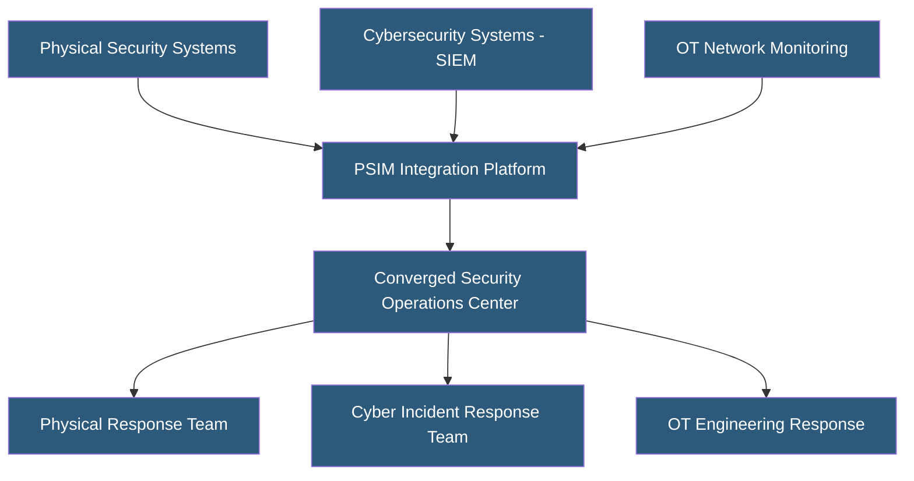

**Category:** Gigawatt Security & Access Control
**Difficulty:** Advanced
**Reading time:** 7 min read

---

Cyber-physical security integration unifies cybersecurity and physical security programs to detect and respond to threats that span both domains. At gigawatt facilities where physical access to control systems can enable cyberattacks, and where cyberattacks can manipulate physical security controls, integrated security is essential for comprehensive protection.

- **Converged security** — unified governance, operations, and technology across cyber and physical security
- **OT (Operational Technology)** — industrial control systems, PLCs, and SCADA managing physical processes
- **Physical-cyber attack vector** — using physical access to install malware or extract credentials
- **Cyber-physical attack** — cyberattack manipulating physical systems (unlocking doors, disabling cameras)
- **Security convergence** — organizational integration of previously separate cyber and physical security teams
- **BAS (Building Automation System)** — controls HVAC, access, and other building functions; often cyber-vulnerable
- **ICS/SCADA** — industrial control systems; convergence target for advanced persistent threats (APTs)
- **Zero-trust physical** — applying zero-trust principles to physical access: verify every access event regardless of prior clearance

Historically, physical and cybersecurity operated as separate organizational silos with separate teams, technologies, and budgets. This created dangerous blind spots: an adversary could use a physical intrusion to connect a rogue device to an OT network (bypassing cybersecurity controls) or use a cyber breach to disable badge readers and cameras (defeating physical security).

Converged security programs unify these domains. At the technology level, a PSIM integrates physical security event streams (access control, cameras, IDS) with cybersecurity SIEM event streams (network anomalies, authentication failures, OT system alerts). Correlating physical and cyber events enables detection of complex attacks that span both domains. For example: a badge access to an IT equipment room followed immediately by unusual OT network traffic from that room is a correlated indicator of compromise.

At gigawatt facilities, building automation systems (BAS) controlling HVAC, cooling, and electrical distribution are frequently overlooked cybersecurity vulnerabilities. BAS systems often run legacy protocols (BACnet, Modbus) without authentication. Cyberattacks on BAS systems at datacenters have manipulated cooling setpoints, triggering thermal shutdowns. Segmenting BAS networks from corporate and OT networks and applying network monitoring is essential.

Access control systems themselves are cyber-physical targets. IP-based access control panels communicate over the corporate LAN in many installations. A cyber attacker who compromises the access control server can modify access permissions, unlock doors, or erase audit logs. Hardening access control system networks (dedicated VLAN, encrypted communication, multi-factor admin authentication) addresses this.

- Utility grid operator correlating physical and cyber intrusion events for APT detection
- Datacenter converged SOC integrating camera, badge, and SIEM events
- Industrial facility segmenting BAS and OT networks from corporate IT
- Power plant protecting SCADA from physical access to engineering workstations
- Co-location provider hardening customer cage access control network infrastructure

| Advantage | Disadvantage |
|-----------|--------------|
| Detects complex attacks spanning physical and cyber domains | Organizational convergence requires breaking down established siloes |
| Correlated events provide richer context for incident investigation | Technology integration of disparate systems is complex and expensive |
| Unified governance eliminates policy gaps between domains | Combined SOC requires staff with both physical and cyber competencies |
| BAS and OT hardening prevents significant operational disruption attacks | Legacy OT and BAS systems have limited security capabilities |

- [Security Operations Center (SOC) Design](security-operations-center-soc-design.md)
- [Insider Threat Mitigation](insider-threat-mitigation.md)
- [Security Incident Response](security-incident-response.md)

---
*Part of the [Gigawatt Security & Access Control](index.md) category · [Back to Master Index](../../index.md)*
