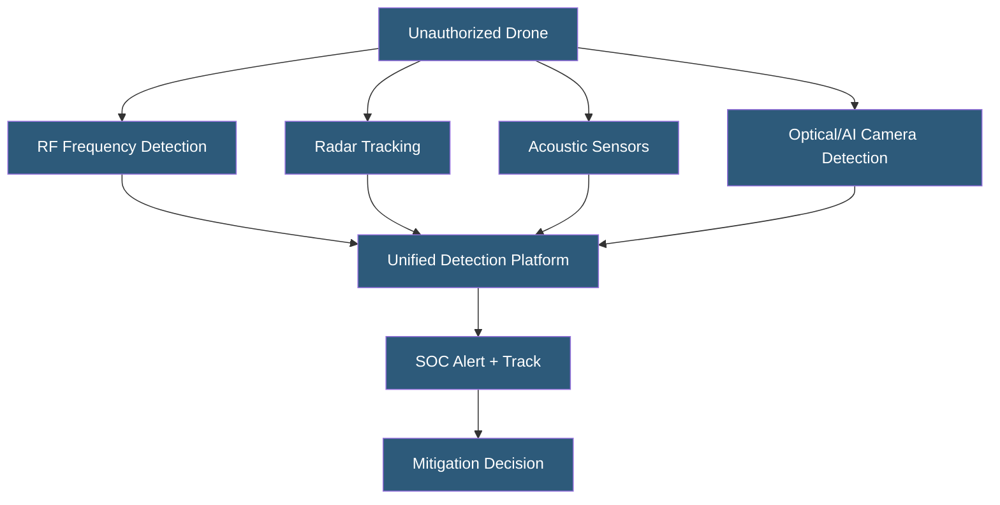

**Category:** Gigawatt Security & Access Control
**Difficulty:** Advanced
**Reading time:** 7 min read

---

Drone detection and mitigation systems address the growing threat of unmanned aerial vehicles (UAVs) conducting surveillance, delivering payloads, or disrupting operations at critical infrastructure. Detection technologies identify unauthorized drone activity; mitigation options range from alerting operators to active countermeasures with significant regulatory constraints.

- **UAV (Unmanned Aerial Vehicle)** — drone; can be commercially available consumer device or custom-built
- **RF detection** — identifying drone control signal and video downlink frequencies
- **Radar detection** — detecting small moving objects using dedicated drone-tracking radar
- **Acoustic detection** — identifying characteristic propeller frequencies of known drone models
- **Optical detection** — visual identification using cameras with AI classification
- **Drone ID** — Remote ID broadcast standard (FAA Part 89) requiring drones to broadcast identity
- **Geofencing** — GPS-based restriction zones programmed into commercial drone firmware
- **Counter-UAV (C-UAV)** — systems that neutralize detected drones; heavily regulated

Effective drone detection requires multiple sensing technologies because each has limitations. RF detection sensors (Dedrone, Aaronia) monitor the radio spectrum for known drone communication frequencies (2.4 GHz, 5.8 GHz, 900 MHz) and can identify specific drone models from their RF signature. Detection range is 1–3 km for many consumer drones. However, autonomous drones operating without radio control evade RF detection entirely.

Radar systems (DJI AeroScope, Echodyne, Fortem Technologies) detect small moving objects and classify them as drones based on radar cross-section and movement pattern. Phased array radar can provide 360-degree coverage and track multiple simultaneous targets. Range extends to several kilometers. Acoustic sensors listen for the characteristic acoustic signature of drone propellers, providing detection even for drones using encrypted control links.

AI-based optical detection using facility cameras or dedicated high-resolution cameras with machine learning classification provides visual confirmation of detected objects. Automated PTZ slew to the drone location enables operators to visually assess size, payload, and behavior.

Counter-UAV (C-UAV) mitigation is tightly regulated in the United States. The FAA Reauthorization Act restricts C-UAV authority primarily to federal government agencies. Private facility operators generally cannot legally deploy active countermeasures (RF jamming, GPS spoofing, net capture, directed energy) without federal authorization. The Framework for Drone Mitigation at Airports and similar legislative proposals have extended some authorities to critical infrastructure operators, but legal requirements must be carefully reviewed by counsel before deployment.

Permissible actions include detection, tracking, alerting, and passive deterrence (lighting, signage indicating drone-free zone). For unauthorized drone incursions, appropriate response includes notifying law enforcement.

- Power substation drone detection protecting high-value transformer infrastructure
- Datacenter campus surveillance drone detection and video recording
- Solar farm perimeter drone monitoring for theft and vandalism reconnaissance
- Stadium and large venue event security drone detection
- Oil and gas facility drone intrusion detection and law enforcement notification

| Advantage | Disadvantage |
|-----------|--------------|
| Multi-sensor fusion provides reliable detection with low false positives | Active countermeasures require federal authorization for most private operators |
| RF detection identifies specific drone models for rapid threat assessment | Autonomous drones without radio control evade RF-only detection |
| Visual tracking provides evidence for law enforcement response | Dense urban environments create challenging detection conditions |
| Remote ID integration will improve detection as FAA mandates are implemented | Detection systems require regular signature updates as new drone models emerge |

- [Perimeter Security at Scale](perimeter-security-at-scale.md)
- [Video Analytics and AI Surveillance](video-analytics-and-ai-surveillance.md)
- [Security Incident Response](security-incident-response.md)

---
*Part of the [Gigawatt Security & Access Control](index.md) category · [Back to Master Index](../../index.md)*
