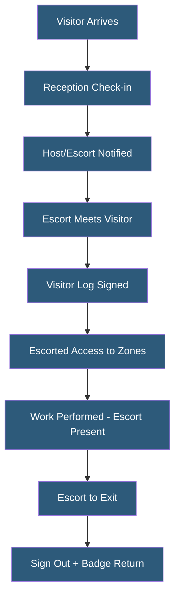

**Category:** Gigawatt Security & Access Control
**Difficulty:** Beginner
**Reading time:** 5 min read

---

Escort requirements mandate that uncleared visitors, contractors, and guests are accompanied by authorized personnel at all times within restricted security zones. They are a fundamental control under standards like NERC CIP and SOC 2, ensuring that individuals without the required background checks cannot access critical areas unsupervised.

- **Escort** — cleared, authorized personnel responsible for the actions and location of an uncleared visitor
- **Escorted access** — access granted to an uncleared individual under continuous supervision of an escort
- **Unescorted access** — access granted to cleared, authorized individuals without supervision requirement
- **Escort ratio** — number of visitors that a single escort may supervise simultaneously (typically 1:1 for sensitive areas)
- **Escort authorization** — formal designation that a cleared employee is authorized to serve as escort
- **Escort accountability** — responsibility for ensuring the escorted individual does not deviate from authorized areas
- **Sign-in/sign-out** — formal logging of when escorted visitors enter and leave secured areas
- **NERC CIP-006** — standard requiring escort for all visitors without unescorted physical access authorization to Physical Security Perimeters

Escort requirements are defined in the facility's physical security plan and communicated to all personnel during security training. The plan specifies which zones require escort, what qualifications an escort must have (cleared for unescorted access in the zone, trained in escort responsibilities), the maximum escort ratio allowed, and what supervision means in practice (continuous visual contact, or presence in the same room).

For NERC CIP compliance, escorts must accompany uncleared visitors within the Physical Security Perimeter (PSP) at all times. The escort is accountable for the visitor's compliance with facility rules and must prevent the visitor from accessing systems or areas beyond those authorized. If a visitor attempts to access unauthorized areas, the escort is responsible for immediately redirecting them or reporting the attempt.

Escort logs capture visitor name, escort name, entry time, authorized areas, and departure time. These logs are required by NERC CIP-006 and are reviewed during CIP compliance audits. Electronic visitor management systems automate log creation and associate escort and visitor access control events.

Large maintenance events—where many contractors work simultaneously—strain escort capacity. Organizations plan for escort headcount in advance, ensuring sufficient cleared staff are available to escort all contractors. Some facilities use crew-lead escort models where a single cleared supervisor escorts a small team working together in a defined area.

- Utility substation escort for uncleared maintenance contractors per NERC CIP-006
- Datacenter escort for equipment delivery personnel in data halls
- Government facility escort for visitors without facility security clearance
- Audit team escort during compliance investigations
- Construction crew escort during facility expansion or renovation

| Advantage | Disadvantage |
|-----------|--------------|
| Prevents uncleared individuals from accessing critical systems unsupervised | Operational friction when escort capacity is insufficient for visitor volume |
| Creates accountability chain for visitor actions within secured zones | Escorts must stop productive work to perform escort duty |
| Required for NERC CIP compliance and most critical infrastructure standards | Large maintenance events require significant advance escort planning |
| Limits insider threat exposure from short-term contractors | Escort ratio limitations can delay contractor start times |

- [Visitor Management at Scale](visitor-management-at-scale.md)
- [Badge Access Control Systems](badge-access-control-systems.md)
- [Security Clearance Requirements](security-clearance-requirements.md)

---
*Part of the [Gigawatt Security & Access Control](index.md) category · [Back to Master Index](../../index.md)*
