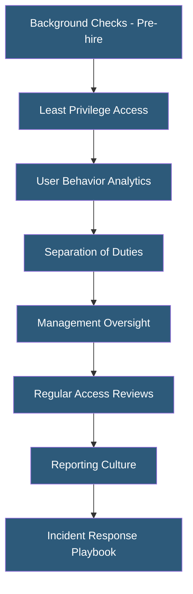

**Category:** Gigawatt Security & Access Control
**Difficulty:** Advanced
**Reading time:** 6 min read

---

Insider threats—malicious or negligent actions by employees, contractors, or trusted partners with authorized access—represent one of the most difficult security challenges for gigawatt facilities. Mitigation combines access minimization, behavioral monitoring, organizational culture, and technical controls to detect and prevent insider-initiated incidents.

- **Insider threat** — security risk posed by individuals with authorized access who misuse that access
- **Malicious insider** — employee intentionally causing harm (theft, sabotage, espionage)
- **Negligent insider** — employee whose careless actions enable security incidents
- **Compromised insider** — employee whose credentials or access have been hijacked by an external adversary
- **Principle of least privilege** — granting only the minimum access required for a person's job function
- **Separation of duties** — requiring multiple individuals to complete sensitive tasks, preventing unilateral action
- **User behavior analytics (UBA)** — monitoring access patterns to detect anomalous behavior
- **Psychological profiling indicators** — behavioral signs that may indicate elevated insider risk

Insider threat mitigation begins before employment. Comprehensive background checks—criminal history, employment verification, education verification, credit history for financially sensitive roles, and reference checks—establish a baseline understanding of a candidate's history. Ongoing re-investigation at defined intervals (every 5 years for sensitive positions) detects changes in personal circumstances that may elevate risk.

Access control minimization is foundational. Applying the principle of least privilege ensures that employees access only the systems and physical areas required for their current job function. Periodic access reviews—quarterly for privileged access, annually for standard access—revoke permissions that are no longer required. This reduces the potential damage from any single insider.

User and entity behavior analytics (UEBA) platforms analyze access logs, email metadata, file access patterns, and physical access records to establish behavioral baselines and detect anomalies. A employee who suddenly starts accessing equipment areas they have never visited, downloads unusual quantities of files, or accesses systems outside business hours may be an indicator of insider threat activity or credential compromise. Alert thresholds must be carefully tuned to avoid excessive false positives that erode the security team's trust in the system.

Separation of duties for high-consequence actions prevents unilateral insider action. For critical electrical switching operations, two-person integrity (TPI) requires two authorized individuals to be present and both to authorize the action. For system configuration changes, a change management workflow requiring manager approval and peer review prevents unauthorized modifications.

A reporting culture where employees feel safe reporting concerning colleague behavior—without fear of retaliation—enables early intervention. Many insider threat incidents involve observable warning signs long before the incident occurs.

- Utility facility applying two-person integrity for high-voltage switching operations
- Datacenter access control with quarterly least-privilege reviews
- UEBA deployment monitoring privileged access behavior patterns
- Separation of duties for system administration and access control management
- Pre-employment background check program for all staff accessing critical zones

| Advantage | Disadvantage |
|-----------|--------------|
| Defense in depth makes unilateral insider action very difficult | Behavioral monitoring programs raise employee privacy concerns |
| Least privilege minimizes damage potential from any single insider | Access reviews require significant management time investment |
| UBA can detect compromised credentials as well as malicious insiders | UEBA generates false positives that can damage employee morale if mishandled |
| Two-person integrity prevents catastrophic unilateral actions | Operational friction of two-person requirements can be significant |

- [Background Check Processes](background-check-processes.md)
- [Security Clearance Requirements](security-clearance-requirements.md)
- [Cyber-Physical Security Integration](cyber-physical-security-integration.md)

---
*Part of the [Gigawatt Security & Access Control](index.md) category · [Back to Master Index](../../index.md)*
