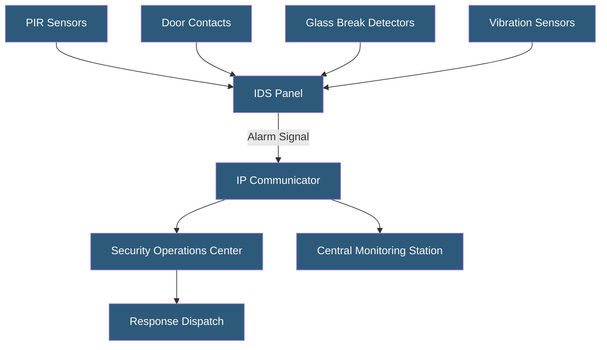

**Category:** Gigawatt Security & Access Control
**Difficulty:** Intermediate
**Reading time:** 6 min read

---

Intrusion detection systems (IDS) use electronic sensors to detect unauthorized entry into secured areas, generating alerts for security operators. In gigawatt facilities, IDS supplements perimeter controls and access control systems by detecting intrusion into areas that should be unoccupied—providing defense in depth against the possibility that perimeter controls are bypassed.

- **PIR (Passive Infrared)** — motion sensor detecting heat signature changes; standard interior sensor
- **Dual-technology sensor** — combines PIR with microwave detection; reduces false alarms
- **Glass break detector** — acoustic sensor detecting the frequency signature of breaking glass
- **Magnetic door contact** — two-part sensor detecting door or window opening
- **Vibration sensor** — wall/floor mounted detector for forced entry through structural elements
- **Seismic detector** — high-sensitivity vibration detector for vault and safe protection
- **IDS panel** — central controller collecting sensor signals, managing zones, and communicating alarms
- **Monitoring station** — central alarm receiving center staffed for 24/7 response coordination

Facility IDS is organized into zones—logical groupings of sensors associated with specific areas. Each zone can be armed or disarmed independently, allowing staff to work in specific areas while others remain protected. Zone status is monitored by the IDS panel, which communicates with the central monitoring station via IP network (primary) and cellular backup.

For unoccupied facility areas (after-hours in administrative sections, unoccupied electrical rooms), PIR sensors provide motion detection. Dual-technology sensors require both PIR motion and microwave motion to trigger, dramatically reducing false alarms from temperature fluctuations or small animals. All door and window openings are monitored with magnetic contacts—the simplest and most reliable intrusion detection technology.

IDS panels for critical infrastructure use UL-listed equipment meeting specific performance standards. UL 2050 covers national central station burglar alarm systems. For high-security applications, supervised wiring—where the panel continuously monitors loop resistance and triggers tamper alarms for wire cuts or shorts—is required.

The IDS must integrate with the access control system to cross-reference legitimate access events against IDS zone states. If a zone is armed but a valid badge presentation occurs, the IDS panel automatically disarms the zone for a defined entry time. If no disarm occurs after the entry, the alarm activates. This prevents false alarms when authorized personnel enter armed areas while enabling alarm activation for unauthorized access.

- Data center after-hours intrusion detection in administrative zones
- Electrical room and switchgear protection with vibration and PIR sensors
- Server cage intrusion detection supplementing access control
- Remote unmanned facility monitoring via central station
- High-security vault protection using seismic and volumetric sensors

| Advantage | Disadvantage |
|-----------|--------------|
| Detects intrusion in areas without continuous human presence | False alarms are costly in guard response time and credibility |
| Dual-technology sensors significantly reduce false positive rates | Complex zone configurations require careful design and testing |
| Provides defense in depth beyond perimeter and access control | IDS maintenance and testing is often neglected post-installation |
| Integrates with access control for automated arming/disarming | Communication path failures must be detected and alarmed |

- [Security Camera Networks](security-camera-networks.md)
- [Security Zone Design for GW Facilities](security-zone-design-for-gw-facilities.md)
- [Security Incident Response](security-incident-response.md)

---
*Part of the [Gigawatt Security & Access Control](index.md) category · [Back to Master Index](../../index.md)*
