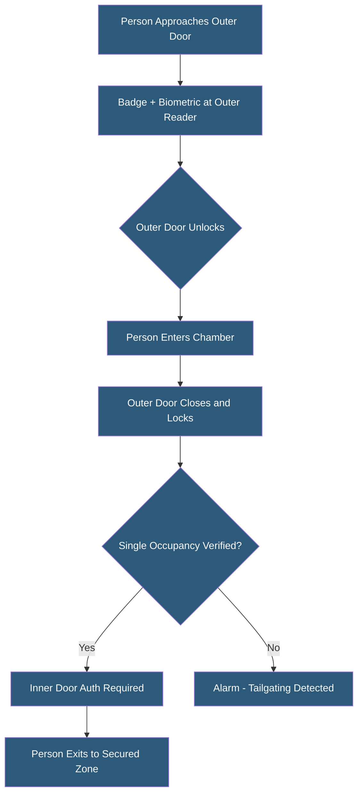

**Category:** Gigawatt Security & Access Control
**Difficulty:** Intermediate
**Reading time:** 6 min read

---

Mantraps (also called airlocks or security vestibules) are controlled entry chambers requiring passage through two sequential locked doors, preventing tailgating and forcing one-person-at-a-time entry with credential verification. They are standard at the highest-security zone transitions in critical infrastructure and financial facilities.

- **Mantrap** — enclosed chamber with two electronically controlled doors; first door must fully close before second can open
- **Interlocking doors** — mechanism ensuring only one door can be open at any time
- **Weight sensor** — floor scale detecting multiple occupants to prevent tailgating
- **Occupancy sensor** — IR or video sensor confirming single occupancy before second door unlocks
- **Anti-passback** — access control policy preventing reuse of a credential at the same door without exiting first
- **Emergency egress** — life-safety override allowing exit in all conditions; must not compromise entry security
- **Glazing** — security glass in mantrap walls enabling visual verification by guards
- **Intercom** — guard communication system for manual override or assistance

A mantrap vestibule is typically a 3x6 foot to 5x8 foot enclosed chamber constructed with bullet-resistant materials and security glazing. Both the outer (entry) and inner (access) doors are electronically controlled and interlock—the access control system prevents the inner door from unlocking while the outer door is open, and vice versa. This physical interlocking is the core anti-tailgating mechanism.

After the outer door closes behind a person entering the chamber, the system verifies single occupancy using a combination of weight sensors (floor scale measures total weight and flags readings consistent with multiple people) and IR or video occupancy sensors. If multiple occupants are detected, an alarm sounds and neither door can be opened until the extra person exits back through the outer door.

Single occupancy verified, the inner door requires its own credential presentation—often a different or higher-level factor than the outer door. For very high-security zones, the outer door may require badge, and the inner door may require badge plus biometric. This two-step authentication prevents a stolen credential from enabling immediate access to the secured zone.

Anti-passback rules in the access control system prevent credential reuse: once a credential is used to enter through the outer door, it cannot be used to re-enter until it has been used to exit. This prevents credential sharing (person A badges in, hands badge back to person B who then uses it).

Emergency egress is a critical life-safety requirement. Fire codes mandate that people must be able to exit at all times. Typically, the inner door includes a panic bar providing immediate egress in an emergency, triggering an alarm but always allowing exit.

- Hyperscale datacenter critical zone entry with badge plus biometric mantrap
- Financial institution vault anteroom with armed guard in adjacent monitoring station
- Government facility entry points for classified areas
- Pharmaceutical cold-chain facility preventing temperature and contamination cross-exposure
- Nuclear facility control room entry meeting regulatory physical security requirements

| Advantage | Disadvantage |
|-----------|--------------|
| Physically prevents tailgating with certainty | Entry throughput limited to one person per cycle (15-30 seconds each) |
| Two-door sequence enables higher authentication at inner door | Construction cost significantly higher than standard door with reader |
| Weight and occupancy sensors provide objective tailgating detection | False positives (heavy bags, unusual weight distribution) require management |
| Anti-passback integration prevents credential sharing | Emergency egress requirements must be carefully balanced against security |

- [Tailgating Prevention](tailgating-prevention.md)
- [Biometric Authentication Deployment](biometric-authentication-deployment.md)
- [Security Zone Design for GW Facilities](security-zone-design-for-gw-facilities.md)

---
*Part of the [Gigawatt Security & Access Control](index.md) category · [Back to Master Index](../../index.md)*
